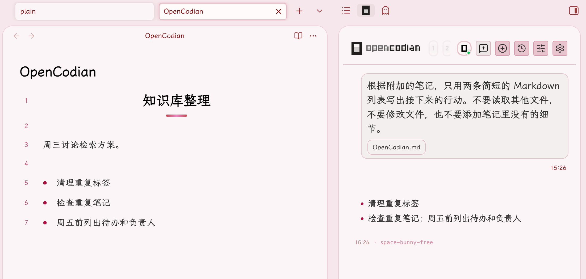
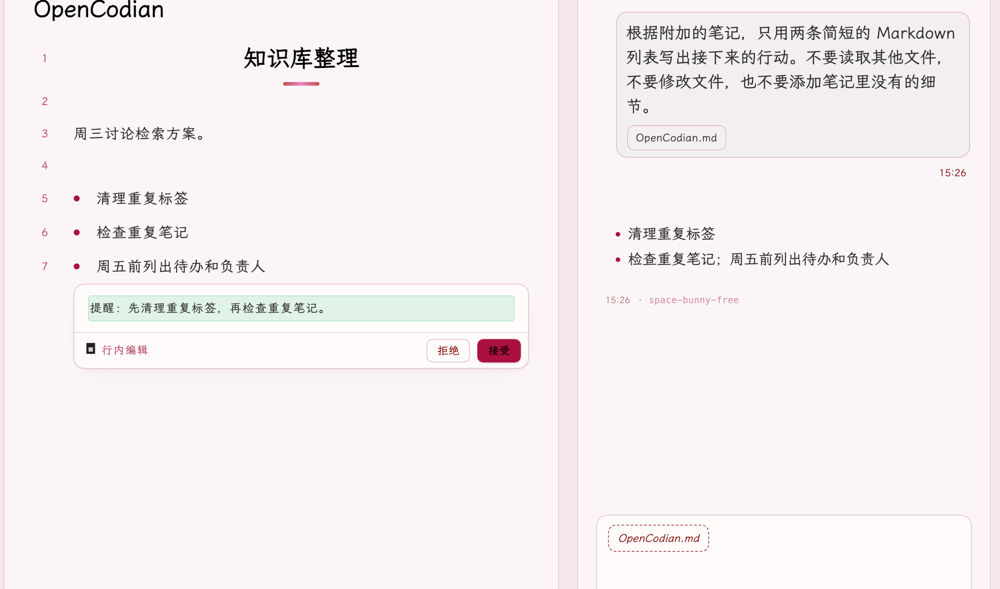

# OpenCodian

OpenCodian 把编程代理接进 Obsidian。它支持多会话聊天，能把笔记、选区和文件交给代理参考。你也可以在编辑器里预览改写，批量整理笔记或生成 Canvas，并查看文件改动。

插件默认使用 OpenCode 1；还可以在设置中启用 OpenCode 2、Claude Code、Codex、Pi 或 ZCode。各后端使用各自的运行环境和账户，能使用的模型与功能以当前后端的实际状态为准。

OpenCodian 只支持桌面版 Obsidian，最低版本为 1.4.5。

## 使用截图

这两张图来自本机 Test Vault。第一张是附加笔记后的问答，第二张是行内编辑的插入预览；我随后拒绝了预览，示例笔记没有写入新增文字。





## 安装

1. 从 [GitHub Releases](https://github.com/OCDcreator/opencodian/releases/latest) 下载同一版本的 `main.js`、`manifest.json` 和 `styles.css`。
2. 在你的 Vault 中创建 `.obsidian/plugins/opencodian/`，把三个文件放进去。
3. 重启 Obsidian，进入「设置 → 第三方插件」，启用 OpenCodian。

当前 GitHub Release 只提供这三个文件。PDF 附加和索引还需要构建产物 `pdf-engine.js`；只安装上述文件时，这两项功能不可用。

默认后端是 OpenCode 1。本地模式需要先安装 [OpenCode](https://opencode.ai/docs/)；插件会尝试从系统 `PATH` 找到可执行文件，也可以在 OpenCodian 的服务器设置中指定路径。本地服务默认自动启动，监听 `127.0.0.1:4196`。如果已经有 OpenCode 服务，可以改用远程模式并填写服务地址。

启用插件后，点击左侧功能区的 OpenCodian 图标，或在命令面板运行「OpenCodian: 打开聊天视图」。在模型设置中选择当前可用的提供商与模型，并完成该提供商要求的认证，然后发送第一条消息。

## 能做什么

### 与代理对话

- **多会话并行**：在聊天侧栏使用多个标签页，各自保留会话和流式状态。历史会话可以重新打开；新会话、分叉、回退等操作按当前后端提供的能力显示。
- **看清执行过程**：工具调用、权限请求和提问会在聊天中呈现。支持后台任务的后端会显示任务进度与完成记录；会话待办、用量和费用信息以相应后端返回的数据为准。
- **选择工作方式**：可以切换代理、模型与思考强度。输入 `/` 查找命令或技能，使用 `@` 选择可用的代理；菜单目录跟随当前后端，不把其他后端的配置混进来。
- **保留成果**：手动把会话导出为 Vault 中的 Markdown 笔记，或开启自动导出。自动导出默认关闭，遇到用户修改过的导出笔记会停止覆盖。

### 把 Obsidian 内容带进对话

- **手动附加上下文**：可附加当前笔记、选区、Vault 文件和文件夹；还可粘贴完整网页地址，在发送时抓取页面内容。输入区会显示待发送的条目。上下文按次发送，下一轮不会悄悄继承。启用 Obsidian 核心 Web Viewer 后，也可附加活动网页标签。
- **主题上下文组**：把常用文件和文件夹编成一个组，在聊天或行内编辑中一次附加。附加时仍会检查条目是否存在；设置中保存的组不会自动进入每轮请求。
- **相关笔记与整库检索**：「打开相关笔记面板」显示当前笔记的链接关系。主动开启整库检索后，输入问题时命中的笔记片段会出现在上下文栏中，发送前可以逐条删除。语义检索另需配置兼容的 embedding 提供商和模型。
- **PDF**：可附加 PDF 文本、建立本地索引，并从 PDF 选区提问；最近一次相关问答可经预览保存为笔记注释。PDF 索引默认关闭。附加和索引依赖 `pdf-engine.js`，安装包限制见下文。
- **工作区记忆**：可为工作区开启独立的长期记忆，让后续回合复用已保存的信息。记忆与整库检索是两套功能，初始都关闭；记忆的抽取模型和存放位置可以单独设置。

### 在笔记中写作和整理

- **行内编辑**：选中文字、把光标放在句中或空行，打开内嵌输入框；模型的改写先以原位差异呈现。接受前会检查原文是否已变化，拒绝则不写入。整篇改写另有命令和二次确认；同一笔记可保留多个独立的编辑预览。行内编辑需要当前后端提供可用的只读辅助会话。
- **补全与内链**：可开启 Alt 触发的行内续写，以 Tab 接受、Esc 放弃；默认关闭。自动内链也默认关闭，只在有合适参考笔记且能验证目标时插入链接。
- **图片生成**：配置 OpenAI Images 兼容模型后，可从聊天或行内编辑入口生成图片。聊天结果先显示在卡片中，点击插入后才写入附件并在笔记中加入引用；初始没有配置图片模型。
- **图片输入**：聊天与行内编辑都可以附上图片，但是否能交给模型识别取决于当前后端及其模型的图片能力。
- **Canvas 与批量整理**：可从选中的笔记生成 Canvas，或选中 Canvas 节点请求 AI 改写并预览。批量整理提供模板、受影响文件预览和确认，可移动笔记或修改属性，完成后有回退入口。Canvas 节点编辑会按当前 Obsidian 运行时的可用接口降级。

### 审阅改动与管理工具

- **文件改动与回退**：OpenCode 会话有单轮文件变更记录和当前会话变更侧栏。插件另有跨后端的本地文件快照，可在有可用快照时回退单个文件或整轮改动、恢复回退，并在执行前查看冲突预览。无法安全回退的文件会明确标出。这些记录描述代理会话，不代表整个 Git 工作区。
- **后端资源设置**：设置页提供模型与提供商、代理、命令、Skills、MCP 和 OpenCode 项目插件的管理入口。来源和运行时状态会分别显示；本地项目配置的修改不会自动写进远程服务器。
- **外观与提示**：聊天主题、背景、输入区、字体和布局可在外观设置中调整；轮次完成提示音默认关闭。
- **可选的外部入口**：Obsidian 原生 CLI 工具注入和本机 HTTP 远程驱动都默认关闭。远程驱动只操作隔离的 OpenCode 会话，需要令牌；能力实验室和诊断页用于查看后端实际可用性，不把探针结果当作所有功能都已验收。

## 选择后端

在「设置 → OpenCodian」中启用需要的后端，再选择新会话默认使用哪一个。初始状态只启用 OpenCode 1。

| 后端 | 连接方式 |
| --- | --- |
| OpenCode 1 | 本地托管的 OpenCode 服务，或已有的远程服务；这是默认后端。 |
| OpenCode 2 | 独立的 OpenCode 2 CLI／服务与配置；会话不与 OpenCode 1 混用。 |
| Claude Code | 使用 Claude Code SDK，需有可用的 Claude Code 运行环境与认证。 |
| Codex | 使用 Codex 后端，需配置相应运行环境与账户。 |
| Pi | 连接本地 Pi Coding Agent RPC 服务。 |
| ZCode | 连接 ZCode 的 app-server 运行时。 |

OpenCode 2 目前仍有[尚未完成的完整兼容验收](docs/status/opencode2-backend-acceptance.md)。不同后端提供的会话、工具和设置能力并不完全相同。例如 OpenCode 2 没有 OpenCode 1 的原生待办与分享接口；在非 Git Vault 中，它的原生文件差异也无法给出完整的状态和行数。部分后端的能力与读取状态可在设置中的能力实验室查看。

## 数据与权限

附加到消息的笔记内容会交给所选后端处理；后端接入云端模型时，内容也会按该提供商的服务方式传输。使用本地服务端口本身不意味着模型在本机运行。需要离线使用时，请另行配置本地模型并检查它实际连接的地址。

OpenCode 1 的默认权限模式是 YOLO，会自动批准操作。命令黑名单默认开启，但只作用于 OpenCode 1 的 bash 拒绝规则，不能当作操作系统沙箱。插件中的「允许访问 Vault 外部文件」开关默认关闭；实际文件访问仍取决于后端的权限配置。不同后端的批准规则需要分别检查。

## 开发

开发环境使用 Node.js 24。安装依赖后，`npm run dev` 会持续构建；提交前用 `npm run verify` 检查代码、模块文档、测试和生产构建。

```bash
npm ci
npm run dev
npm run verify
```

单独生成安装文件时运行：

```bash
npm run build
npm run package:plugin
```

基础插件的三个文件位于 `artifacts/opencodian/`。构建生成的 `dist/pdf-engine.js` 需要另行复制到同一个插件目录，PDF 附加与索引才能加载。如果在 macOS 和 Windows 之间切换后遇到 esbuild 平台不匹配，先运行 `npm run doctor:esbuild`；确有不匹配时再运行 `npm run doctor:esbuild:fix`。两个系统最好各自使用独立的工作目录和 `node_modules`。

源码与模块文档有[一对一映射和守卫](docs/modules/README.md)。改动 `src/` 后需同步对应的 `docs/modules/**`，并运行 `npm run graphify:update:src`；`npm run check:module-docs` 与 `npm run check:graphify` 会在 `verify` 中执行。查找模块责任边界可运行 `npm run inspect:owner -- <path|symbol>`。从 [文档索引](docs/README.md) 进入架构与需求文档，动手前请读 [项目代理指南](AGENTS.md)。

查具体实现可从[聊天模块](docs/modules/features/chat/index.md)、[代理后端](docs/modules/core/agents/backend/index.md)、[行内编辑](docs/modules/features/inline-edit/InlineEditController.md)、[检索与记忆](docs/modules/core/memory/index.md)、[PDF](docs/modules/core/pdf/index.md)、[Canvas](docs/modules/core/canvas/index.md)和[编辑回退](docs/modules/core/storage/EditRevertService.md)开始。

## 许可证

[MIT](LICENSE)
