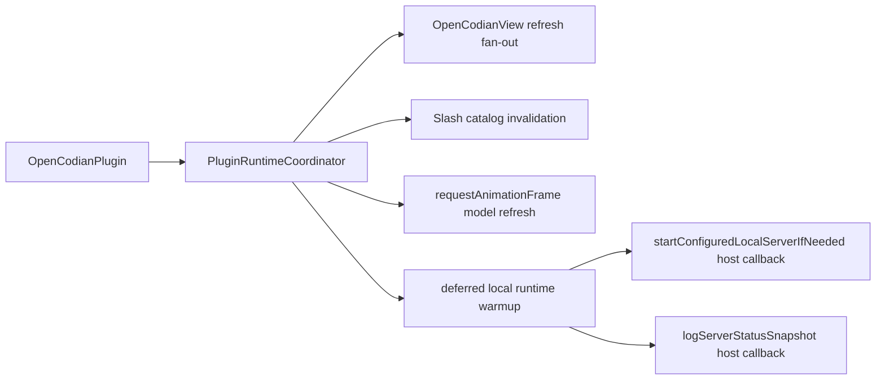

# PluginRuntimeCoordinator

> **源码**: `src/app/runtime/PluginRuntimeCoordinator.ts`
> **Owner**: `app.runtime`（`app` layer）
> **状态**: [REVIEW]

## 概述

`PluginRuntimeCoordinator` 是 app 层的 runtime orchestration owner。它把原本集中在 `main.ts` 里的跨视图刷新、模型目录刷新调度、slash command catalog invalidation、deferred local runtime warmup，以及启动期插件更新检查收束到一个 durable coordinator 中。

`OpenCodianPlugin` 仍然负责 Obsidian lifecycle、settings/storage/service 构造和诊断导出；本模块只持有启动后 runtime 调度所需的 timer / animation-frame / promise 状态，并通过 host seam 回调入口拥有的服务能力。

## 导入关系

```text
上游:
- Obsidian `WorkspaceLeaf` 类型
- `src/core/opencode/OpenCodeService`
- `src/core/types`
- `src/core/update/PluginUpdateService`
- `src/features/chat/OpenCodianView`
- `src/features/chat/runtime/UserMessageFooterRenderer`
- `src/i18n`
- `src/shared`

下游:
- `src/main.ts`
- `src/core/runtime/OpenCodianStartupCoordinator.ts`
- `src/core/runtime/OpenCodianSettingsRuntimeCoordinator.ts`
```

## 核心类型 / 状态

- `PluginRuntimeCoordinatorHost`: 入口注入的 host seam，提供 settings、OpenCode service、当前 OpenCodian leaves、provider icon color mode 应用、本地服务启动、server snapshot 记录和 settings tab model-loaded 通知。
- `PluginRuntimeCoordinatorHost.hasEnabledBackend()`: 可选 backend availability seam，允许 runtime warmup 在入口层就跳过“backend 已整体禁用”的场景。warmup 还要求当前 active backend 是 `opencode`，避免 Codex / Claude Code 会话恢复时继续做无意义的 OpenCode health snapshot。
- `RuntimeRefreshOptions`: 控制跨视图刷新是否 reload models、是否 apply UI。
- `SlashCommandCatalogInvalidationOptions`: 透传给 `OpenCodianView.invalidateSlashCommandMenuCatalog()` 的 preload 选项。
- `RuntimeWarmupSource`: 区分 startup deferred warmup 和 session-bootstrap 强制 warmup。
- `PluginRuntimeCoordinatorHost.getPluginUpdateService()` / `getPluginVersion()`：把入口已构造的更新服务与当前插件版本以窄 seam 提供给启动检查，不让入口重新持有更新决策。
- `modelRefreshFrameId`: 模型目录刷新 requestAnimationFrame 句柄。
- `deferredRuntimeWarmupTimerId`: onload 后延迟 warmup 的 setTimeout 句柄。
- `deferredRuntimeWarmupPromise`: 正在执行的 runtime warmup promise，用于 session bootstrap 复用或等待。

## 核心逻辑

### Cross-view refresh

- `refreshOpenCodianViews()` 通过 host 提供的 leaves 找到所有 `OpenCodianView` 实例。
- `applyUi` 为 true 时先应用 provider icon color mode，再同步 locale、已渲染 user footer tooltip、chat appearance、scroll mode 和 tab bar layout。
- `reloadModels` 为 true 时触发每个打开视图的 `reloadModelCatalog()`。

### Slash command catalog invalidation

- `invalidateSlashCommandMenuCatalogs()` 只遍历当前打开的 OpenCodian view，并把 preload 选项传给视图自己的 catalog cache invalidation seam。
- 入口的 server-status callback 仍决定何时在 `running` 状态触发 preload；本模块只拥有 fan-out 行为。

### Model refresh scheduling

- `queueModelRefresh()` 会取消上一帧 pending refresh，再用 `requestAnimationFrame` 合并模型目录刷新。
- frame callback 完成 view model reload fan-out 后调用 host `onModelsLoaded()`，保持 settings tab 的模型加载提示与原入口行为一致。
- `dispose()` 会清理 pending model refresh frame，供插件 unload 调用。

### Deferred runtime warmup

- `scheduleDeferredRuntimeWarmup()` 只在当前 settings 是 local server mode、`autoStart` 为 true、`opencode` 已启用且也是 active backend 时排队 warmup。
- 如果入口已经确认 `opencode` backend 当前未启用，或用户当前 active backend 是 Codex / Claude Code 等非 OpenCode 后端，deferred warmup 与 session-bootstrap warmup 都会直接跳过，不再额外调用 `logServerStatusSnapshot()` 触发一次离线探测日志。
- 如果 timer 或 warmup promise 已存在，不重复排队。
- `ensureRuntimeWarmupReadyForSessionBootstrap()` 用于创建 session 前的安全栅栏：如果 deferred timer 还没跑，先取消 timer 并以 `session-bootstrap` source 立即 warmup；如果 warmup 已在运行则等待同一个 promise。
- `runDeferredRuntimeWarmup()` 保持原启动语义：记录开始日志，调用 host 启动本地服务，再写 server status snapshot，最后记录耗时。

### Plugin update startup check

- `checkPluginUpdateOnStartup()` 在正常启动注册完成后由入口 fire-and-forget 调用，不会阻塞插件加载。
- 服务检查出新的兼容稳定版时，coordinator 比较当前版本与 `settings.pluginUpdateState.lastNotifiedVersion`；每个版本最多显示一次 notice，然后让 service 持久化通知标记。
- 检查、比较或通知标记写入异常只写 runtime warning；它们不影响插件启动，也不会安装、回滚或热重载插件。

## 数据流



## 与其他模块的交互

- `main.ts` 构造本模块并提供 host callbacks；入口仍保留 lifecycle order、service construction、settings persistence、diagnostic report 和 command registration。
- `OpenCodianView` 继续拥有实际 UI refresh 和 slash catalog cache 行为，本模块只负责找到当前打开的 view 并按入口策略调用它们。
- `OpenCodeService` 仍拥有 server lifecycle；本模块只通过入口 host seam 触发 configured local server startup 和 readiness check。
- `core/types` 的 `isLocalServerMode()` 是 warmup eligibility 的唯一设置判断，避免把 server mode 结构判断留在入口层重复实现。

## 配置项

本模块没有独立配置项。它读取 host 暴露的 `OpenCodianSettings.server`，并只关心 local server mode 与 `server.local.autoStart`。

## 注意事项

- 不要把 Obsidian plugin lifecycle、storage/config/model-service construction 或 diagnostic report 逻辑搬入本模块；这些仍属于 `main.ts`。
- 不要把 view 级 UI 细节复制进 coordinator；新增视图刷新行为优先由 `OpenCodianView` 提供稳定方法后再由本模块 fan out。
- `ensureRuntimeWarmupReadyForSessionBootstrap()` 的 timer cancellation 和 promise reuse 是创建会话前的竞态保护，不要拆成 fire-and-forget。
- `dispose()` 必须在 plugin unload 时调用，避免 pending timeout/frame 在卸载后继续触发。
