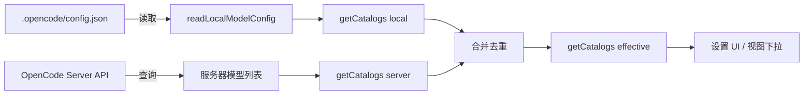

# ModelConfigService

> **源码**: `src/core/config/ModelConfigService.ts`
> **状态**: [DRAFT]

## 概述

模型配置解析服务，负责合并本地 `.opencode/config.json` 中的模型配置与 OpenCode 服务器提供的模型目录（catalog）。提供统一的模型可用性查询接口，支持本地、服务器和有效（merged）三种目录视图，并处理模型配置的持久化写入。

## 导入关系

```text
上游: src/core/config/OpencodeConfigManager, src/core/opencode/OpenCodeService, src/core/config/modelConfig
下游: src/features/settings/OpenCodianSettings (模型选择 UI), src/features/chat/OpenCodianView (运行时模型切换)
```

## 核心类型 / 接口

```typescript
// 目录模式：本地配置 vs 服务器 vs 合并后的有效目录
type CatalogMode = "local" | "server" | "effective";

// 模型目录条目
interface ModelCatalogEntry {
  provider: string;
  model: string;
  // ...
}

// 目录集合
interface ModelCatalogs {
  local: ModelCatalogEntry[];
  server: ModelCatalogEntry[];
  effective: ModelCatalogEntry[];
}
```

## 核心逻辑

### 三层目录解析

1. **本地目录** (`readLocalModelConfig`): 从 `.opencode/config.json` 读取用户配置的 provider/model 列表
2. **服务器目录**: 通过 OpenCodeService 向服务器查询当前可用的 provider 和 model
3. **有效目录**: 合并本地和服务器目录，去重后得到最终可用模型列表

### 模型可用性验证

`isModelAvailableOnServer()` 用于在用户选择模型时，验证该模型在服务器端是否真实可用，防止配置不可用模型。

### 配置写入

`writeLocalModelConfig()` 接受部分模型配置子集，仅更新 `.opencode/config.json` 中与模型相关的字段，不覆盖其他配置项。

## 关键方法

| 方法 | 说明 |
|------|------|
| `getCatalogs(mode)` | 构建并返回指定模式的模型目录（local / server / effective） |
| `readLocalModelConfig()` | 从 `.opencode/config.json` 读取模型相关配置子集 |
| `writeLocalModelConfig(subset)` | 将模型配置子集持久化到 `.opencode/config.json` |
| `isModelAvailableOnServer(provider, model)` | 检查指定 provider/model 是否在服务器目录中存在 |

## 数据流



## 与其他模块的交互

- **OpencodeConfigManager**: 委托实际的 `.opencode/config.json` 读写操作
- **OpenCodeService**: 调用 `getAvailableModels()` 获取服务器端模型目录
- **modelConfig helpers**: 使用 `src/core/config/modelConfig.ts` 中的辅助类型和解析函数
- **OpenCodianSettings**: 提供模型选择 UI 所需的目录数据，接收用户选择
- **OpenCodianView**: 运行时模型切换下拉框的数据源

## 配置项

- **模型源模式** (`modelSourceMode`): 决定优先使用本地配置还是服务器目录
- **默认 provider / model**: 用户设置的默认模型选择

## 注意事项

- `writeLocalModelConfig()` 是部分更新，必须保留 config.json 中非模型字段
- 服务器目录依赖 OpenCode 服务器的可用性，离线时回退到本地目录
- 模型可用性检查应在用户切换模型时即时验证，避免发送请求到不可用模型

## 待补充

- [ ] `getCatalogs` 各模式的具体合并/去重逻辑
- [ ] 本地配置解析的 JSON schema 或字段列表
- [ ] 离线 / 服务器不可用时的降级策略细节
- [ ] 与设置 UI 中 "Model Config JSON Editor" 的交互方式
