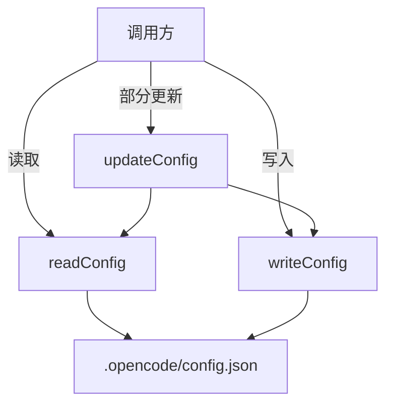

# OpencodeConfigManager

> **源码**: `src/core/config/OpencodeConfigManager.ts`
> **状态**: [DRAFT]

## 概述

OpenCode 配置文件管理器，负责读写当前 vault 的 `.opencode/config.json` 文件。作为配置持久化的底层服务，为 ModelConfigService 和 PluginManagementService 提供统一的配置文件访问接口。处理 JSON 读取、写入、合并和字段级部分更新。

## 导入关系

```text
上游: obsidian (Vault API), src/shared/logger
下游: src/core/config/ModelConfigService, src/core/config/PluginManagementService
```

## 核心类型 / 接口

```typescript
// OpenCode 配置 schema 类型（从 types/opencodeConfig 导入）
interface OpencodeConfig {
  provider?: Record<string, any>;
  model?: Record<string, any>;
  plugin?: any[];
  // ... 其他 OpenCode 配置字段
}

// 部分更新输入类型
type ConfigSubset = Partial<OpencodeConfig>;
```

## 核心逻辑

### 配置文件读写

在 vault 根目录的 `.opencode/config.json` 路径下进行文件操作。使用 Obsidian Vault API 读取文件内容，解析 JSON 后返回结构化配置。写入时执行 JSON 序列化并保持格式化输出。

### 部分更新

支持字段级部分更新：读取当前完整配置，合并传入的部分配置，再写回文件。确保不覆盖未涉及的字段。

## 关键方法

| 方法 | 说明 |
|------|------|
| `readConfig()` | 读取并解析 `.opencode/config.json`，文件不存在时返回空对象 |
| `writeConfig(config)` | 完整写入配置对象到 `.opencode/config.json` |
| `updateConfig(subset)` | 读取当前配置，合并 subset 后写回（部分更新） |

## 数据流



## 与其他模块的交互

- **ModelConfigService**: 委托模型配置的读写操作
- **PluginManagementService**: 委托插件配置的读写操作
- **StorageService**: 不直接交互，配置文件存储在 vault 级别（非 plugin 级别）

## 配置项

配置文件路径固定为 vault 根目录下 `.opencode/config.json`。

## 注意事项

- 配置文件属于 vault 级别资源，与插件级别的 `.obsidian/plugins/opencodian/` 存储位置不同
- 部分更新时必须深合并（deep merge），避免浅覆盖嵌套对象
- 文件不存在时不应报错，应返回空配置对象并允许后续写入
- 与 OpenCode CLI 的配置格式保持兼容

## 待补充

- [ ] 深合并策略的具体实现逻辑
- [ ] 配置 schema 的完整字段列表
- [ ] 错误处理：JSON 解析失败、文件权限问题
- [ ] 是否支持 config.jsonc（JSON with comments）
