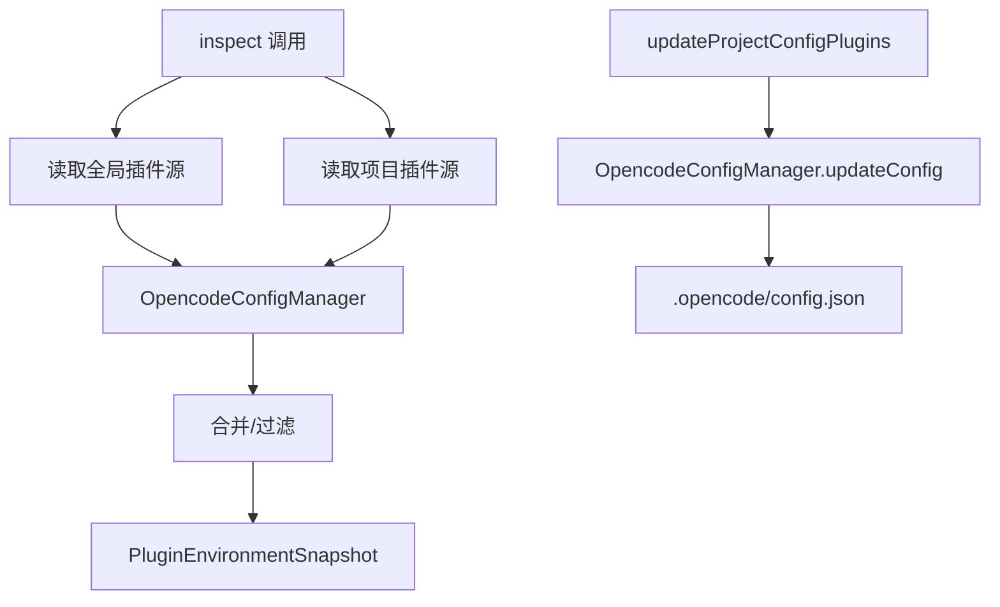

# PluginManagementService

> **源码**: `src/core/config/PluginManagementService.ts`
> **状态**: [DRAFT]

## 概述

OpenCode 插件源管理服务，负责检查和管理当前 vault 的 OpenCode 插件（plugins）配置。提供插件环境的完整快照（全局 + 项目级源），支持项目级插件目录的创建、插件配置的持久化更新，以及 oh-my-opencode (OMO) 配置文件的管理。

## 导入关系

```text
上游: src/core/config/OpencodeConfigManager, src/core/opencode/OpenCodeService, src/shared/logger
下游: src/features/settings/OpenCodianSettings (插件管理 UI)
```

## 核心类型 / 接口

```typescript
// 插件源信息
interface PluginSource {
  name: string;
  source: string;
  enabled?: boolean;
}

// 服务模式与隔离模式
type ServiceMode = ...;
type IsolationMode = ...;

// 插件环境快照
interface PluginEnvironmentSnapshot {
  global: PluginSource[];
  project: PluginSource[];
  // ...
}
```

## 核心逻辑

### 插件环境检查 (inspect)

`inspect(serviceMode, isolationMode)` 构建当前 vault 的完整插件环境快照，包括：
1. 全局插件源（OpenCode 全局配置中的 plugins）
2. 项目级插件源（`.opencode/config.json` 中的 `plugin` 数组）
3. 根据 `serviceMode` 和 `isolationMode` 过滤可见插件

### 项目级插件配置更新

`updateProjectConfigPlugins()` 修改 `.opencode/config.json` 中的 `plugin` 数组，通过 `OpencodeConfigManager` 进行部分更新。

### 目录与配置初始化

- `ensureProjectPluginDirectory()`: 确保 `.opencode/plugins/` 目录存在
- `ensureProjectOmoConfig()`: 确保 `.opencode/oh-my-opencode.jsonc` 配置文件存在

## 关键方法

| 方法 | 说明 |
|------|------|
| `inspect(serviceMode, isolationMode)` | 构建插件环境快照（全局 + 项目级） |
| `updateProjectConfigPlugins(plugins)` | 持久化更新项目级 `plugin` 数组 |
| `ensureProjectPluginDirectory()` | 确保 `.opencode/plugins/` 目录存在 |
| `ensureProjectOmoConfig()` | 确保 `.opencode/oh-my-opencode.jsonc` 存在 |

## 数据流



## 与其他模块的交互

- **OpencodeConfigManager**: 委托所有 `.opencode/config.json` 的读写操作
- **OpenCodeService**: 可能查询服务器端插件状态
- **OpenCodianSettings**: 插件管理 UI 的后端服务，包括全局/项目级源可见性切换
- **pure mode**: 当服务器以 pure 模式运行时，影响插件加载环境

## 配置项

- **插件隔离模式** (`pluginIsolationMode`): 控制全局/项目插件的加载范围
- **pure 模式**: 纯净模式下限制插件源
- **OMO 配置**: `oh-my-opencode.jsonc` 的初始化和管理

## 注意事项

- 更新项目插件配置后，需要重启 OpenCode 服务器才能生效
- `pluginIsolationMode` 的变更需要与 `OpencodeConfigManager` 和服务器环境变量保持同步
- OMO 配置文件使用 JSONC 格式（带注释的 JSON）

## 待补充

- [ ] `inspect` 返回的快照完整字段
- [ ] `serviceMode` 和 `isolationMode` 的枚举值
- [ ] 服务器重启触发的具体机制
- [ ] pure 模式下的插件过滤规则
- [ ] OMO 配置文件的 schema
