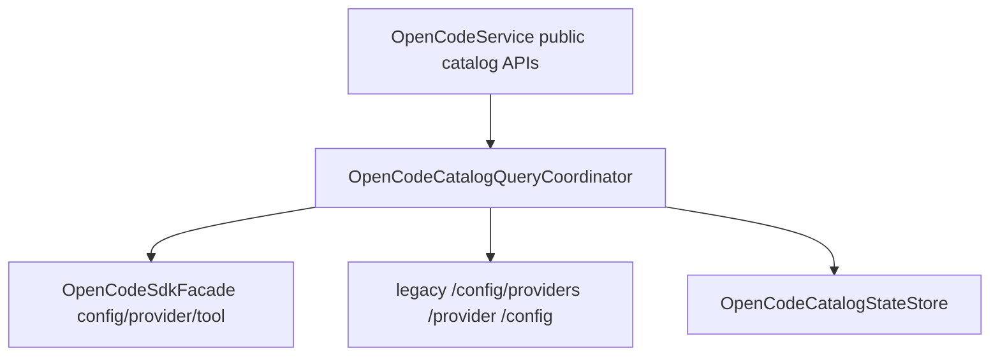

# OpenCodeCatalogQueryCoordinator

> **源码**: `src/core/opencode/OpenCodeCatalogQueryCoordinator.ts`
> **状态**: [REVIEW]

## 概述

`OpenCodeCatalogQueryCoordinator` 是 `OpenCodeService` 内部的 directory-scoped config/tool-catalog owner。它把 provider/model runtime 目录查询、connect-provider 目录查询、resolved model config 读取，以及 tool registry/schema cache 的 transport + scope 生命周期集中到一个较厚 coordinator 中，同时保留 `OpenCodeService` 作为对外 façade。

R36 的目标不是再拆出 `ConfigProvider`、`ToolCatalogCache`、`ProviderDirectoryAdapter` 之类薄层，而是把这组共享目录作用域、SDK-first/legacy fallback、debug logging 与 cache invalidation 语义的查询链收束到一个可以单独推理的边界里。

## 导入关系

```text
上游:
- `../../shared`
- `../types`
- `./OpenCodeCatalogStateStore`
- `./OpenCodeSdkFacade`
- `./types`

下游:
- `src/core/opencode/OpenCodeService`
- 单元测试（经由 `OpenCodeService`）
```

## 核心类型 / 接口

- `OpenCodeCatalogQueryCoordinatorHost`: host seam，提供 `sdkCrud` 开关、SDK facade、legacy GET transport、统一 warning/error logger、调试元数据，以及当前 tool-catalog scope key。
- `OpenCodeCatalogQueryCoordinatorDebugMetadata`: debug log 所需的 `baseUrl`、`vaultPath`、server status 与 managed-server snapshot。
- `OpenCodeCatalogQueryCoordinator`: 当前 owner，集中承接 config/provider/tool catalog 查询与 cache/scope 生命周期。

## 核心逻辑

### Directory-scoped config lookups

coordinator 现在统一承接三条模型目录链路：

- `getAvailableModels()`: SDK `config.providers()` 优先，失败时回退 legacy `/config/providers`，并统一 string-array/object 两种 provider model 形状。
- `getProviderDirectory()`: SDK `provider.list()` 优先，失败时回退 legacy `/provider`，保留 `connected`、`default` 与宽 provider 目录语义。
- `getResolvedModelConfig()`: SDK `config.get()` 优先，失败时回退 legacy `/config`，只提取模型相关配置字段。

这三条链继续共享：

- `includeDirectory` 目录作用域注入
- SDK-first / legacy fallback 语义
- debugReason 调试日志
- 归一化后的 provider/default/config 输出形状

### Tool catalog lifecycle

coordinator 同时承接 tool catalog 的目录作用域状态：

- `refreshToolIds()`：读取 registry tool ids 并写回 `OpenCodeCatalogStateStore`
- `listTools()`：按 `scope::provider::model` 维度读取/缓存 tool schemas
- `clearToolSchemaCacheIfScopeChanged()`：在 vault directory 或 server baseUrl 变化后失效旧 cache
- `buildOpenCodeToolIdentityContext()` / `observeRuntimeToolNames()`：继续复用 `OpenCodeCatalogStateStore` 的 observed tools / registry snapshot，供流式事件和历史 message hydration 使用

这样 tool registry、tool schema cache 与 model/config directory lookup 共用同一个目录作用域 owner，而不是散落在 `OpenCodeService` 主类的多个私有 helper 中。

### Boundaries

本模块刻意不处理：

- MCP status/auth mutation 与 broad query/admin surface（留给 `OpenCodeQueryGateway`）
- session lifecycle / session control / question-permission negotiation
- prompt send/stream finalize orchestration
- `ServerManager` 生命周期与 settings update 决策

它只收束 config/tool-catalog residual seam，并继续通过 host seam 复用 `OpenCodeService` 已有的 transport、日志与 scoped-directory 规则。

## 数据流



## 与其他模块的交互

- `OpenCodeService` 负责创建 coordinator，并把 public façade 保持在服务层。
- `OpenCodeCatalogStateStore` 继续拥有 registry ids、tool schema cache、observed external tools 与 snapshot 构造；coordinator 只集中调用它。
- `OpenCodeSdkFacade` 继续负责 SDK client 创建、auth/directory 注入、response unwrap 与 error normalization；coordinator 不复制这层逻辑。
- `ServerManager` 只通过 host debug metadata / scope invalidation 间接受影响，本轮没有改它的生命周期规则。

## 注意事项

- 不要再把本模块拆成 `ModelsDirectoryLookup`、`ProviderDirectoryLookup`、`ToolCatalogCache` 之类薄 wrapper；R36 明确要求保留较厚 owner。
- `getAvailableModels()` 与 `getProviderDirectory()` 语义不同：前者接近 `opencode models`，后者是 connect-provider 目录总览。
- 目录作用域 cache key 必须继续绑定 `baseUrl` 与 normalized vault directory，避免 stale managed server / stale vault cache 混淆。
- 不要移除 SDK-first / legacy fallback，也不要改变 scoped-directory config semantics 或 public API shape。
