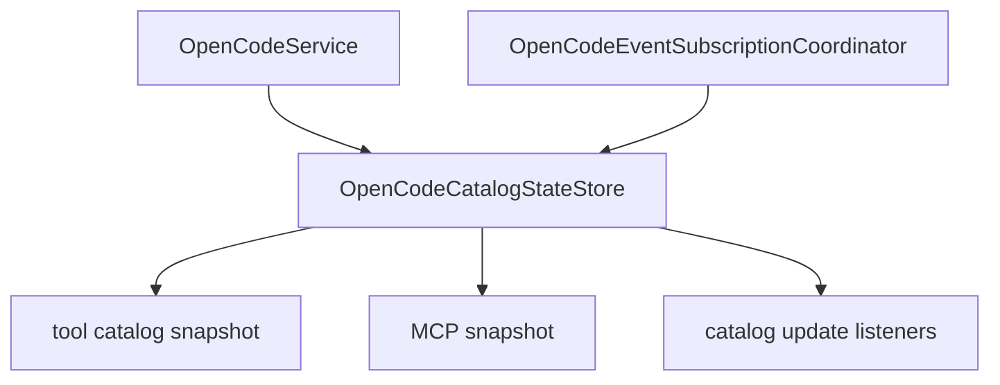

# OpenCodeCatalogStateStore

> **源码**: `src/core/opencode/OpenCodeCatalogStateStore.ts`
> **状态**: [REVIEW]

## 概述

`OpenCodeCatalogStateStore` 是 `OpenCodeService` 内部的 tool/MCP catalog state owner。它把 registry tool ids、tool schema cache、observed external tool names、MCP server status、snapshot 构造，以及 catalog listener lifecycle 收束到一个 store，避免这些缓存与广播逻辑继续散落在主服务里。

store 不负责 SDK 事件订阅本身；它只通过 host seam 告诉 `OpenCodeEventSubscriptionCoordinator` 何时需要保持或释放 open-code event streams。

## 导入关系

```text
上游:
- `../../shared`
- `../../shared/toolIdentity`
- `./types`

下游:
- `src/core/opencode/OpenCodeService`
- 单元测试
```

## 核心类型 / 状态

- `CatalogUpdateListener`: capability snapshot listener，供设置页或视图订阅 tool/MCP catalog 变化。
- `OpenCodeCatalogToolIdentityContext`: 给 `shared/toolIdentity` 使用的 registry/observed tool 集合视图。
- `registryToolIds`: SDK `tool.ids()` 返回的目录级 tool id 集合。
- `toolSchemasByModel`: 以 `scope::provider::model` 为键缓存 `tool.list()` 的 schema 列表。
- `observedExternalToolNames`: 运行时从 stream/event/allowed-tools 中观察到的外部工具集合。
- `mcpServerStatus`: 当前 MCP server status map。
- `toolCatalogUpdatedAt` / `mcpCatalogUpdatedAt`: tool catalog 与 MCP snapshot 的最后更新时间。

## 核心逻辑

### Catalog listener lifecycle

`subscribeToCatalogUpdates()` 会：

1. 注册 listener
2. 通过 host `syncOpenCodeEventSubscriptions()` 让 open-code event runtime 重新对齐 wanted state
3. 立即回放当前 capability snapshot

listener 释放后也会再次触发 `syncOpenCodeEventSubscriptions()`，这样当最后一个 catalog listener 消失时，runtime 可以在没有 open-code event listeners 的情况下停掉 `event` / `global` streams。

### Tool catalog state

- `classifyToolIds()` 复用 `shared/toolIdentity` 的 builtin 判定，把 tool ids 分成 builtin/custom 两组
- `observeRuntimeToolNames()` 只记录非 builtin 的外部工具名，并返回“集合是否变化”
- `updateRegistryToolIds()` 负责规范化 tool ids、更新时间并广播 snapshot
- `updateToolSchemaCache()` 负责按 model scope 写入 schema cache、更新时间并广播 snapshot
- `buildToolIdentityContext()` 统一给历史消息恢复与流式 tool kind 识别提供 registry/observed tools 视图

### MCP state

- `normalizeMcpServerStatusMap()` 过滤并规范化 SDK 返回的 MCP status payload
- `updateMcpServerStatus()` 写入当前 MCP status map、更新时间并广播 snapshot
- `getMcpServerSnapshot()` 负责稳定排序输出，减少订阅侧比较噪音

## 关键方法

| 方法 / 导出 | 说明 |
|-------------|------|
| `subscribeToCatalogUpdates()` | 注册 capability snapshot listener，并同步 open-code event runtime wanted state |
| `hasCatalogUpdateListeners()` | 给 `OpenCodeEventSubscriptionCoordinator` 判断是否还需要保留 SDK event streams |
| `classifyToolIds()` | 按共享 tool identity 规则把 tool ids 分成 builtin/custom |
| `observeRuntimeToolNames()` | 记录外部工具名并返回是否发生集合变化 |
| `updateRegistryToolIds()` | 更新 registry tool ids 并广播 tool catalog snapshot |
| `updateToolSchemaCache()` | 更新 model 级 tool schema cache 并广播 |
| `normalizeMcpServerStatusMap()` | 过滤 SDK MCP status payload，只保留服务层支持的 status shape |
| `updateMcpServerStatus()` | 更新 MCP status map 并广播 |
| `getCapabilitySnapshot()` | 生成 tool catalog + MCP 的组合快照 |
| `emitCatalogUpdate()` | 手动广播当前 capability snapshot |

## 数据流



## 与其他模块的交互

- `OpenCodeService` 保留对外 `refreshToolIds()`、`listTools()`、`refreshMcpServerStatus()`、`subscribeToCatalogUpdates()` 门面，但内部状态读写都委托给本 store。
- `OpenCodeEventSubscriptionCoordinator` 在 `message.updated` / `message.part.updated` / `permission.asked` 时通过 host 观察 runtime tool 名，并在集合有变化时让 store 广播。
- `shared/toolIdentity` 继续负责 builtin / MCP / custom 的最终 kind 判定；store 只提供输入集合，不改变判定规则。

## 配置项

无独立配置项。cache scope key 仍由 `OpenCodeService` 根据 `baseUrl + directory + provider + model` 决定后传入本 store。

## 注意事项

- 不要再把它拆成 `ToolCacheHelper`、`McpStatusHelper` 一类更薄文件；R21 的目标是把 catalog/MCP state 作为一个完整 owner 收口。
- `observeRuntimeToolNames()` 不会自动广播；只有显式 `emitCatalogUpdate()` 或其他 update 方法才会触发 listener，便于调用方保持原有广播时机。
- `clearToolSchemaCache()` 当前只负责 scope 切换时清空 cache，不主动广播；这是为了保持现有 `OpenCodeService` 行为不变。
