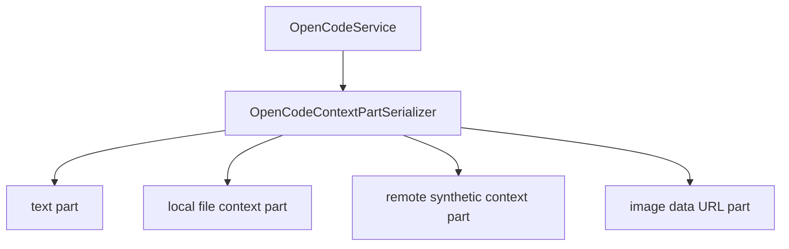

# OpenCodeContextPartSerializer

> **源码**: `src/core/opencode/OpenCodeContextPartSerializer.ts`
> **状态**: [REVIEW]

## 概述

`OpenCodeContextPartSerializer` 是 `OpenCodeService` 内部的 request-part serialization owner。它把用户输入后的 prompt parts 顺序、本地/远程 Obsidian context item 序列化，以及 image data URL part 组装收束到同一个 serializer，避免这些跨平台细节继续铺在主服务里。

serializer 不负责 prompt option assembly，也不负责 SDK/legacy transport 分流；`OpenCodePromptRequestBuilder` 继续负责 `provider/model`、allowed-tools、output-format、reasoning 等 options，`OpenCodeService` 继续决定走 SDK 还是 legacy。

## 导入关系

```text
上游:
- Node `path`
- `../../shared`
- `../../shared/contextPath`
- `../types`
- `./types`
- `./OpenCodePromptRequestBuilder`

下游:
- `src/core/opencode/OpenCodeService`
- 单元测试
```

## 核心类型 / 状态

- `OpenCodeContextPartSerializerHost.isLocalServerMode()`: 暴露当前 server mode，让 serializer 在 local/remote 两种 context 表达之间切换。
- `OpenCodeContextPartSerializerHost.getVaultPath()`: 暴露当前 vault path，供本地模式解析绝对文件路径与生成稳定的 `file://` URL。
- `PromptRequestPart`: 与 `OpenCodePromptRequestBuilder` 共享的 prompt part 结构。
- `REMOTE_CONTEXT_TEXT_LIMIT_BYTES = 64 * 1024`: 远程 synthetic text part 的字节上限，保持既有 guard 语义。

## 核心逻辑

### Prompt part 顺序

`buildPromptRequestParts()` 固定按以下顺序组装：

1. 当前输入文本
2. `contextItems`
3. `images`

`externalContextPaths` 仍然只会被 debug log 记录后忽略，不会重新回到 request payload。

### 本地 context item

local mode 下，serializer 会：

- 用 `resolveContextPath()` + `toFileContextUrl()` 生成 `file` part
- 对 text-like MIME 统一归一化为 `text/plain`
- 在 `selection + textSnapshot` 场景下，把选中文本写入 `source.text`
- 保持 Windows vault path 在非 Windows 平台也能稳定输出 `file:///C:/...` 的既有行为

### 远程 context item

remote mode 下，serializer 会：

- 只接受 text-like MIME
- 要求必须存在 `textSnapshot`
- 用 `TextEncoder` 检查 64 KiB 上限
- 生成带 `synthetic: true` 的 `<obsidian_context ...>` text part，并保留 `kind/path/lines` metadata

### 图片 part

图片 attachment 会被追加成 `data:<mime>;base64,...` 的 `file` part。这样 serializer 同时覆盖 text、context 与 image part 的完整 request-part ownership。

## 关键方法

| 方法 / 导出 | 说明 |
|-------------|------|
| `buildPromptRequestParts()` | 组装输入文本、context items、images 的完整 prompt parts |
| `createPromptContextPart()` | 序列化单个 context item，按 local/remote mode 分流 |

## 数据流



## 与其他模块的交互

- `OpenCodeService` 通过 host seam 暴露当前 `server.mode` 与 `vaultPath`，自己不再直接铺开 context/image serialization 细节。
- `OpenCodePromptRequestBuilder` 与 serializer 通过共享 `PromptRequestPart` 类型协作，但两者边界刻意分离：builder 只管 prompt options，serializer 只管 request parts。
- `shared/contextPath` 和 `shared/obsidianContext` 继续承接跨平台 path 规范化与 `<obsidian_context>` tag 语义，serializer 不重写这些 helper。

## 配置项

无独立配置项。serializer 的行为完全由 host 提供的 server mode、vault path 和调用时的 `QueryOptions` 决定。

## 注意事项

- 不要把它再拆成 `ImagePartBuilder`、`RemoteContextHelper` 之类更薄文件；R23 的目标是把 context/image request-part ownership 收口到一个较厚 owner。
- `buildObsidianContextTag()` 的文本格式、Windows path normalization，以及 remote text-size guard 都是兼容边界，不要在没有专门迁移计划时改动。
- serializer 只负责 request-part assembly；stream runtime、event transform、message normalization 分别留给后续 R24-R26。
