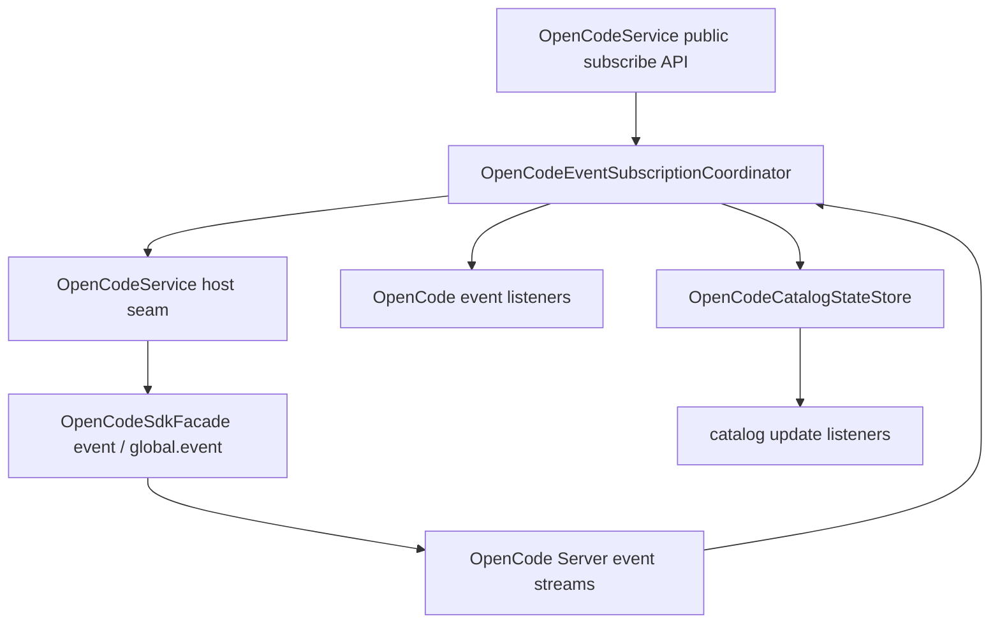

# OpenCodeEventSubscriptionCoordinator

> **源码**: `src/core/opencode/OpenCodeEventSubscriptionCoordinator.ts`
> **状态**: [REVIEW]

## 概述

`OpenCodeEventSubscriptionCoordinator` 是 `OpenCodeService` 内部的 open-code event runtime owner。它把 `event.subscribe()` / `global.event()` 相关的 listener registry、wanted state、双流订阅生命周期，以及 catalog-relevant payload routing 收束到同一个较厚 coordinator，避免这些状态机继续铺在 `OpenCodeService` 主门面里。

它不承接 tool/MCP catalog state 本身；registry tool ids、tool schema cache、MCP server status snapshot 与 catalog listener 现在都在 `OpenCodeCatalogStateStore`。本模块只负责在事件流里触发相应的 runtime 观察与 catalog store 广播。

## 导入关系

```text
上游:
- `../../shared`
- `./sdkTypes`
- `./types`

下游:
- `src/core/opencode/OpenCodeService`
- 单元测试
```

## 核心类型 / 接口

- `OpenCodeEventListener`: 对外转发的 OpenCode SDK event envelope listener。
- `OpenCodeEventSubscriptionCoordinatorHost`: host seam，提供按 source 订阅 SDK events、catalog listener presence、runtime tool 观察、catalog store broadcast、MCP status refresh、日志与 delay。
- `OpenCodeEventSubscriptionCoordinator`: 持有 open-code event listener registry、`event` / `global` 两路订阅状态和 payload routing。

## 核心逻辑

### Listener registry

当前只有 `subscribeToOpenCodeEvents()` 直接注册在本 coordinator。catalog listeners 已迁到 `OpenCodeCatalogStateStore`，但 coordinator 仍会通过 host `hasCatalogUpdateListeners()` 把它们计入 wanted state；只要 open-code listeners 或 catalog listeners 任一存在，就会保持 `event` 与 `global` 两路 SDK 订阅。

### Subscription lifecycle

`ensureSubscriptions()` 只在存在 listener 且当前 source 没有活跃 promise 时启动 loop。`stopSubscriptions(keepWanted)` 在 settings 或 vault scope 切换时只负责中断当前订阅，可选择保留 wanted state。`restartSubscriptions()` 用于受控重启两路 stream，同时保留 listener registry。

每个 source 都维持自己的 `AbortController` 与 promise；某一路结束或失败时只重建该 source，不影响另一条仍在运行的 loop。

### Event routing

coordinator 会兼容 direct payload 和嵌套在 `{ payload }` 里的 SDK envelope payload，并保持原有 catalog-relevant 语义：

- `mcp.tools.changed` → 触发 host `refreshMcpServerStatus()`，由 catalog store 更新 MCP snapshot 并广播
- `message.part.updated` 中的 tool part → 观察 runtime tool 名；若外部工具集合有变化则让 catalog store 广播
- `message.updated` 中的 `info.tools` → 同上
- `permission.asked` → 同上

所有原始 envelope 仍会原样透传给 `OpenCodeService.subscribeToOpenCodeEvents()` 的 listener。

## 关键方法

| 方法 / 导出 | 说明 |
|-------------|------|
| `subscribeToOpenCodeEvents()` | 注册 OpenCode SDK event listener，并按需启动 `event` / `global` loop |
| `hasListeners()` | 供 `OpenCodeService.updateSettings()` 判断是否需要保留 wanted state |
| `ensureSubscriptions()` | 确保双路 OpenCode event 订阅存在 |
| `stopSubscriptions()` | 中断双路订阅，可选择保留 wanted state |
| `restartSubscriptions()` | 在 directory/settings scope 改变时重启订阅 |

## 数据流



## 与其他模块的交互

- `OpenCodeService` 继续作为对外总门面，负责创建 coordinator、创建 `OpenCodeCatalogStateStore`，并提供 host seam。
- `OpenCodeSdkFacade` 仍集中 SDK client options injection；coordinator 不直接创建客户端。
- `OpenCodeCatalogStateStore` 持有 tool schema cache、registry ids、MCP status 与 catalog listeners；coordinator 只在事件流里触发它的更新/广播。

## 配置项

无独立配置项。是否订阅由 listener registry 与 `OpenCodeService` 当前 server/baseUrl scope 决定。

## 注意事项

- 不要把 open-code event listener runtime 再拆成更薄的 service；它仍和 catalog listeners 共享 wanted state 与双路 SDK stream 生命周期。
- 不要在这里重新混入 tool/MCP catalog state store、prompt request builder、streaming runtime 或 message normalization；这些属于相邻 owner 或后续 maintainability queue。
- `refreshMcpServerStatus()` 仍走 host seam，确保 catalog state 更新和对外 API 语义继续留在 `OpenCodeService`。
