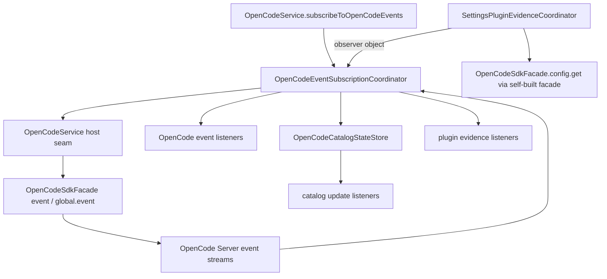

# OpenCodeEventSubscriptionCoordinator

> **源码**: `src/core/opencode/OpenCodeEventSubscriptionCoordinator.ts`
> **状态**: [REVIEW]

## 概述

`OpenCodeEventSubscriptionCoordinator` 是 `OpenCodeService` 内部的 open-code event runtime owner。它把 `event.subscribe()` / `global.event()` 相关的 listener registry、wanted state、双流订阅生命周期，以及 catalog-relevant payload routing 收束到同一个较厚 coordinator，避免这些状态机继续铺在 `OpenCodeService` 主门面里。

它不承接 tool/MCP catalog state 本身；registry tool ids、tool schema cache、MCP server status snapshot 与 catalog listener 现在都在 `OpenCodeCatalogStateStore`。本模块只负责在事件流里触发相应的 runtime 观察与 catalog store 广播。

## 导入关系

```text
上游:
- `../../shared`
- `./sdkTypes`
- `./types`

下游:
- `src/core/opencode/OpenCodeService`
- 单元测试
```

## 核心类型 / 接口

- `OpenCodeEventListener`: 对外转发的 OpenCode SDK event envelope listener（function 形式）。
- `PluginEvidenceListener`: 接收 `PluginEvidenceSnapshot` 的 listener。
- `OpenCodePluginEvidenceObserver`: plugin evidence 的生产入口对象，必须提供 `onPluginEvidence`、`getConnectionSignature` 与 `fetchPluginConfig`；生产代码通过它把 SDK transport 注入 coordinator，而不是通过 host seam。
- `OpenCodeEventSubscriptionInput`: `OpenCodeEventListener` 或 `OpenCodePluginEvidenceObserver` 的并集。
- `OpenCodePluginEvidenceSubscriptionHandle`: plugin evidence 订阅返回的扩展句柄，提供 `getPluginEvidenceSnapshot()` 与 `refreshPluginConfigEvidence()`。
- `PluginEvidenceSnapshot`: 插件证据快照，包含当前 `connectionGeneration`、effective/previous SDK config evidence、fetch state、runtime/stale runtime evidence 与 transport state。
- `PluginEffectiveConfigEvidence`: 最近一次成功通过 `sdk.config.get()` 取到的 normalized `Config.plugin` 数组、获取时间、连接 generation 与 stale 标记。
- `PluginFetchState`: 最近一次 `sdk.config.get()` 刷新状态（`idle` / `ready` / `error`）、尝试时间、尝试开始时的 generation 与错误信息。
- `PluginRuntimeEvidence`: 从 `plugin.added` 事件观察到的单个 runtime plugin id，包含首次/末次观察时间、generation、stale 标记与来源（`event` / `global`）。
- `PluginTransportState`: 当前是否希望捕获事件、哪些 source 处于活跃订阅、capture generation 与 capture 开始时间（nullable）。
- `OpenCodeEventSubscriptionCoordinatorHost`: host seam，提供按 source 订阅 SDK events、catalog listener presence、runtime tool 观察、plugin config fetch、connection signature、catalog store broadcast、MCP status refresh、日志与 delay。`getConnectionSignature` 与 `fetchPluginConfig` 现在只是测试/legacy fallback；生产代码应使用 observer 回调。
- `OpenCodeEventSubscriptionCoordinator`: 持有 open-code event listener registry、`event` / `global` 两路订阅状态、payload routing 与 plugin evidence state。

## 核心逻辑

### Listener registry

`subscribeToOpenCodeEvents()` 接受两种输入：

- function listener：原样接收所有 OpenCode SDK event envelope。
- `OpenCodePluginEvidenceObserver` 对象：提供 `onPluginEvidence`、`getConnectionSignature`、`fetchPluginConfig`，coordinator 会把它注册为 plugin evidence listener 并保留 transport callbacks；返回的 dispose function 同时带有 `getPluginEvidenceSnapshot()` 与 `refreshPluginConfigEvidence()` 两个扩展方法，方便调用方只读/刷新证据。

`subscribeToPluginEvidence()` 保留为内部/测试 seam，直接注册 plugin evidence listener。

catalog listeners 已迁到 `OpenCodeCatalogStateStore`，但 coordinator 仍会通过 host `hasCatalogUpdateListeners()` 把它们计入 wanted state；只要 open-code listeners、plugin-evidence listeners 或 catalog listeners 任一存在，就会保持 `event` 与 `global` 两路 SDK 订阅。

### Subscription lifecycle

`ensureSubscriptions()` 只在存在 listener 且当前 source 没有活跃 promise 时启动 loop。`stopSubscriptions(keepWanted)` 在 settings 或 vault scope 切换时只负责中断当前订阅，可选择保留 wanted state。`restartSubscriptions()` 用于受控重启两路 stream，同时保留 listener registry。

每个 source 都维持自己的 `AbortController` 与 promise；某一路结束或失败时只重建该 source，不影响另一条仍在运行的 loop。

### Event routing

coordinator 会兼容 direct payload 和嵌套在 `{ payload }` 里的 SDK envelope payload，并保持原有 catalog-relevant 语义：

- `mcp.tools.changed` → 触发 host `refreshMcpServerStatus()`，由 catalog store 更新 MCP snapshot 并广播
- `message.part.updated` 中的 tool part → 观察 runtime tool 名；若外部工具集合有变化则让 catalog store 广播
- `message.updated` 中的 `info.tools` → 同上
- `permission.asked` → 同上
- `plugin.added` → 提取 `properties.id` 作为 opportunistic runtime evidence；不构造 `plugin.removed` / `plugin.load-error` 等 SDK 1.18.3 不存在的事件

所有原始 envelope 仍会原样透传给 `OpenCodeService.subscribeToOpenCodeEvents()` 的 listener。

### Plugin evidence

本 coordinator 是 SDK 1.18.3 plugin 相关运行时证据的唯一 owner：

- **Effective config evidence**: 通过 host `fetchPluginConfig()`（即 directory-scoped `sdk.config.get()`）刷新，只 normalize `Config.plugin` 中的 string 与 `[string, Record]` tuple，忽略无效成员，不制造 entry-level load error。多个并发刷新按单调 attempt token 只保留最新一次结果；旧响应完成时不覆盖、不发射 completion 状态。
- **Runtime event evidence**: 仅消费 `plugin.added` 事件中的 `properties.id`；runtime ID 不保证与配置声明相同，因此不与声明做自动关联。
- **Connection generation**: 使用 host `getConnectionSignature()` 的 opaque signature 标记 generation。generation 变化时，旧 effective 与旧 runtime evidence 会标为 stale/previous；runtime ID 在新 generation 重新出现会被视为新的当前证据。`getPluginEvidenceSnapshot()` 每次读取都会观察 generation，因此只读快照也能触发 stale 迁移与 listener 通知。
- **Capture boundary**: `transport.captureGeneration` / `captureStartedAt` 在订阅开始或 rotation 后首个事件到达时设置；rotation 时重置。它只表达“从这个 generation 开始尝试捕获”，不承诺完整性或重放。
- **No replay**: SDK 不保证事件重放。订阅前或断线期间丢失的 `plugin.added` 不会恢复；stale/unknown 状态通过 `stale` 标记与 `captureGeneration` 边界表达，而不是伪造 loaded truth。
- **Defensive snapshots**: `getPluginEvidenceSnapshot()` 与 listener callback 返回深拷贝；每次 listener 调用获得独立快照，一个 listener 的修改不会影响另一个 listener 或 coordinator 状态。

## 关键方法

| 方法 / 导出 | 说明 |
|-------------|------|
| `subscribeToOpenCodeEvents()` | 注册 function listener 或 `OpenCodePluginEvidenceObserver` 对象；对 observer 返回的 dispose function 附带 `getPluginEvidenceSnapshot()` / `refreshPluginConfigEvidence()` |
| `subscribeToPluginEvidence()` | 注册 plugin evidence listener，并计入 wanted state（内部/测试 seam） |
| `getPluginEvidenceSnapshot()` | 返回当前 plugin evidence 的防御性快照 |
| `refreshPluginConfigEvidence()` | 通过 observer 或 host fallback 刷新 directory-scoped `sdk.config.get()` 证据 |
| `hasListeners()` | 供 `OpenCodeService.updateSettings()` 判断是否需要保留 wanted state |
| `ensureSubscriptions()` | 确保双路 OpenCode event 订阅存在 |
| `stopSubscriptions()` | 中断双路订阅，可选择保留 wanted state |
| `restartSubscriptions()` | 在 directory/settings scope 改变时重启订阅 |

## 数据流



## 与其他模块的交互

- `OpenCodeService` 继续作为对外总门面，负责创建 coordinator、创建 `OpenCodeCatalogStateStore`，并提供 host seam。Service 不再暴露独立的 plugin evidence 公开方法；Settings 侧通过既有 `subscribeToOpenCodeEvents` 传入 observer 对象来接入。
- `OpenCodeSdkFacade` 仍集中 SDK client options injection；coordinator 不直接创建客户端。生产代码中 plugin evidence 的 directory-scoped `config.get()` 与 connection signature 由 `SettingsPluginEvidenceCoordinator` 自行构建 facade 后通过 observer 回调注入。
- `OpenCodeCatalogStateStore` 持有 tool schema cache、registry ids、MCP status 与 catalog listeners；coordinator 只在事件流里触发它的更新/广播。

## 配置项

无独立配置项。是否订阅由 listener registry 与 `OpenCodeService` 当前 server/baseUrl scope 决定。

## 注意事项

- 不要把 open-code event listener runtime 再拆成更薄的 service；它仍和 catalog listeners、plugin-evidence listeners 共享 wanted state 与双路 SDK stream 生命周期。
- 不要在这里重新混入 tool/MCP catalog state store、prompt request builder、streaming runtime 或 message normalization；这些属于相邻 owner 或后续 maintainability queue。
- `refreshMcpServerStatus()` 仍走 host seam，确保 catalog state 更新和对外 API 语义继续留在 `OpenCodeService`。
- Plugin evidence 不执行本地声明匹配，也不把 runtime ID 与 `PluginManagementService` 的声明条目关联；UI 层如需合并展示，应在更高层根据确定证据显式处理，不能在本 coordinator 假设对应关系。
- 当前 SDK 1.18.3 只暴露 `plugin.added` 作为 plugin runtime 事件；不要在本模块发明 `plugin.removed` 或 `plugin.load-error`。
- 远程模式下 `refreshPluginConfigEvidence()` 只读 `sdk.config.get()`，不会调用 `sdk.config.update()`；任何 local declaration 的写入仍由 `PluginManagementService` 与 `OpencodeConfigManager` 负责。
