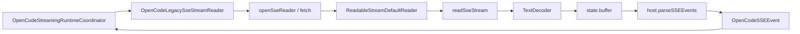

# OpenCodeLegacySseStreamReader

> **源码**: `src/core/opencode/OpenCodeLegacySseStreamReader.ts`
> **状态**: [REVIEW]

## 概述

`OpenCodeLegacySseStreamReader` 是 legacy `/event` SSE 传输的协议边界所有者。它封装了 SSE reader 的完整生命周期——从 fetch 打开连接、到逐块读取、buffer 缓冲、事件解析、直到 abort/dispose 清理——把这些低层协议细节从 `OpenCodeStreamingRuntimeCoordinator` 中剥离出来。

本模块只负责 SSE 协议层面的读取与解析，不涉及事件语义转换、stream mutation 应用、或 active stream registry 管理。那些职责继续留在 `OpenCodeStreamingRuntimeCoordinator` 及其下游的 `OpenCodeStreamEventTransformer` 中。

## 导入关系

```text
上游:
- `../../shared` (logger)
- `./OpenCodeStreamEventTransformer` (OpenCodeSSEEvent 类型)

下游:
- `src/core/opencode/OpenCodeStreamingRuntimeCoordinator.ts`
- `tests/unit/core/opencode/OpenCodeLegacySseStreamReader.test.ts`
```

## 核心类型 / 接口

- `OpenCodeLegacySseStreamReaderHost`: reader 所需的 host seam，只暴露两件事：
  - `getLegacyEventStreamRequest()` —— 返回 SSE fetch 的 URL 与 headers
  - `parseSSEEvents(buffer)` —— 把原始 buffer 切成完整 SSE events + 剩余未解析文本
- `OpenCodeSseStreamContext` (内部): 单条 SSE 连接的运行时上下文，包含 reader、decoder、signal、read state、abort handler
- `OpenCodeSseReadState` (内部): 读取状态，记录 `aborted` 标记与当前 `buffer`

## 核心逻辑

### SSE 连接生命周期

- `connectSSE(signal?)` 是唯一的公共入口。它按以下顺序执行：
  1. `createSseStreamContext()` —— 如果 signal 已 aborted，立即返回 null；否则调用 `openSseReader()` 建立 fetch 连接，创建 read state，注册 abort handler
  2. `readSseStream()` —— 循环读取并解码 chunk，直到 stream 结束或 abort
  3. `disposeSseStreamContext()` —— 在 finally 中移除 abort listener、释放 reader lock

### Fetch 与 Reader 打开

- `openSseReader(signal)` 使用 host 提供的 URL/headers 发起 `fetch(GET, signal)`
- 如果 response 非 OK 或无 body，立即抛错
- 返回 `response.body.getReader()`，后续所有读取都通过此 reader

### 分块读取与缓冲

- `readNextSseTextChunk()` 先检查 `shouldStopSseStream()`，然后调用 `readSseChunk()` 读取下一个 Uint8Array chunk，再用 `TextDecoder` 解码为文本
- 解码后的文本追加到 `state.buffer`
- `readSseChunk()` 把 reader 抛错统一转为 `isAbortedSseRead()` 判断；如果是 abort 场景则返回 null，不向上抛异常

### 事件解析与 tail flush

- `emitParsedSseEvents()` 委托 host 的 `parseSSEEvents()` 解析当前 buffer，yield 所有完整事件，然后把剩余未解析文本写回 `state.buffer`
- `flushRemainingSseEvents()` 在 stream 结束时检查 buffer：如果有残留文本且未 abort，追加 `\n\n` 后再次解析，确保最后一个不完整的 SSE event 也能被 flush 出来

### Abort / Cancel 语义

- `createSseAbortHandler()` 返回的 handler 在 signal abort 时：
  1. 把 `state.aborted` 设为 true
  2. 调用 `reader.cancel()` 尝试中断正在进行的读取
- `shouldStopSseStream()` 检查 `state.aborted || signal?.aborted`
- `isAbortedSseRead()` 在此基础上还捕获 `Error.name === 'AbortError'` 的异常，作为兜底

## 关键方法

| 方法 | 说明 |
|------|------|
| `connectSSE(signal?)` | 公共入口：建立 SSE 连接并 yield 解析后的事件 |
| `openSseReader(signal?)` | 发起 fetch，返回 response body reader |
| `readSseStream(context)` | 主读取循环：解码 → 缓冲 → 解析 → yield |
| `flushRemainingSseEvents(context)` | EOF 时 flush buffer 中残留的最后一个事件 |
| `createSseAbortHandler(reader, state)` | 创建 abort signal 的 handler |

## 数据流



## 与其他模块的交互

- `OpenCodeStreamingRuntimeCoordinator` 在 `consumeLegacyEventStream()` 中调用 `legacyReader.connectSSE(signal)` 获取事件流，然后继续负责事件转换、mutation 应用、和 finalization
- `OpenCodeStreamEventTransformer` 提供 `parseSSEEvents()` 实现，reader 只负责调用它，不内嵌解析逻辑
- `OpenCodeStreamingRuntimeCoordinatorHost` 的 `getLegacyEventStreamRequest()` 继续提供 URL/headers，reader 只是消费方

## 配置项

无。

## 注意事项

- 不要把 event → StreamChunk 的语义转换搬回本模块；那是 `OpenCodeStreamEventTransformer` 和 `OpenCodeStreamingRuntimeCoordinator` 的职责
- `releaseLock()` 必须在 finally 中执行，否则 reader 会保持 locked 状态导致后续连接失败
- `flushRemainingSseEvents` 追加 `\n\n` 再解析的行为是为了兼容最后一个 event 没有空行结尾的情况；这个行为必须与 `OpenCodeStreamEventTransformer.parseSSEEvents()` 的实现保持一致
- abort handler 中 `void reader.cancel()` 是 best-effort；某些运行时的 `cancel()` 可能不会立即中断正在进行的 `read()` Promise，因此 `isAbortedSseRead()` 的兜底判断很重要
