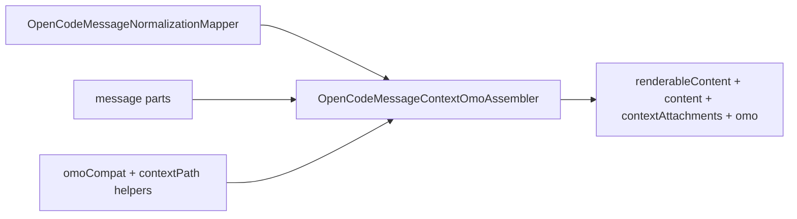

# OpenCodeMessageContextOmoAssembler

> **源码**: `src/core/opencode/OpenCodeMessageContextOmoAssembler.ts`
> **状态**: [REVIEW]

## 概述

`OpenCodeMessageContextOmoAssembler` 是 `OpenCodeMessageNormalizationMapper` 邻近的 context/OMO owner。它负责：

- 从 hydrated OpenCode message parts 收束 renderable text 与 `contextAttachments`
- 统一解析 Obsidian context tag、`file` part 与 inline Read tool 文本里的上下文引用
- 对 user message 的原生 `agent` part 按 `source.value/start/end` 恢复 `@agent` 可见文本，避免发送侧去除 text fallback 后 hydration 丢失 mention
- 把 OpenCode 原生 `compaction` part 归一化为结构化 `compactionDivider` 元数据（`auto`, `overflow`, `tailStartId`），并隐藏 `metadata.compaction_continue` synthetic follow-up
- 对 attachment 路径、行号和 MIME 做跨平台归一化与去重
- 识别 OMO user injection / system reminder metadata，并产出 mapper 继续组装 `ChatMessage` 所需的显示字段

它不负责 tool/content block 组装、question request 归一化或 session/runtime transport；这些仍留在 `OpenCodeMessageNormalizationMapper` 与 `OpenCodeService`。

## 导入关系

```text
上游:
- `../../shared`
- `../../shared/contextPath`
- `../types`
- `./omoCompat`

下游:
- `src/core/opencode/OpenCodeMessageNormalizationMapper.ts`
- `tests/unit/core/opencode/OpenCodeMessageNormalizationMapper.test.ts`
```

## 核心逻辑

### `assemble()`

- 先收集 message parts 中可见文本与 context attachments
- 对 user message 额外补充 `file` part 与 inline Read tool context
- 在保持 pre-OMO `renderableContent` 的同时，生成 UI 使用的 `content` / `displayStyle` / `noticeTone` / `omo` / `compactionDivider`
- 对重复 attachment 按 kind/path/line-range 去重

### Context attachment 收集

- `normalizeTextPart()` 处理普通文本、Obsidian context tag 与 synthetic inline Read 恢复
- `normalizeTextPart()` 现在也会过滤 `metadata.compaction_continue === true` 的内部续跑 user text，避免 transcript 泄露“Continue...”提示
- `normalizeTextPart()` 对 `metadata.kind === 'skill-expansion'` 的 synthetic part 直接返回 `{ attachments: [] }`（无 visibleText），使 skill 展开内容在用户消息渲染中隐藏——AI 可见但 UI 不显示
- `collectAgentSourceSpans()` / `restoreAgentMentionSourceText()` 只在 user message 上运行，按原始 source span 把 native `agent` part 的 `@agent` 文本补回 hydrated visible content；如果 text part 已经包含该 mention，则不会重复插入
- `parseFileContextAttachment()` 统一处理 `file` part 的 path/url/line-range/mime/textSnapshot
- `extractInlineReadToolContext()` 从历史 Read tool 文本中恢复 file/selection attachment，并剥离用户可见文本
- `collectRenderableTextState()` 现在把 user `compaction` part 投影成结构化 `compactionDivider` 元数据（`auto`, `overflow`, `tailStartId`），不再生成 plain-text marker

### OMO 归一化

- `normalizeOmoContent()` 通过 `detectOmoMessageMeta()` 识别 user injection 与 system reminder
- system reminder 会映射到 `notice` / `info` 展示语义
- user injection 会恢复原始用户文本，避免 UI 暴露内部注入头

## 数据流



## 与其他模块的交互

- `OpenCodeMessageNormalizationMapper` 保留公开 hydration 入口，但把 context/OMO 装配委托给本 owner。
- `shared/contextPath` 与 `shared` 中的 context helpers 提供路径、行号与 MIME 归一化能力。
- `omoCompat` 提供 OMO metadata 识别；本模块只负责把结果映射到 `ChatMessage` 兼容字段。

## 注意事项

- 本模块仍不直接返回完整 `ChatMessage`；它只扩展 mapper 继续消费的局部显示语义。
- inline Read tool 文本剥离与 Windows path 归一化属于历史兼容边界，变更前应补 focused tests。
- tool/content seam 仍留在 `OpenCodeMessageNormalizationMapper.ts`；不要把两条责任线重新混在一起。
