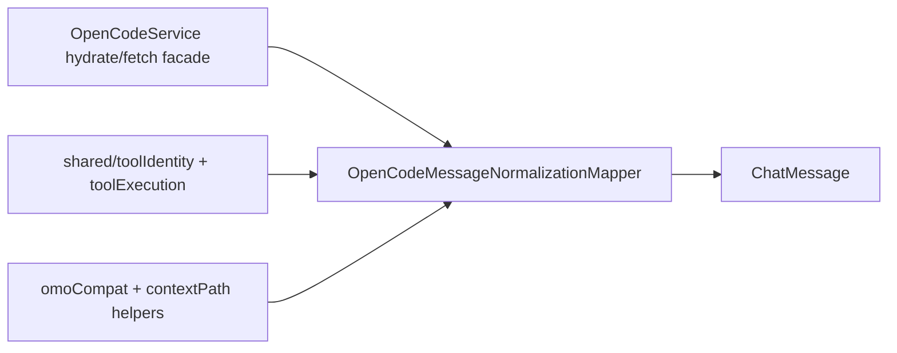

# OpenCodeMessageNormalizationMapper

> **源码**: `src/core/opencode/OpenCodeMessageNormalizationMapper.ts`
> **状态**: [REVIEW]

## 概述

`OpenCodeMessageNormalizationMapper` 是 `OpenCodeService` 内部的消息归一化 owner。它负责：

- 把 OpenCode persisted message + parts 归一化成 UI 使用的 `ChatMessage`
- 统一 question request / prompt 的结构化归一化
- 统一历史消息里的 tool identity 判断，保持 builtin / MCP / custom 语义和流式路径一致
- 从用户消息里提取 `contextAttachments`，并识别 OMO 注入 / system reminder metadata

它不负责 message fetch、session CRUD、transport、stream lifecycle 或 tool catalog state；这些仍留在 `OpenCodeService` 及相邻 coordinator/store。

## 导入关系

```text
上游:
- `../../shared`
- `../../shared/contextPath`
- `../types`
- `./OpenCodeCatalogStateStore`
- `./omoCompat`

下游:
- `src/core/opencode/OpenCodeService.ts`
- `tests/unit/core/opencode/OpenCodeMessageNormalizationMapper.test.ts`
```

## 核心逻辑

### `normalizeQuestionRequest()`

- 校验 `id` / `sessionID`
- 逐条裁剪 `question`、`header`、`options`
- 丢弃空问题和空 option label
- 保持 `multiple` / `custom` 的既有默认语义

### `openCodeMessageToChatMessage()`

- 先通过文件内的 tool/content seam 收束 renderable `tool` parts、pending `toolCalls`、历史 `tool_use` block 与 `contentBlocks` 装配
- 为 assistant message 生成 `modelId`
- 用 `shared/toolExecution` + `shared/toolIdentity` 归一化 `toolCalls` 与历史 `tool_use`
- 过滤内部 `structured_output` tool，同时保留 assistant `structured` payload

### Context attachment 与 OMO

- 识别三种上下文来源：Obsidian context tag、`file` part、inline Read tool 记录
- 对路径与行号统一走 `shared/contextPath` / `parseLineRangeFromFileUrl()` 做跨平台归一化
- 对重复 attachment 按 kind/path/line-range 去重
- 通过 `detectOmoMessageMeta()` 识别 user injection 和 system reminder，并写回 `displayStyle` / `noticeTone` / `omo`

## 数据流



## 与其他模块的交互

- `OpenCodeService` 继续保留 `openCodeMessageToChatMessage()` / `hydrateOpenCodeMessage()` 的公共入口，但实现委托给 mapper。
- `OpenCodeStreamEventTransformer` 通过 service host seam 复用同一个 question normalization 与 tool kind 规则，避免流式/历史路径分叉。
- `OpenCodeCatalogStateStore` 提供 `OpenCodeCatalogToolIdentityContext`，让历史 hydration 在 catalog 可用时准确区分 custom / MCP。
- tool/content seam 只负责 renderable tool part collection、pending tool-call assembly、thinking/tool/text content block 拼装；context attachment 与 OMO 归一化仍留在 mapper 主 owner。

## 注意事项

- 不要在这里改 `ChatMessage` 形状；调用方和测试都依赖现有 schema。
- 不要把 tool icon / summary 规则搬回 UI；这里只产出结构化 `toolKind` / `toolSourceKey`。
- inline Read tool 文本剥离和 Windows path 归一化是历史兼容边界，修改前应补 focused tests。
