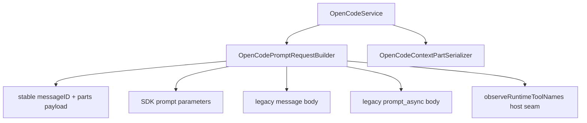

# OpenCodePromptRequestBuilder

> **源码**: `src/core/opencode/OpenCodePromptRequestBuilder.ts`
> **状态**: [REVIEW]

## 概述

`OpenCodePromptRequestBuilder` 是 `OpenCodeService` 内部的 prompt option assembly owner。它把稳定 `messageID + parts[]` send payload、SDK prompt parameters、legacy request body、allowed-tools / output-format / variant / reasoning 映射，以及默认 provider/model 选择收束到同一个 builder，避免这些请求拼装细节继续散落在主服务里。A2 之后它也负责给显式代理调用生成稳定 part id：`agent` 与 `subtask` parts 会和普通 text/file parts 一起进入同一批 payload cloning 逻辑。

builder 不负责 transport 分流，也不负责 context/image request part 序列化；`OpenCodeService` 仍决定走 SDK 还是 legacy，而 request-part assembly 现在由相邻的 `OpenCodeContextPartSerializer` 负责。

## 导入关系

```text
上游:
- `../../shared`
- `./sdkTypes`
- `./types`

下游:
- `src/core/opencode/OpenCodeService`
- 单元测试
```

## 核心类型 / 状态

- `PromptRequestPart`: prompt 请求里的 text/file/agent/subtask part 结构，包含可选稳定 `id`，供 `OpenCodeContextPartSerializer`、`AgentInvocationService` 与 builder 共享。
- `PromptSyntheticTextPartInput`: 供插件 hook / reminder / 其他注入层传入的“附加 synthetic text part”输入；builder 会统一补上 `synthetic: true` 与稳定 `part.id`。
- `BuiltPromptSendPayload`: 发送层共享的结构化 payload，集中持有稳定 `messageID`、transport `requestParts` 与 optimistic seed `optimisticUserParts`。
- `PromptRequestOptions`: `QueryOptions` 加上可选 `system` 的 prompt 组装输入。
- `host.getDefaultModelSelection()`: 提供当前默认 `providerID` / `modelID`，让 builder 不直接持有 settings 副本。
- `host.createPromptEntityId()`: 生成稳定 `message` / `part` id；当前会使用 OpenCode 兼容的 `msg_*` / `prt_*` 前缀，避免 optimistic seed 与 transport 各自临时造号，并满足服务端对 prompt id 格式的校验。
- `host.observeRuntimeToolNames()`: 在 allowed-tools 装配阶段把 runtime 外部工具名交回 `OpenCodeService` / `OpenCodeCatalogStateStore` 观察。

## 核心逻辑

### 默认模型选择

builder 统一处理 `provider` / `model` 覆盖与 settings 默认值回退：

- 显式 `options.provider` / `options.model` 优先
- 否则回退到 host 暴露的默认 provider/model

这样 `requestAssistantResponse()`、legacy `prompt_async` 与 SDK `prompt/promptAsync` 不再各自重复写一遍默认模型选择逻辑。

### Shared prompt options 归一化

`buildSharedPromptOptions()` 会统一规范化：

- `allowedTools` -> `{ [toolName]: true }`
- `reasoningEffort` -> `variant`
- `system` / `agent` 的 trim
- `noReply` 布尔透传
- `format` 的 text / json_schema 结构克隆

### SDK 与 legacy payload 装配

- `buildSdkPromptParameters()` 负责 SDK `session.prompt()` / `promptAsync()` 参数；发送路径会把稳定 `messageID` 一并写入 SDK payload，并保持 `thinkingBudget` 继续只记 debug log、不写进 SDK payload。
- `buildLegacyMessageRequestBody()` 负责 `/session/:id/message` 的非流式 legacy body，保持不写 `model.options` 的现有语义。
- `buildLegacyStreamRequestBody()` 负责 `/session/:id/prompt_async` 的 legacy 流式 body；发送路径同样会透传稳定 `messageID`，并继续把 `reasoningEffort` 和 `thinkingBudget` 写进 `model.options`。

### 稳定 send payload

- `buildStructuredPromptSendPayload()` 会先为用户消息生成稳定 `messageID`
- 每个 text/file/agent/subtask request part 也会在这里拿到稳定 `part.id`
- `invocationParts` 会在普通 request parts 之后、synthetic text parts 之前并入最终 payload，保持显式代理调用仍属于同一条用户消息的 stable part truth
- 若调用方额外提供 `syntheticTextParts`，builder 会把它们追加成结构化 synthetic text parts，而不是要求上游把注入文本直接拼回 user content string
- builder 会复制出两份 part 数组：一份给 SDK/legacy transport，一份给 optimistic canonical seed
- 两份 part 共享同一批稳定 id，但不会共享同一对象引用，避免后续 mutation 泄漏

## 关键方法

| 方法 / 导出 | 说明 |
|-------------|------|
| `buildSdkPromptParameters()` | 组装 SDK prompt / promptAsync 参数 |
| `buildLegacyMessageRequestBody()` | 组装 legacy 非流式 `/message` body |
| `buildLegacyStreamRequestBody()` | 组装 legacy 流式 `/prompt_async` body |
| `buildStructuredPromptSendPayload()` | 生成稳定 `messageID + parts[]` 的发送层共享 payload |
| `PromptRequestPart` | 给服务层 request-part serialization 复用的 prompt part 类型 |
| `PromptSyntheticTextPartInput` | 给插件注入 synthetic text part 的稳定输入类型 |

## 数据流



## 与其他模块的交互

- `OpenCodeService` 仍持有对外 `requestAssistantResponse()` / `sendMessage()` / `sendMessageWithSdk()` 门面，但 prompt option assembly 与稳定 send payload 组装已统一委托给 builder。
- `OpenCodeCatalogStateStore` 继续通过 `observeRuntimeToolNames()` 收集 runtime 外部工具名；builder 只负责在 allowed-tools 组装时触发观察。
- `OpenCodeContextPartSerializer` 负责 request parts；builder 与它共享 `PromptRequestPart`，并在 serializer 之后补上稳定 `messageID` / `part.id`。
- `AgentInvocationService` 负责把聊天意图翻成 `agent` / `subtask` native parts；builder 只负责把这些 part 纳入稳定 payload 并 clone。

## 配置项

无独立配置项。builder 通过 host seam 读取 `OpenCodeService` 当前 settings 默认模型选择。

## 注意事项

- 不要把它重新拆成 `AllowedToolsHelper`、`OutputFormatHelper` 之类更薄文件；R22 的目标是把 prompt option assembly 收口到一个较厚 owner。
- SDK 路径对 `thinkingBudget` 的“只记录 debug log、不入 payload”行为是刻意保留的兼容边界。
- legacy `/message` 与 `/prompt_async` 对 `model.options` 的差异也是兼容语义，不要在没有专门迁移计划时擅自统一。
