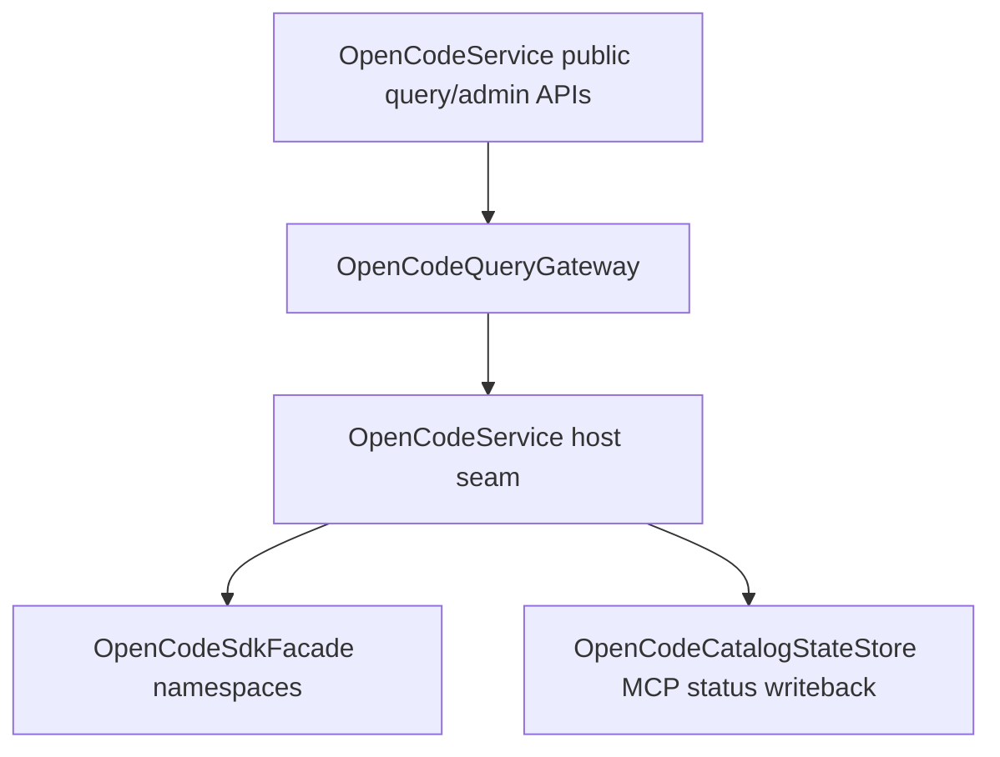

# OpenCodeQueryGateway

> **源码**: `src/core/opencode/OpenCodeQueryGateway.ts`
> **状态**: [REVIEW]

## 概述

`OpenCodeQueryGateway` 是 `OpenCodeService` 内部的 broad query/admin owner。它把 provider auth、project/file/find/path/VCS/formatter/LSP 查询，以及 MCP status/server/auth 管理收束到同一个较厚 gateway 中，让 `OpenCodeService` 继续保留对外 façade，而不再直接铺开这组 SDK-only wrapper。

这个模块刻意保持为单一 owner：R31 的目标不是给每个 SDK namespace 增加一个薄 provider，而是把这组低状态、广域查询入口集中到一个可测试边界里。

## 导入关系

```text
上游:
- `./types`

下游:
- `src/core/opencode/OpenCodeService`
- 单元测试
```

## 核心类型 / 接口

- `OpenCodeMcpSdk`: gateway 依赖的最小 MCP SDK 面，覆盖 status、add/connect/disconnect 与 auth start/callback/authenticate/remove。
- `OpenCodeProviderSdk`: provider auth 与 OAuth authorize/callback 的最小 SDK 面。
- `OpenCodeProjectSdk` / `OpenCodeFileSdk` / `OpenCodeFindSdk` / `OpenCodePathSdk` / `OpenCodeVcsSdk` / `OpenCodeFormatterSdk` / `OpenCodeLspSdk`: query/admin namespaces 的最小 SDK 面。
- `OpenCodeQueryGatewayHost`: host seam，提供上述 SDK namespace getter、MCP status normalization，以及写回 `OpenCodeCatalogStateStore` 的入口。
- `OpenCodeQueryGateway`: 当前 owner，集中实现 broad query/admin 公开方法。

## 核心逻辑

### MCP status and auth

gateway 现在统一承接 MCP status 与 auth 侧的状态写回：

- `refreshMcpServerStatus()` / `addMcpServer()`：读取 SDK 响应后，通过 host 的 `normalizeMcpServerStatusMap()` 与 `updateMcpServerStatus()` 写回 catalog snapshot。
- `connectMcpServer()` / `disconnectMcpServer()`：执行 SDK mutation 后刷新 MCP status，并保持旧语义：只有 SDK 返回严格 `true` 时才返回 `true`。
- `startMcpAuth()` / `completeMcpAuth()` / `authenticateMcp()` / `removeMcpAuth()`：集中处理 auth start/callback/authenticate/remove，并保留单 server auth 结果的 fallback `{ status: 'failed', error: 'Unknown MCP auth result' }`。

这样 MCP catalog 写回不再散落在 `OpenCodeService` 主类里，同时仍然复用 `OpenCodeCatalogStateStore` 作为 snapshot owner。

### Broad query/admin wrappers

gateway 同时承接以下 SDK-only query/admin surface：

- provider auth 与 OAuth authorize/callback
- project list/current/init-git/update
- file list/read/status
- find text/files/symbols
- path get
- VCS get/diff
- formatter status
- LSP status

这些方法保持原有输入与返回语义，不增加新的 fallback 层，也不把调用方改成直接依赖 gateway；上层仍然只调用 `OpenCodeService`。

### Boundary and validation

本模块刻意不处理：

- session lifecycle / session control / question-permission negotiation
- SDK facade 的 auth/directory 注入、response unwrap 或 error normalization
- `ServerManager` 生命周期
- model catalog / provider directory / resolved config 的 SDK-vs-legacy fallback

这些边界分别留在已经存在的 coordinator、hub、facade、manager 或 `OpenCodeService` transport seam 中。

## 数据流



## 与其他模块的交互

- `OpenCodeService` 继续作为对外总门面，负责创建 gateway 并提供 SDK namespace 与 MCP catalog host seam。
- `OpenCodeCatalogStateStore` 仍然拥有 MCP server snapshot 的 normalization/writeback；gateway 只集中调用这组 host 方法。
- `OpenCodeSdkFacade` 继续负责 SDK namespace creation、auth/directory injection、response unwrap 与 error normalization；gateway 不复制这些底层职责。

## 注意事项

- 不要把本模块再拆成 `ProviderGateway` / `FileGateway` / `McpAuthGateway` 之类薄 façade；R31 明确要求只有在形成较厚 owner 时才执行。
- MCP status/auth mutation 后的 catalog refresh 语义需要保持一致，避免 UI 看到 stale MCP snapshot。
- 如果未来某个 query namespace 需要 legacy fallback，应先判断是否仍属于这个 broad gateway；不要把 fallback 分支重新铺回 `OpenCodeService` 主类。
