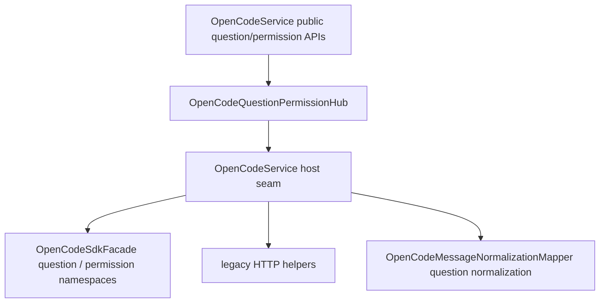

# OpenCodeQuestionPermissionHub

> **源码**: `src/core/opencode/OpenCodeQuestionPermissionHub.ts`
> **状态**: [REVIEW]

## 概述

`OpenCodeQuestionPermissionHub` 是 `OpenCodeService` 内部的 question / permission negotiation owner。它把 pending questions/reply/reject、pending permissions/respond，以及 session-scoped permission responder 收束到同一个较厚 hub 中，让 `OpenCodeService` 退回为 SDK/legacy host seam 与对外 façade。

它不改变外部 API；上层仍然通过 `OpenCodeService.getPendingQuestions()`、`replyToQuestion()`、`getPendingPermissions()`、`respondToPermission()`、`respondToSessionPermission()` 访问这条协商链路。

## 导入关系

```text
上游:
- `../../shared`
- `../types`

下游:
- `src/core/opencode/OpenCodeService`
- 单元测试
```

## 核心类型 / 接口

- `OpenCodeQuestionSdk`: hub 依赖的最小 question SDK 面，覆盖 list/reply/reject。
- `OpenCodePermissionSdk`: hub 依赖的最小 permission SDK 面，覆盖 list/reply/respond。
- `OpenCodeQuestionPermissionHubHost`: host seam，提供 `sdkQuestions` / `sdkCrud` 开关、SDK namespace、legacy HTTP helper、question mapper 与 warning/error 日志。
- `OpenCodeQuestionPermissionHub`: 当前 owner，集中实现 question / permission negotiation 公开方法。

## 核心逻辑

### Question negotiation

hub 现在统一承接：

- `getPendingQuestions()`：先按 `sdkQuestions` 尝试 SDK `question.list()`，失败后回退 legacy `/question`，并统一通过 mapper 归一化 question request。
- `replyToQuestion()` / `rejectQuestion()`：保持现有 SDK→legacy fallback 语义，不在 `OpenCodeService` 主类里重复铺开 transport 分支。question mutation 会对保守识别的 transient request failure 做最多 2 次额外尝试；如果仍失败，最终错误会原样抛给上层 Notice / error path。

这样 question request 的 list/reply/reject 共享一套 host seam、warning 日志与 normalization 入口，不再散落在主服务中。

### Permission negotiation

同一个 hub 也承接 permission 侧的交互式协商：

- `getPendingPermissions()`：按 `sdkCrud` 选择 SDK `permission.list()` 或 legacy `/permission`，兼容 `Array` 与 `{ data }` 两种返回形状，并过滤成稳定的 `PermissionRequest` 形状。
- `respondToPermission()`：保持现有“`sdkCrud` 启用时走 SDK reply，否则走 legacy `/permission/:id/reply`”的语义，同时保留 mutation 失败时直接抛错；插件本地 `session` reply 会在这里映射为 OpenCode wire value `always`。
- `respondToSessionPermission()`：继续走 SDK session permission responder，但由同一个 owner 收口 permission responder surface，并复用相同的 reply wire-value 映射。

这让 pending/session permissions 与 question negotiation 留在同一个 owner 中，避免再分裂成两个过薄模块。

### Boundary and validation

hub 当前还负责两类轻量过滤：

- question list 会统一兼容 array 与 `{ data }` 两种返回形状，再借助 host mapper 过滤掉无效 request。
- permission list 会统一兼容 `Array` / `{ data }` 返回形状，过滤掉缺少 `id` / `sessionID` / `permission` 的无效项，并标准化 `patterns`、`always`、`metadata` 与可选 `tool` 引用。
- permission reply 会把插件内存语义 `session` 转成 SDK / legacy HTTP 都支持的 `always`，避免向 OpenCode 发送未知 reply value。
- question reply/reject retry 只覆盖请求层面的短暂失败，例如常见 network code、HTTP 408/409/425/429/5xx、timeout/abort/network error 名称或消息。确定性的 validation/auth/schema 错误不重试。

它刻意不处理 session lifecycle、session control/message operations、broad query gateway、streaming runtime 或 settings/model catalog 逻辑。

## 数据流



## 与其他模块的交互

- `OpenCodeService` 继续作为对外总门面，负责创建 hub 并提供 SDK namespace、legacy helper、mapper 与日志 host seam。
- `OpenCodeMessageNormalizationMapper` 仍拥有 question request normalization；hub 不重复发明 mapper，只通过 host seam 复用它。
- `OpenCodeSessionControlOrchestrator` 与 `OpenCodeSessionLifecycleCoordinator` 继续负责 session/control ownership；本模块只处理 negotiation surface。

## 注意事项

- 不要再把 question 和 permission 拆成两个薄 façade；roadmap 明确要求它们共享一个较厚 owner。
- `getPendingPermissions()` / `respondToPermission()` 继续跟随 `sdkCrud`，而 question list/reply/reject 继续跟随 `sdkQuestions`；不要把两组 rollout flag 混成一套。
- retry 只属于 question reply/reject mutation resiliency，不要扩大到 `question.list()`、permission responder 或 waiter timeout。
- `respondToSessionPermission()` 目前仍是 SDK-only responder；如果未来需要 legacy fallback，应该在这个 hub 内集中补，而不是把逻辑重新散回 `OpenCodeService`。
