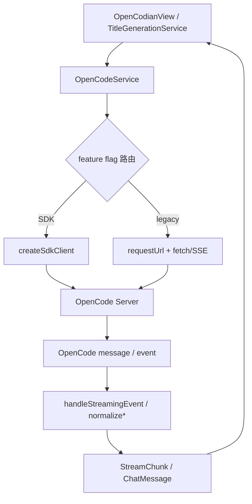

# OpenCodeService

> **源码**: `src/core/opencode/OpenCodeService.ts`
> **状态**: [REVIEW]

## 概述

`OpenCodeService` 是 OpenCodian 与 OpenCode Server 之间的核心门面。它把几类能力收在同一个服务里：

- 通过 `ServerManager` 管理本地或远程 OpenCode 服务状态
- 在 SDK v2 与 legacy HTTP/SSE 两条链路之间按 feature flag 路由
- 维护按 session 隔离的流式状态，支持多标签并发流式响应
- 归一化 session、message、todo、question、diff、permission 等返回值
- 把 OpenCode 持久化消息转换成 UI 可直接消费的 `ChatMessage`

当前实现是“混合外观层”：SDK v2 已覆盖大部分 CRUD、非流式 prompt、流式主链路、abort 与 sync 事件；legacy HTTP/SSE 仍完整保留作为回滚路径。

## 导入关系

```text
上游:
- Obsidian `requestUrl`
- Node `path` / `url`
- `../../shared/*`
- `../types/*`
- `../types/settings`
- `./createSdkClient`
- `./omoCompat`
- `./sdkFeatureFlags`
- `./sdkTypes`
- `./ServerManager`
- `./types`

下游:
- `src/main.ts`
- `src/features/chat/OpenCodianView`
- `src/features/chat/services/TitleGenerationService`
- `src/core/config/ModelConfigService`
- 单元测试
```

## 核心类型 / 状态

- `OpenCodeServiceEvents`: server status、错误、模型加载事件回调。
- `OpenCodeServiceRuntimeOptions`: 初始 managed pid、state 持久化回调、SDK feature flag 覆盖。
- `SessionActivityStatus`: session 的 `idle` / `busy` / `retry` 状态。
- `activeStreams: Map<string, ActiveStreamContext>`: 以 `sessionId` 为键保存当前流的 `AbortController` 和 part 类型映射。
- `sdkFeatureFlags`: 由 `resolveSdkFeatureFlags()` 合并后的运行时 SDK 开关。
- `sessionTodoListeners` / `sessionStatusListeners`: 订阅 `global.syncEvent.subscribe()` 的本地监听集合。
- `syncEventAbortController` / `syncEventPromise` / `syncEventWanted`: 同步事件循环的生命周期状态。
- `vaultPath`: 用于 SDK `directory` 注入、上下文文件绝对路径解析，以及 `ServerManager` 工作目录设置。

`responseHandlers` 字段虽然仍然存在，但当前公开的主流式接口已经是 `AsyncGenerator<StreamChunk>`。

## 核心逻辑

### 服务初始化、设置同步与服务状态

构造函数会先：

1. 深拷贝 `OpenCodianSettings`
2. 由 `getServerBaseUrl()` 生成 `baseUrl`
3. 以“全关闭”为基线解析 `sdkFeatureFlags`
4. 创建 `ServerManager`

`ServerManager` 的回调被接上后，服务层会在 server 进入 `running` 时自动执行 `autoFetchModels()`，并把错误与状态变化向上传递。

运行时还有三条重要的配置通道：

- `setVaultPath(path)`: 更新 vault 路径、把工作目录传给 `ServerManager`，并重启 sync event 订阅。
- `checkHealth()`: 优先走 SDK `global.health()`，失败时回退到 `ServerManager.checkHealth()`。
- `updateSettings(settings)`: 根据新旧设置差异决定是否需要重启/停止 managed server；失败时会回滚内存设置、`baseUrl`、`ServerManager` 配置，并尽力恢复原服务。

特别点：

- 如果本地 managed server 正在运行，切换到新的 host/port 前会先调用 `canBindLocalEndpoint()` 做端口占用预检。
- `isServerProcessRunning()` 代理的是 `ServerManager.isRunning()`，语义是“插件是否持有一个 managed pid”，不是“远端服务是否可达”。

### 会话 CRUD 与回退态过滤

会话读写接口几乎都支持 SDK / legacy 双路径：

- `createSession()`
- `listSessions()`
- `getSessionMessages()`
- `getSessionTodos()`
- `getSessionStatuses()`
- `deleteSession()`
- `updateSessionTitle()`
- `forkSession()`
- `revertSession()`
- `unrevertSession()`
- `getSessionRevertState()`
- `getSessionDiff()`

其中 `getSessionMessages()` 有两个实现细节需要注意：

- legacy 路径使用的是 `/session/:id/message`，不是 `messages`。
- 无论 SDK 还是 legacy，读到消息后都会调用 `applySessionRevertState()`，按 session 的 `revert.messageID` / `revert.partID` 过滤被回滚掉的消息或消息尾部 parts。

`currentSessionId` 是默认会话指针；调用方如果不显式传 `options.sessionId`，多数接口会落回它。

### Prompt 组装与 SDK/legacy 分流

#### `buildPromptRequestParts()`

请求 parts 的组装顺序固定为：

1. 当前输入文本
2. `contextItems`
3. `images`

`externalContextPaths` 仍保留在 `QueryOptions` 里，但这里会直接记一条 debug log 后忽略，不再序列化。

#### 上下文 item 的序列化

- 本地模式：
  - 序列化为 `file` part
  - `url` 使用 `toFileContextUrl()`
  - 如果是 `selection` 且带 `textSnapshot`，会把选中文本放进 `source.text`
- 远程模式：
  - 只允许 text-like MIME
  - 必须有 `textSnapshot`
  - 文本大小上限是 `64 * 1024` 字节
  - 序列化为带 `synthetic: true` 的 `text` part，内容由 `buildObsidianContextTag()` 生成

图片会被追加成 data URL `file` part。

#### 非流式请求

`requestAssistantResponse()`：

- `sdkPrompt` 开启时调用 `client.session.prompt(...)`
- 否则 POST 到 `/session/:id/message`

返回值不是原始 OpenCode message，而是已经过 `openCodeMessageToChatMessage()` 归一化后的 `ChatMessage`。

#### 流式请求

`sendMessage()`：

- `sdkStream` 开启时调用 `sendMessageWithSdk()`
- 否则先 POST `/session/:id/prompt_async`，再连接 legacy SSE `/event`

`buildSdkPromptParameters()` 只在 SDK 路径上生效，并且：

- `allowedTools` 会被转换成 `{ [toolName]: true }`
- `reasoningEffort` 会映射到 SDK `variant`
- `system` 会透传
- `thinkingBudget` 当前不会写进 SDK v2 payload，只会记录 debug log

legacy 流式路径则会把：

- `reasoningEffort` 写进 `model.options.reasoningEffort`
- `thinkingBudget` 写进 `model.options.thinking`

### 流式事件处理与取消

服务层的并发模型是“每个 session 一条活动流”：

- `createActiveStreamContext()` 会为 `sessionId` 分配独立 `AbortController`
- 如果同一 session 已有旧流，会先中断旧流再替换
- `handleStreamingEvent()` 负责把 OpenCode event 归一化成 `StreamChunk`

当前会产出的 chunk 类型包括：

- `usage`
- `text`
- `thinking`
- `tool_use`
- `tool_result`
- `permission_request`
- `file_edited`
- `question_request`
- `message_start`
- `message_stop`
- `message_metadata`
- `error`

`sendMessageWithSdk()` 有一个很具体的降级策略：

- 如果 SDK `event.subscribe()` 在第一条事件之前就失败，会回退到 legacy SSE
- 一旦已经开始收到 SDK 事件，后续异常不会再切回 legacy，而是直接产出 `error` chunk

流结束后，`finishStreamingResponse()` 还会重新拉一次 session messages，补发任何未在流里出现的尾部文本，并补一条 `message_metadata`，最后统一输出 `message_stop`。

取消分两种：

- `cancelStream(sessionId?)`: 先中断本地流，再 best-effort 调用 `abortSessionOnServer()`
- `detachStream(sessionId?)`: 只中断本地观察，不请求服务端 abort

### Todo / status 的 sync 事件循环

只有在 `sdkSync` 开启且存在本地监听器时，才会启动 `global.syncEvent.subscribe()` 循环。

链路如下：

1. `subscribeToSessionTodoUpdates()` / `subscribeToSessionStatusUpdates()` 注册监听器
2. `ensureSyncEventSubscription()` 启动循环
3. `runSyncEventLoop()` 订阅 SDK sync stream
4. `handleSyncEvent()` 只处理两类事件：
   - `todo.updated`
   - `session.status`
5. 订阅失败后等待 1 秒并重试；停止时通过 `AbortController` 中断

修改 vault 路径或设置时，服务会先停掉旧订阅，再按需要恢复。

### 消息标准化、上下文附件与 OMO

`openCodeMessageToChatMessage()` 是服务层和 UI 之间的重要桥：

- 把 `text` / `reasoning` / `tool` parts 组装成 `contentBlocks`
- 为 assistant message 生成 `modelId`
- 为用户消息提取 `contextAttachments`
- 识别 OMO 注入与 system reminder

上下文提取有三条来源：

1. 用户消息中的 synthetic text tag（`parseObsidianContextTag`）
2. `file` parts（`parseFileContextAttachment`）
3. 夹在文本里的 inline Read tool 记录（`Called the Read tool with the following input:`）

inline Read tool 解析成功后：

- 会把对应的文件/行号转成 `MessageContextAttachment`
- 同时把这段工具调用 JSON 从可见正文里剥离出去

OMO 处理则基于 `detectOmoMessageMeta()`：

- 用户注入消息最终显示 `originalText`
- system reminder 最终显示 `reminderText`
- system reminder 会把 `displayStyle` 设为 `notice`，`noticeTone` 设为 `info`

### 模型、权限、问题与上下文使用快照

除了聊天主链路，服务层还负责一组周边接口：

- `getAvailableModels()`: 读取 SDK `config.providers()` 或 legacy `/config/providers`，并把 string-array/object 两种 provider model 结构统一成同一个返回形状。
- `getSessionContextUsageSnapshot()`: 并发读取 session、messages、providers，计算 provider/model 名称、上下文窗口、token 统计和总 cost。
- `getPendingPermissions()` / `respondToPermission()`: 当前跟随 `sdkCrud` 开关走 SDK `permission.*` 或 legacy `/permission/*`。
- `getPendingQuestions()` / `replyToQuestion()` / `rejectQuestion()`: 由 `sdkQuestions` 单独控制。

## 关键方法

| 方法 | 说明 |
|------|------|
| `start()` / `stop()` | 启停底层 `ServerManager` 并管理 sync 事件订阅 |
| `checkHealth()` | SDK 优先健康检查，失败时回退到 `ServerManager` |
| `updateSettings()` | 根据新旧设置差异更新 `baseUrl`、`ServerManager` 和订阅状态 |
| `createSession()` | 创建 session，并可同时写入 `currentSessionId` |
| `getSessionMessages()` | 读取消息并应用 revert 过滤 |
| `requestAssistantResponse()` | 非流式请求，返回归一化后的 `ChatMessage` |
| `sendMessage()` | 流式请求入口，按 flag 选择 SDK 或 legacy SSE |
| `cancelStream()` | 本地 abort + 服务端 abort |
| `detachStream()` | 只停止本地流观察 |
| `subscribeToSessionTodoUpdates()` | 订阅 todo.updated sync 事件 |
| `subscribeToSessionStatusUpdates()` | 订阅 session.status sync 事件 |
| `getAvailableModels()` | 读取并统一 provider/model 目录 |
| `getSessionContextUsageSnapshot()` | 计算 token/cost/context window 快照 |
| `getPendingPermissions()` / `respondToPermission()` | 处理权限请求 |
| `getPendingQuestions()` / `replyToQuestion()` / `rejectQuestion()` | 处理 OpenCode question 请求 |
| `getSessionDiff()` | 拉取 session diff 元数据 |
| `openCodeMessageToChatMessage()` | 把 OpenCode persisted message 归一化为 UI message |

## 数据流



## 与其他模块的交互

- `ServerManager`: 负责本地/远程服务生命周期与健康检查。
- `createSdkClient`: 为每次 SDK 调用创建客户端实例。
- `sdkFeatureFlags`: 定义 SDK 与 legacy 的路由开关。
- `omoCompat`: 负责 OMO 文本检测与元数据提取。
- `shared/*`: 提供上下文标签、路径解析、tool 状态和结果文本等辅助能力。
- `OpenCodianView`: 是最主要消费者，聊天发送、流式渲染、取消、diff、todo、question 都通过本服务完成。
- `TitleGenerationService`: 调用 `requestAssistantResponse()` 走非流式链路。
- `ModelConfigService`: 调用 `getAvailableModels()` 读取服务端目录。

## 配置项

| 项目 | 来源 | 当前行为 |
|------|------|---------|
| `sdkFeatureFlags` | 运行时注入 | 不传时全部关闭；`main.ts` 当前启用 `sdkCrud` / `sdkPrompt` / `sdkStream` / `sdkAbort` / `sdkSync`，保留 `sdkQuestions` 为关闭 |
| `server.*` | `OpenCodianSettings` | 决定 `baseUrl`、认证方式和 `ServerManager` 行为 |
| `defaultProvider` / `defaultModel` | `OpenCodianSettings` | 调用方未显式传 `provider` / `model` 时作为默认模型 |
| `allowedTools` | `QueryOptions` | 只在 SDK prompt 路径里映射为 `tools` 记录 |
| `reasoningEffort` | `QueryOptions` | SDK 路径映射到 `variant`；legacy 路径映射到 `model.options.reasoningEffort` |
| `thinkingBudget` | `QueryOptions` | legacy 路径会下发；SDK prompt 路径当前仅记录日志，不写入 payload |
| `REMOTE_CONTEXT_TEXT_LIMIT_BYTES` | 常量 | 远程模式上下文文本上限 64 KiB |

## 注意事项

- `OpenCodeService.initialize()` 仍然存在，但运行时入口 `main.ts` 并不调用它；主要使用方是测试。
- `getPendingPermissions()` / `respondToPermission()` 当前跟随的是 `sdkCrud`，不是单独的 permission flag。
- `checkHealth()` 和 `getAvailableModels()` 也跟随 `sdkCrud`，而不是独立的 health/models flag。
- legacy `connectSSE()` / `parseSSEEvents()` 仍然是有效回滚路径，不能在 SDK rollout 未完全收口前删除。
- 文件里的 `transformEventToChunks()` / `transformPartToChunks()` 仍保留，但当前主流式路径实际走的是 `handleStreamingEvent()`。
