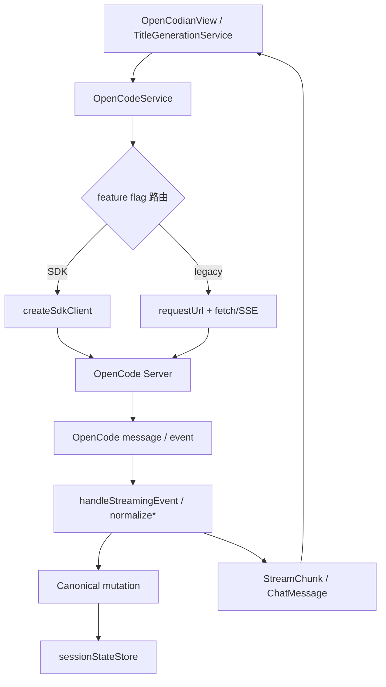

# OpenCodeService

> **源码**: `src/core/opencode/OpenCodeService.ts`
> **状态**: [REVIEW]

## 概述

`OpenCodeService` 是 OpenCodian 与 OpenCode Server 之间的核心门面。它把几类能力收在同一个服务里：

- 通过 `ServerManager` 管理本地或远程 OpenCode 服务状态
- 在 SDK v2 与 legacy HTTP/SSE 两条链路之间按 feature flag 路由
- 维护按 session 隔离的流式状态，支持多标签并发流式响应
- 归一化 session、todo、diff 等返回值，并通过专门 owner 收束 question / permission negotiation 与 catalog/query surface
- 通过 `OpenCodeMessageNormalizationMapper` 统一 question prompt、工具身份、持久化消息 hydration、上下文附件与 OMO metadata

当前实现是“混合外观层”：SDK v2 已覆盖大部分 CRUD、非流式 prompt、流式主链路、abort、questions 与 sync 事件；legacy HTTP/SSE 仍完整保留作为回滚路径。

## 导入关系

```text
上游:
- Obsidian `requestUrl`
- Node `path` / `url`
- `../../shared/*`
- `../../shared/contextPath`
- `../types/*`
- `../types/settings`
- `./createSdkClient`
- `./OpenCodeCatalogStateStore`
- `./OpenCodeCatalogQueryCoordinator`
- `./OpenCodeContextPartSerializer`
- `./OpenCodeEventSubscriptionCoordinator`
- `./OpenCodeMessageNormalizationMapper`
- `./OpenCodePromptRequestBuilder`
- `./OpenCodeQuestionPermissionHub`
- `./OpenCodeSessionControlOrchestrator`
- `./OpenCodeSessionLifecycleCoordinator`
- `./OpenCodeSessionStateStore`
- `./OpenCodeServiceLifecycleCoordinator`
- `./OpenCodeStreamingRuntimeCoordinator`
- `./OpenCodeStreamEventTransformer`
- `./OpenCodeSyncEventRuntimeCoordinator`
- `./sdkFeatureFlags`
- `./sdkTypes`
- `./types`

下游:
- `src/main.ts`
- `src/features/chat/OpenCodianView`
- `src/features/chat/services/TitleGenerationService`
- `src/core/config/ModelConfigService`
- 单元测试
```

## 核心类型 / 状态

- `OpenCodeServiceEvents`: server status、错误、模型加载事件回调。
- `OpenCodeServiceRuntimeOptions`: 初始 managed pid、state 持久化回调、SDK feature flag 覆盖。
- `SessionActivityStatus`: session 的 `idle` / `busy` / `retry` 状态。
- `sdkFeatureFlags`: 由 `resolveSdkFeatureFlags()` 合并后的运行时 SDK 开关。
- `syncEventRuntime`: `OpenCodeSyncEventRuntimeCoordinator` 实例，负责 session todo/status/message sync event 的监听集合、wanted state、SDK 订阅生命周期、reducer-ready payload 归一化，以及把 sync mutation 先写入 `sessionStateStore` 后再广播给外部 listener。
- `catalogState`: `OpenCodeCatalogStateStore` 实例，负责 registry tool ids、tool schema cache、observed external tool names、MCP server status、catalog snapshot 构造与 catalog listener lifecycle。
- `catalogQueries`: `OpenCodeCatalogQueryCoordinator` 实例，负责 directory-scoped provider/model/config lookup、tool registry/schema cache、MCP status/auth 写回，以及 provider/project/file/find/path/VCS/formatter/LSP query/admin surface。
- `contextPartSerializer`: `OpenCodeContextPartSerializer` 实例，负责 prompt 输入文本、本地/远程 context item 与 image part 的 request-part 序列化。
- `diagnostics`: `OpenCodeSdkFacade` 模块提供的 diagnostics owner，负责 transient connectivity suppression、assistant/probe 错误文本整形，以及 assistant finalization debug payload 日志，并继续复用 façade 集中的 SDK error formatter。
- `messageNormalizationMapper`: `OpenCodeMessageNormalizationMapper` singleton，负责 question request normalization、历史 message → `ChatMessage` hydration、tool kind 归类、context attachment 提取与 OMO/system reminder 归一化。
- `promptRequestBuilder`: `OpenCodePromptRequestBuilder` 实例，负责稳定 `messageID + parts[]` send payload、SDK prompt parameters、legacy request body 与 shared prompt options/variant/output-format/model defaults 的组装。
- `streamEventTransformer`: `OpenCodeStreamEventTransformer` 实例，负责 SDK / legacy stream event → `StreamChunk + OpenCodeStreamMutation` 的转换、tool/question/file/permission 事件映射，以及 SSE parser。
- `streamingRuntime`: `OpenCodeStreamingRuntimeCoordinator` 实例，负责单一 streaming 入口下的 SDK/legacy transport 选择、首事件前的 legacy SSE fallback、legacy SSE reader lifecycle、stream mutation 应用顺序、final response completion，以及 active stream registry、session-scoped abort controller、part metadata tracking、cancel/detach lifecycle。
- `sessionLifecycle`: `OpenCodeSessionLifecycleCoordinator` 实例，负责 session create/list/messages/todos/statuses/delete/update、session info lookup、session abort fallback、默认 current session 指针，以及公开 session sync 订阅 API 到 `syncEventRuntime` 的委托。
- `sessionStateStore`: `OpenCodeSessionStateStore` 实例，负责 canonical `session/message/part` graph 的 snapshot replace、增量 mutation 与只读 state clone。
- `sessionControl`: `OpenCodeSessionControlOrchestrator` 实例，负责 fork/revert/unrevert/diff、context usage snapshot、session message control、command/shell 与 message-part operations。
- `serviceLifecycle`: `OpenCodeServiceLifecycleCoordinator` 实例，负责 initialize/start/stop/dispose、server running 后的 model/catalog bootstrap、SDK health response normalization / health probe fallback、vault path scope refresh、server status/diagnostics proxy，以及 settings update / rollback 与 sync/open-code event subscription 的 lifecycle 编排；其与 `ServerManager` 的共享装配集中在 `OpenCodeServiceLifecycleCoordinator.createAssembly()`。
- `questionPermissionHub`: `OpenCodeQuestionPermissionHub` 实例，负责 pending questions/reply/reject、pending permissions/respond，以及 session permission responder 的 negotiation lifecycle。
- `openCodeEventRuntime`: `OpenCodeEventSubscriptionCoordinator` 实例，负责 open-code event listener registry、`event` / `global` 订阅生命周期，以及 catalog-relevant payload 到 `catalogState` 的刷新/广播触发。
- `vaultPath`: 用于 SDK `directory` 注入、上下文文件绝对路径解析，以及 `ServerManager` 工作目录设置；OpenCode directory scope 和 context file path 的跨平台规范化委托给 `shared/contextPath`。

`responseHandlers` 字段虽然仍然存在，但当前公开的主流式接口已经是 `AsyncGenerator<StreamChunk>`。

另外，tool/MCP 目录状态与 directory-scoped config/tool-catalog 查询现在分别集中在 `catalogState` 与 `catalogQueries`：

- `catalogQueries` 统一承接 `getAvailableModels()` / `getProviderDirectory()` / `getResolvedModelConfig()` 的 SDK-first/legacy fallback，以及 `refreshToolIds()` / `listTools()` 的 scope-aware cache lifecycle
- 运行时可见的外部工具键名会被记录到 observed external tools 集合
- `refreshToolIds()` / `listTools()` 继续通过同一个 state store 更新 tool snapshot；`refreshMcpServerStatus()` 与 MCP server/auth mutation 现在也经由 `OpenCodeCatalogQueryCoordinator` 写回 MCP snapshot 与 listener 广播
- 流式 `tool_use` 与历史 message hydration 继续复用同一套 `shared/toolIdentity` 规则写入结构化 `toolKind`
- 当没有稳定 MCP 目录时，OpenCode 风格外部工具也会按保守 `custom` 图标 `layers` 兜底，而不是回落成 `wrench`；一旦命中 MCP 目录则会切到 `opencodian-tool-mcp`

## 核心逻辑

### 服务初始化、设置同步与服务状态

构造函数会先：

1. 深拷贝 `OpenCodianSettings`
2. 由 `getServerBaseUrl()` 生成 `baseUrl`
3. 以“全关闭”为基线解析 `sdkFeatureFlags`
4. 装配 `OpenCodeSdkFacade` 模块提供的 diagnostics owner
5. 通过 `OpenCodeServiceLifecycleCoordinator.createAssembly()` 一次性装配 `ServerManager` 与 lifecycle owner

`ServerManager` 的回调被接上后，服务层会把 status 交给 `OpenCodeServiceLifecycleCoordinator`；coordinator 会在 server 进入 `running` 时自动执行 model/catalog bootstrap，并把错误、状态变化、diagnostics 与 managed process state 向上传递。

运行时还有三条重要的配置通道：

- `setVaultPath(path)`: 公开入口仍保留在服务层，但 vault path 写回、`ServerManager` 工作目录更新、tool schema cache scope invalidation 与 sync/open-code event restart 已委托给 `OpenCodeServiceLifecycleCoordinator`。
- `checkHealth()`: 公开入口仍保留在服务层，但 SDK-first health probe、SDK health payload normalization 与 `ServerManager.checkHealth()` fallback 已委托给 `OpenCodeServiceLifecycleCoordinator`。
- health 路径命中 SDK 时，现在通过 `OpenCodeSdkFacade` 统一承接 transport error normalization，而不是让 raw SDK rejection shape 直接泄漏给 lifecycle owner。
- `updateSettings(settings)`: 公开入口仍保留在服务层，但完整 settings reconfiguration lifecycle 已并入 `OpenCodeServiceLifecycleCoordinator`；失败时仍会回滚内存设置、`baseUrl`、`ServerManager` 配置，并尽力恢复原服务。

补充一个运行时细节：

- 当本地服务短暂离线、SDK/legacy 都同时打到 `ERR_CONNECTION_REFUSED` / `ERR_CONNECTION_RESET` 时，lifecycle diagnostics owner 会把整段离线期的重复 fallback / failure 日志合并成一次；服务恢复并重新健康后才解除抑制。`global.syncEvent.subscribe()` 在离线期也会改为健康轮询等待恢复，而不是每秒继续重连刷控制台。

特别点：

- 如果本地 managed server 正在运行，切换到新的 host/port 前会先调用 `canBindLocalEndpoint()` 做端口占用预检。
- `isServerProcessRunning()` 代理的是 `ServerManager.isRunning()`，语义是“插件是否持有一个 managed pid”，不是“远端服务是否可达”。

### 会话 CRUD、control 与回退态过滤

`OpenCodeService` 的 session lifecycle 公开接口与共享 session runtime fallback 现在由 `OpenCodeSessionLifecycleCoordinator` 承担主要 owner；服务层保留 host seam、transport helper、normalizer 与 revert/tool-observation 依赖，并继续作为对外 façade。被 lifecycle coordinator 收束的接口包括：

- `createSession()`
- `getSessionInfo()`（内部 shared session lookup，含 SDK get fallback）
- `abortSession()`（内部 streaming cancel 使用，含 SDK abort fallback）
- `listSessions()`
- `getSessionMessages()`
- `getSessionTodos()`
- `getSessionStatuses()`
- `deleteSession()`
- `updateSessionTitle()`

`OpenCodeSessionControlOrchestrator` 则继续收束 session control / message-operation 公开接口：

- `forkSession()`
- `revertSession()`
- `unrevertSession()`
- `getSessionRevertState()`
- `getSessionDiff()`
- `getSessionContextUsageSnapshot()`
- `initializeSession()`
- `getSessionChildren()`
- `shareSession()` / `unshareSession()` / `summarizeSession()`
- `getSessionMessage()` / `deleteSessionMessage()`
- `runSessionCommand()` / `runSessionShell()`
- `updateMessagePart()` / `deleteMessagePart()`

其中 `getSessionMessages()` 的共享细节仍然由 `OpenCodeService` 通过 host seam 提供给 coordinator：

- legacy 路径使用的是 `/session/:id/message`，不是 `messages`。
- 无论 SDK 还是 legacy，读到消息后都会调用 `applySessionRevertState()`，按 session 的 `revert.messageID` / `revert.partID` 过滤被回滚掉的消息或消息尾部 parts。
- 过滤后的 authoritative snapshot 会立即写入 `sessionStateStore`，让服务层第一次拥有稳定的 canonical `session/message/part` truth layer。
- `getCanonicalSessionState(sessionId)` 提供只读读取口，供后续 sync-event / render slice 共享同一份图状态。
- `getCanonicalSessionMessages(sessionId)` 会把 canonical graph 重新组装成 `[{ info, parts[] }]` 视图，供 chat sync 层在不重拉 server 的情况下复用既有 hydrate / merge 路径。
- `seedCanonicalUserMessage()` 提供发送前的 optimistic canonical seed seam，让准备阶段可以先把稳定 `messageID + parts[]` 写进同一个 graph owner，再等待 authoritative reload 覆盖。

除此之外，`OpenCodeService` 现在还会在 sync-event runtime host seam 上直接执行 `applyCanonicalSyncEvent()`：`message.updated` / `message.removed` / `message.part.updated` / `message.part.removed` / `message.part.delta` 会先归并到 `sessionStateStore`，`session.diff` 仍只保留给后续 authoritative reload/gap recovery。

流式路径也会写入同一个 canonical graph：`OpenCodeStreamEventTransformer` 从 `message.part.updated` / `message.part.delta` 产出 stream mutations，`OpenCodeStreamingRuntimeCoordinator` 在 yield legacy chunks 前把 mutations 交回服务层。服务层会为缺失的 assistant message 建立最小 canonical info、合并 part upsert（避免空字段覆盖已有 text/tool state），并在 delta 先到时补建对应 part；最终 `finishStreamingResponse()` 的 authoritative snapshot 仍会覆盖这些实时状态。

默认会话指针现在由 `sessionLifecycle` 持有；调用方如果不显式传 `options.sessionId`，多数接口仍会落回当前 session，只是状态所有权不再直接留在 `OpenCodeService` 主类里。与 session tree/share/command/part 编辑有关的更厚 control surface 则继续落在 `sessionControl`，避免 `OpenCodeService` 再次直接编排这条链。

`runSessionCommand()` 公开 wrapper 现在还接受一份可选的 placeholder runtime context，但 template expansion 仍委托给 `sessionControl` 内的 `runSessionCommand()` seam；`OpenCodeService` 自己不接管 slash command template 语义。

### Prompt 组装与 SDK/legacy 分流

#### Request-part serializer

`OpenCodeContextPartSerializer` 现在统一负责：

- prompt parts 的顺序组装（输入文本 → `contextItems` → `images`）
- 本地模式下的 `file://` context URL、selection `source.text`、text MIME 归一化
- 远程模式下的 synthetic `<obsidian_context>` text part、metadata 与 64 KiB size guard
- image attachment 的 data URL `file` part

兼容边界保持不变：

- `externalContextPaths` 仍只写 debug log 后忽略
- context tag 文本格式仍由 `buildObsidianContextTag()` 生成
- Windows vault path normalization 仍通过 `shared/contextPath` 保持跨平台稳定
- remote mode 继续拒绝 binary context 和超限文本

#### Prompt option builder

`OpenCodePromptRequestBuilder` 现在统一负责：

- 稳定 `messageID + parts[]` send payload 的生成
- SDK `session.prompt()` / `promptAsync()` 的参数组装
- legacy `/session/:id/message` 与 `/session/:id/prompt_async` 的 shared prompt options 拼装
- `allowedTools`、`output-format`、`variant`、默认 `provider/model` 的映射

兼容边界保持不变：

- SDK 路径仍不会写入 `thinkingBudget`，只记录 debug log
- legacy `/prompt_async` 仍会把 `reasoningEffort` / `thinkingBudget` 写进 `model.options`
- legacy `/message` 仍保持不写 `model.options`

`OpenCodeService` 现在只保留 transport 分流；request-part serialization、稳定 send payload 组装与 canonical optimistic seed 分别委托给 `OpenCodeContextPartSerializer`、`OpenCodePromptRequestBuilder` 与 `OpenCodeSessionStateStore`。

#### 非流式请求

`requestAssistantResponse()`：

- `sdkPrompt` 开启时调用 `client.session.prompt(...)`
- 否则 POST 到 `/session/:id/message`
- 如果服务端返回的是“assistant message + structured error”而不是直接 throw，服务层也会优先把 `info.error` 提取成异常抛出，而不是默默返回一个空 assistant
- SDK prompt transport 自身如果返回非 `Error` rejection，也会先经过 façade/exported diagnostics helper 归一化，再进入 assistant / probe follow-up 逻辑

返回值不是原始 OpenCode message，而是已经过 `openCodeMessageToChatMessage()` 归一化后的 `ChatMessage`。

另外还有一个专门给设置页用的 `probeProviderResponse(providerId, modelId)`：

- 创建一个临时 session
- 用指定 `provider/model` 发送一条最小真实请求
- 成功时返回简短响应预览
- 失败时返回真实错误文本
- 最后无论成功失败都会删除临时 session

这让设置页的 provider 测试可以验证“真实发送能力”，而不是只看目录或 runtime 是否出现。

#### 流式请求

`sendMessage()`：

- 先通过 `OpenCodeContextPartSerializer` + `OpenCodePromptRequestBuilder` 组装稳定 `messageID + requestParts[]`
- 如果上游已经在 preparation 阶段构造好稳定 request parts，transport 会直接复用，不再重建另一批临时 part id
- 再统一委托 `streamingRuntime.streamResponse()`：coordinator 依据 `sdkStream` flag 选择 SDK 或 legacy transport，并继续持有首事件前失败时的 legacy SSE fallback 与最终 assistant message completion

对应的 prompt option assembly 仍全部委托给 `OpenCodePromptRequestBuilder`；`sendMessage()` 现在只保留 session 选择、payload 组装与 transport callback 注入，不再直接铺开 SDK/legacy 入口分流、transport/fallback/read/finalize 细节。

### 流式事件处理与取消

服务层的并发模型仍然是“每个 session 一条活动流”，而完整 transport runtime seam 现在由 `OpenCodeStreamingRuntimeCoordinator` 持有：

- `streamingRuntime.createActiveStreamContext()` 会为 `sessionId` 分配独立 `OpenCodeStreamingRuntimeContext`
- 如果同一 session 已有旧流，coordinator 会先中断旧 context 再替换
- `releaseActiveStreamContext()` 只释放仍然是当前注册实例的 context，避免旧流 finally 清掉新流
- `streamSdkResponse()` 负责 SDK stream 订阅、首事件前失败时的 legacy SSE fallback，以及最终 assistant message completion
- `streamLegacyResponse()` 负责 legacy `/event` 连接、reader abort/detach 生命周期、event loop 与最终 assistant message completion

与之配套的 event→chunk transform 现在由 `OpenCodeStreamEventTransformer` 持有：

- `handleStreamingEvent()` 负责 session guard、tool_use/tool_result 去重、thinking delta、question/file/permission 事件映射、canonical stream mutation 输出，以及 `session.error` / `session.idle` 的 stop 判断
- `parseSSEEvents()` 负责把 legacy `/event` buffer 解析成完整 SSE event，并保留 incomplete tail
- `transformEventToChunks()` / `transformPartToChunks()` 继续作为较薄的通用 payload→chunk helper，供 focused coverage 和后续局部调用复用

当前会产出的 chunk 类型包括：

- `usage`
- `text`
- `thinking`
- `tool_use`
- `tool_result`
- `permission_request`
- `file_edited`
- `question_request`
- `message_start`
- `message_stop`
- `message_metadata`
- `error`

`OpenCodeStreamingRuntimeCoordinator.streamSdkResponse()` 有一个很具体的降级策略：

- 如果 SDK `event.subscribe()` 在第一条事件之前就失败，会回退到 legacy SSE
- 一旦已经开始收到 SDK 事件，后续异常不会再切回 legacy，而是直接产出 `error` chunk

`handleStreamingEvent()` 现在还会显式处理 `session.error`：

- 普通 provider/API 错误会立刻转成 `error` chunk
- `MessageAbortedError` 只会结束流，不会误报成发送失败

换句话说，`OpenCodeService` 现在只保留 payload 组装与入口分流；SDK / legacy transport/fallback/read/finalize 细节已经收束到 `OpenCodeStreamingRuntimeCoordinator`，事件解析与 chunk 归一化则收束到 `OpenCodeStreamEventTransformer`。

stream outcome 的顺序边界是：先应用 canonical mutations，再把旧的 `StreamChunk` 交给 UI 渲染。这样 tool-first / text-late 序列能先在 `sessionStateStore` 下落到同一条 assistant message，再由现有 chunk shell 继续渲染，避免 loose text 与 sync/reload 事实长期分叉。

除此之外，`OpenCodeStreamingRuntimeCoordinator.finishStreamingResponse()` 在收尾重新拉取 assistant message 时，也会再检查一次 `assistant.info.error`。如果流里没收到 `session.error`，但最终持久化消息里已经带了结构化错误，coordinator 仍会补发 `error` chunk，避免 UI 再次把它误判成“空回复”。

流结束后，`OpenCodeStreamingRuntimeCoordinator.finishStreamingResponse()` 还会重新拉一次 session messages，补发任何未在流里出现的尾部文本，并补一条 `message_metadata`，最后统一输出 `message_stop`。

取消分两种：

- `cancelStream(sessionId?)`: 委托给 `streamingRuntime.cancelStream()`，先中断本地流，再 best-effort 调用 `abortSessionOnServer()`
- `detachStream(sessionId?)`: 委托给 `streamingRuntime.detachStream()`，只中断本地观察，不请求服务端 abort

### Todo / status 的 sync 事件循环

只有在 `sdkSync` 开启且存在本地监听器时，才会启动 `global.syncEvent.subscribe()` 循环。

链路如下：

1. `subscribeToSessionTodoUpdates()` / `subscribeToSessionStatusUpdates()` 注册监听器
2. `ensureSyncEventSubscription()` 启动循环
3. `runSyncEventLoop()` 订阅 SDK sync stream
4. `handleSyncEvent()` 只处理两类事件：
   - `todo.updated`
   - `session.status`
5. 订阅失败后等待 1 秒并重试；停止时通过 `AbortController` 中断

修改 vault 路径或设置时，服务会先停掉旧订阅，再按需要恢复。

### 消息标准化、上下文附件与 OMO

`OpenCodeMessageNormalizationMapper` 现在是服务层和 UI 之间的消息 hydration owner；`OpenCodeService` 只保留 `openCodeMessageToChatMessage()` / `hydrateOpenCodeMessage()` 这层门面：

- 把 `text` / `reasoning` / `tool` parts 组装成 `contentBlocks`
- 为 assistant message 生成 `modelId`
- 为用户消息提取 `contextAttachments`
- 识别 OMO 注入与 system reminder

上下文提取有三条来源：

1. 用户消息中的 synthetic text tag（`parseObsidianContextTag`）
2. `file` parts（`parseFileContextAttachment`）
3. 夹在文本里的 inline Read tool 记录（`Called the Read tool with the following input:`）

file part 与 inline Read tool 里的路径会先通过 `shared/contextPath` 做跨平台归一化：Windows drive path 会统一成 `C:/...`，如果能确认在当前 `vaultPath` 内则再还原为 vault-relative attachment path。

inline Read tool 解析成功后：

- 会把对应的文件/行号转成 `MessageContextAttachment`
- 同时把这段工具调用 JSON 从可见正文里剥离出去

OMO 处理则继续基于 `detectOmoMessageMeta()`，但解析逻辑已经与 question prompt normalization、tool identity 判断一起收束到 mapper：

- 用户注入消息最终显示 `originalText`
- system reminder 最终显示 `reminderText`
- system reminder 会把 `displayStyle` 设为 `notice`，`noticeTone` 设为 `info`

### 模型、权限、问题、catalog/query owner 与上下文使用快照

除了聊天主链路，服务层还负责一组周边接口：

- `getAvailableModels()` / `getProviderDirectory()` / `getResolvedModelConfig()`: 现在统一委托给 `OpenCodeCatalogQueryCoordinator`，由它集中处理 directory-scoped config/provider/tool-catalog transport seam、debug logging 与 scope-aware cache invalidation。
- `getAvailableModels()`: 读取 SDK `config.providers()` 或 legacy `/config/providers`，并把 string-array/object 两种 provider model 结构统一成同一个返回形状。开启 `includeDirectory` 时，它表示“当前项目目录作用域下的 runtime provider/model 列表”，也是设置页复现 `opencode models` 结果的主入口。
- `getProviderDirectory()`: 读取 SDK `provider.list()` 或 legacy `/provider`，归一化 `all` / `default` / `connected`；它对应的是 connect-provider 目录总览，不是 `opencode models` 的等价接口。
- `getResolvedModelConfig()`: 读取 SDK `config.get()` 或 legacy `/config`，只提取模型相关配置字段。开启 `includeDirectory` 时返回当前项目作用域的解析结果；关闭时返回服务端“默认工作目录作用域”的解析结果，不能把它简单等同于纯全局配置文件。
- `getSessionContextUsageSnapshot()`: 现在委托给 `OpenCodeSessionControlOrchestrator`，并发读取 session、messages、providers，计算 provider/model 名称、上下文窗口、token 统计和总 cost。
- `getPendingPermissions()` / `respondToPermission()` / `respondToSessionPermission()` / `getPendingQuestions()` / `replyToQuestion()` / `rejectQuestion()`: 现在统一委托给 `OpenCodeQuestionPermissionHub`，由它处理 SDK flag、legacy fallback、question prompt normalization 与 permission request filtering。
- `getMcpStatus()` / `addMcpServer()` / provider auth / project / file / find / path / VCS / formatter / LSP 查询：现在统一委托给 `OpenCodeCatalogQueryCoordinator`，由它集中处理 SDK query/admin surface 与 MCP status normalization/writeback。

额外要记住一个容易混淆的点：

- `opencode models` CLI 与 `getAvailableModels(includeDirectory=true)` / `/config/providers` 同源，都是目录作用域下服务端内部 `Provider.list()` 的结果；这里说的是 OpenCode 内部 provider service，不是 SDK `provider.list()` / `/provider` 这条 HTTP 接口
- `provider.list().all` 只是当前作用域下的 connect-provider 目录，不等于当前项目实际启用列表，也不是 models.dev 的无过滤全量目录
- 如果比较 CLI、HTTP API 和插件 UI，一定要先确认三者是不是在同一个 `directory` 作用域下
- 在 Windows 上，插件发送给 OpenCode 的 `directory` 必须规范化成正斜杠路径（例如 `C:/vault`）；如果直接传 `C:\vault`，服务端会退回到接近“无目录作用域”的结果，常见症状就是 runtime providers 只剩 `deepseek`
- 如果 `config.providers(directory)` 和 `opencode models` 仍然对不上，下一步先看 `ServerManager` 有没有继续接管旧的本地 `4096` 服务；不要把 `provider.list()` 重新接回设置页目录

## 关键方法

| 方法 | 说明 |
|------|------|
| `start()` / `stop()` | 启停底层 `ServerManager` 并管理 sync 事件订阅 |
| `checkHealth()` | SDK 优先健康检查，失败时回退到 `ServerManager` |
| `updateSettings()` | 根据新旧设置差异更新 `baseUrl`、`ServerManager` 和订阅状态 |
| `createSession()` | 创建 session，并可同时写入 `currentSessionId` |
| `getSessionMessages()` | 读取消息、应用 revert 过滤，并刷新 canonical session graph snapshot |
| `getCanonicalSessionState()` | 读取指定 session 的只读 canonical `message/part` 图状态 |
| `requestAssistantResponse()` | 非流式请求，返回归一化后的 `ChatMessage` |
| `probeProviderResponse(providerId, modelId)` | 用临时 session 做一次最小真实发送探测 |
| `sendMessage()` | 流式请求入口，按 flag 选择 SDK 或 legacy SSE |
| `cancelStream()` | 本地 abort + 服务端 abort |
| `detachStream()` | 只停止本地流观察 |
| `subscribeToSessionTodoUpdates()` | 订阅 todo.updated sync 事件 |
| `subscribeToSessionStatusUpdates()` | 订阅 session.status sync 事件 |
| `getAvailableModels()` | 读取并统一 provider/model 目录 |
| `getProviderDirectory()` | 读取服务端宽 provider 目录，不等同于运行时可用列表 |
| `getResolvedModelConfig()` | 读取服务器解析后的模型配置子集 |
| `getSessionContextUsageSnapshot()` | 计算 token/cost/context window 快照 |
| `respondToSessionPermission()` | 回传 session-scoped permission 决策 |
| `getPendingPermissions()` / `respondToPermission()` | 处理权限请求 |
| `getPendingQuestions()` / `replyToQuestion()` / `rejectQuestion()` | 处理 OpenCode question 请求 |
| `getMcpStatus()` / `getProviderAuthMethods()` / `listProjects()` / `listFiles()` / `findText()` / `getVcsDiff()` | 委托 catalog/query owner |
| `getSessionDiff()` | 拉取 session diff 元数据，并兼容 legacy `before/after` 与 SDK `1.4.x` `patch` 形状 |
| `openCodeMessageToChatMessage()` | 把 OpenCode persisted message 归一化为 UI message |

## 数据流



## 与其他模块的交互

- `ServerManager`: 负责本地/远程服务生命周期与健康检查。
- `OpenCodeSyncEventRuntimeCoordinator`: 负责 `global.syncEvent.subscribe()` 的 session todo/status/message sync event listener registry、订阅重启和 transient connectivity recovery 循环。
- `OpenCodeEventSubscriptionCoordinator`: 负责 `event.subscribe()` / `global.event()` 的 open-code event listener registry、catalog-relevant payload routing、双路订阅重启与 catalog listener emit。
- `OpenCodeCatalogQueryCoordinator`: 负责 directory-scoped provider/model/config lookup、tool registry/schema cache、MCP status/auth 写回，以及 provider/project/file/find/path/VCS/formatter/LSP query surface。
- `OpenCodeStreamingRuntimeCoordinator`: 负责 active stream registry、session-scoped abort controllers、part metadata tracking、stream mutation 应用顺序，以及 cancel/detach 的 runtime lifecycle。
- `OpenCodeStreamEventTransformer`: 负责 SDK / legacy stream event → `StreamChunk + OpenCodeStreamMutation` 的转换、part-type/message-id-aware delta routing，以及 SSE parser。
- `createSdkClient`: 为每次 SDK 调用创建客户端实例。
- `sdkFeatureFlags`: 定义 SDK 与 legacy 的路由开关。
- `omoCompat`: 负责 OMO 文本检测与元数据提取。
- `shared/*`: 提供上下文标签、路径解析、tool 状态和结果文本等辅助能力。
- `OpenCodianView`: 是最主要消费者，聊天发送、流式渲染、取消、diff、todo、question 都通过本服务完成。
- `TitleGenerationService`: 调用 `requestAssistantResponse()` 走非流式链路。
- `ModelConfigService`: 现在用 `getAvailableModels()` 的目录作用域运行时列表，加上 `getResolvedModelConfig()` 的禁用配置来构建服务器 catalog；`getProviderDirectory()` 保留给显式诊断 connect-provider 目录时使用。
- 对本地模式的 provider/config 问题，优先用 live HTTP/CLI 调试验证：`config.providers()` 看运行时列表，`provider.list()` 看当前作用域下的 connect-provider 目录，`config.get(directory)` 看当前 vault 解析结果；不要直接拿无 `directory` 的 `/config` 当“全局文件内容”。

## 配置项

| 项目 | 来源 | 当前行为 |
|------|------|---------|
| `sdkFeatureFlags` | 运行时注入 | 不传时全部关闭；`main.ts` 当前 6 个 SDK rollout 开关全部开启 |
| `server.*` | `OpenCodianSettings` | 决定 `baseUrl`、认证方式和 `ServerManager` 行为 |
| `defaultProvider` / `defaultModel` | `OpenCodianSettings` | 调用方未显式传 `provider` / `model` 时作为默认模型 |
| `allowedTools` | `QueryOptions` | 只在 SDK prompt 路径里映射为 `tools` 记录 |
| `reasoningEffort` | `QueryOptions` | SDK 路径映射到 `variant`；legacy 路径映射到 `model.options.reasoningEffort` |
| `thinkingBudget` | `QueryOptions` | legacy 路径会下发；SDK prompt 路径当前仅记录日志，不写入 payload |
| `REMOTE_CONTEXT_TEXT_LIMIT_BYTES` | 常量 | 远程模式上下文文本上限 64 KiB |

## 注意事项

- `OpenCodeService.initialize()` 仍然存在，但运行时入口 `main.ts` 并不调用它；主要使用方是测试。
- `OpenCodeQuestionPermissionHub` 现在拥有 question / permission negotiation owner；`OpenCodeService` 只保留 host seam 与对外 façade。
- `OpenCodeCatalogQueryCoordinator` 现在拥有 directory-scoped config/tool-catalog/MCP/query owner；不要把 `config.providers()`、`provider.list()`、`config.get()`、`tool.ids()`、`tool.list()`、provider/file/find/MCP auth 再拆成多个薄 wrapper，也不要把 `OpenCodeSdkFacade` 的 request option injection 逻辑复制进来。
- `getPendingPermissions()` / `respondToPermission()` 当前仍跟随 `sdkCrud`，不是单独的 permission flag；`respondToSessionPermission()` 继续直接走 SDK permission responder。
- `checkHealth()`、`getAvailableModels()`、`getProviderDirectory()` 和 `getResolvedModelConfig()` 都跟随 `sdkCrud`，而不是独立的 health/models flag。
- `getAvailableModels()` 是运行时可用列表，也是最接近 OpenCode 主界面当前 provider 列表的数据源。
- `getProviderDirectory()` 返回的是 connect-provider 目录；如果只禁用了少量 provider，它仍可能返回上百个可连接项，所以不要把它当成设置页服务器模型目录。
- SDK client 会把 `directory` 作为查询参数和 `x-opencode-directory` 头一起传给服务端；直接手写 HTTP 请求如果不带这个作用域，`/config` 和 `/config/providers` 看到的通常是全局层结果。
- `OpenCodeService` 不再直接使用宿主平台 `path.resolve()` / `path.relative()` 处理 context attachment 的 Windows path；相关兼容逻辑集中在 `shared/contextPath.ts`。
- 本地模式下如果 `4096` 是旧的 managed server，`getAvailableModels()` / `getResolvedModelConfig()` 即使代码本身没错，也会返回“上一份 vault / 上一份配置”对应的结果；先重启 stale server，再判断是不是 SDK/归一化问题。
- legacy `connectSSE()` / `parseSSEEvents()` 仍然是有效回滚路径，不能在 SDK rollout 未完全收口前删除。
- 文件里的 `transformEventToChunks()` / `transformPartToChunks()` 仍保留，但当前主流式路径实际走的是 `handleStreamingEvent()`。
