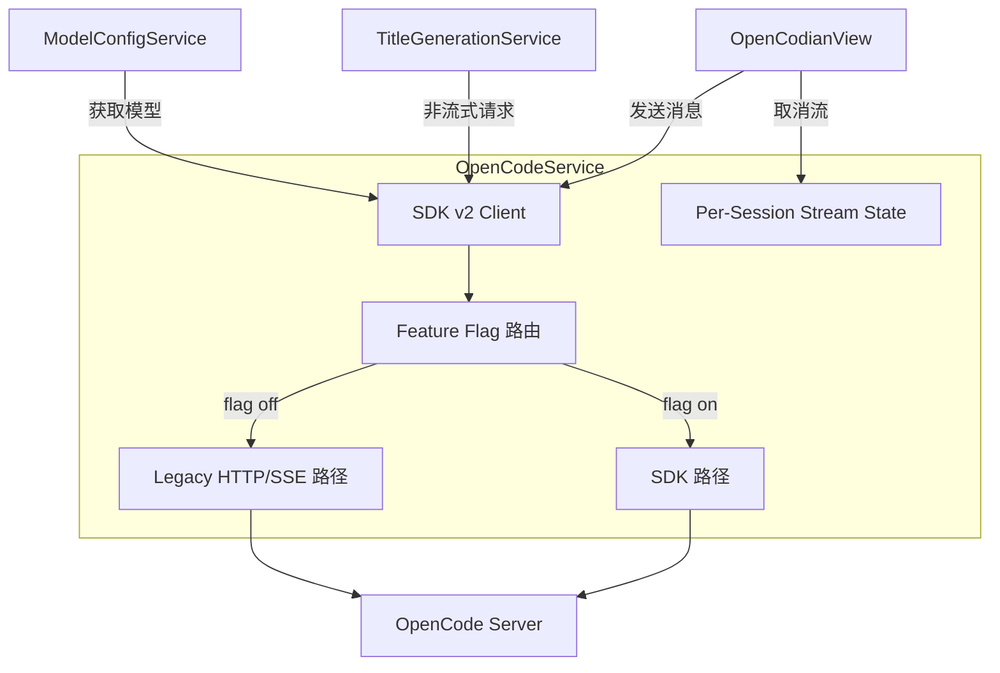

# OpenCodeService

> **源码**: `src/core/opencode/OpenCodeService.ts`
> **状态**: [DRAFT]

## 概述

OpenCodian 与 OpenCode Server 交互的核心服务层。当前为混合架构外观（hybrid facade）：UI 层 API 保持本地化，`ServerManager` 拥有进程生命周期，SDK v2 承载大部分 CRUD、流式响应和取消中断逻辑。维护 per-session 的流式状态以支持多 Tab 并发流式。通过特性开关控制 SDK v2 与 legacy HTTP/SSE 路径之间的切换。

## 导入关系

```text
上游: src/core/opencode/ServerManager, src/core/opencode/createSdkClient, src/core/opencode/sdkFetch, src/core/opencode/sdkFeatureFlags, src/core/opencode/sdkTypes, src/core/opencode/omoCompat, src/core/opencode/types, src/shared/logger
下游: src/features/chat/OpenCodianView, src/features/chat/services/TitleGenerationService, src/core/config/ModelConfigService
```

## 核心类型 / 接口

```typescript
// SDK 特性开关
interface SdkFeatureFlags {
  sdkCrud: boolean;
  sdkPrompt: boolean;
  sdkStream: boolean;
  sdkAbort: boolean;
  sdkQuestions: boolean;
  sdkSync: boolean;
}

// Per-session 流式状态
interface SessionStreamState {
  controller: AbortController | null;
  // ...
}

// 发送消息选项
interface SendMessageOptions {
  sessionId: string;
  model?: string;
  provider?: string;
  contextItems?: ContextItem[];
  effort?: string;
  thinkingBudget?: string;
  // ...
}
```

## 核心逻辑

### 健康检查 (checkHealth)

SDK 优先的健康检查，失败时回退到本地探针。检测 OpenCode 服务器是否可达并正常响应。

### 会话 CRUD

- `createSession(title?)`: 创建新的聊天会话
- `getSessionMessages(sessionId)`: 获取会话消息列表
- `updateSessionTitle(sessionId, title)`: 更新会话标题
- `deleteSession(sessionId)`: 删除会话
- `forkSession(sessionId, messageID?)`: 从指定消息分叉会话
- `revertSession(sessionId, messageID, partID?)`: 回滚会话到指定消息

### 消息发送与流式响应

`sendMessage(message, options)` 发送用户消息并返回流式响应。per-session 维护 `AbortController`，支持多 Tab 并发流式。`requestAssistantResponse()` 发送消息并等待完整（非流式）响应。

### 流式取消 (cancelStream)

`cancelStream(sessionId?)` 停止指定会话的本地流，并尽力通知服务器中止执行。双路径取消：本地 AbortController + 服务器端 abort API。

### 权限与问答

- `getPendingPermissions()`: 获取待处理的权限请求
- `respondToPermission(requestID, reply, message?)`: 回复权限请求
- `getPendingQuestions()`: 获取待处理的问答请求
- `replyToQuestion(requestID, answers)`: 回复问答请求
- `rejectQuestion(requestID)`: 拒绝问答请求

### 消息标准化

`openCodeMessageToChatMessage(info, parts)` 将持久化消息转换为聊天 UI 数据，包括 OMO 元数据和通知提示。

### Diff 与同步

- `getSessionDiff(sessionId, messageID?)`: 获取当前轮次/会话的 diff 元数据
- 通过 `global.syncEvent.subscribe()` 接收 session todo/status 更新

### SDK v2 / Legacy 双路径

通过 `sdkFeatureFlags` 控制运行时路径选择：
- **sdkCrud**: 会话 CRUD 操作
- **sdkPrompt**: 非流式消息发送
- **sdkStream**: 流式消息主路径
- **sdkAbort**: 取消/中断操作
- **sdkQuestions**: 问答请求处理
- **sdkSync**: 同步事件订阅

Legacy 的 `connectSSE()`, `parseSSEEvents()` 和 HTTP 辅助方法保留作为回滚路径。

## 关键方法

| 方法 | 说明 |
|------|------|
| `checkHealth()` | SDK 优先健康检查，回退到本地探针 |
| `createSession(title?)` | 创建新聊天会话 |
| `cancelStream(sessionId?)` | 停止指定会话流 + 尽力 abort 服务器执行 |
| `sendMessage(message, options)` | 发送消息并获取流式响应 |
| `requestAssistantResponse(message, options)` | 发送消息并等待完整非流式响应 |
| `getAvailableModels()` | 获取可用的 provider 和 model 列表 |
| `getSessionMessages(sessionId)` | 获取会话消息 |
| `updateSessionTitle(sessionId, title)` | 更新会话标题 |
| `deleteSession(sessionId)` | 删除会话 |
| `forkSession(sessionId, messageID?)` | 从指定消息分叉会话 |
| `revertSession(sessionId, messageID, partID?)` | 回滚会话 |
| `getPendingPermissions()` | 获取待处理权限请求 |
| `getPendingQuestions()` | 获取待处理问答请求 |
| `respondToPermission(requestID, reply, message?)` | 回复权限请求 |
| `replyToQuestion(requestID, answers)` | 回复问答请求 |
| `rejectQuestion(requestID)` | 拒绝问答请求 |
| `getSessionDiff(sessionId, messageID?)` | 获取 diff 元数据 |
| `openCodeMessageToChatMessage(info, parts)` | 标准化消息为 UI 数据 |

## 数据流



## 与其他模块的交互

- **ServerManager**: 间接使用，服务器进程生命周期由 ServerManager 管理
- **createSdkClient**: 创建 SDK v2 客户端实例
- **sdkFetch**: 为 SDK 提供混合 requestUrl/fetch 传输层
- **sdkFeatureFlags**: 读取运行时特性开关
- **sdkTypes**: SDK v2 与内部类型的桥接
- **omoCompat**: 在消息标准化中检测 OMO 元数据
- **OpenCodianView**: 主要消费者，通过此服务完成所有聊天交互
- **TitleGenerationService**: 调用 `requestAssistantResponse` 生成标题
- **ModelConfigService**: 调用 `getAvailableModels()` 获取模型目录

## 配置项

- **SDK Feature Flags**: 通过 `main.ts` 注入的运行时开关
- **服务器模式**: 本地 / 远程，影响 ServerManager 行为
- **端口 / URL**: OpenCode 服务器连接配置

## 注意事项

- **并发安全**: 流状态按 session 维护，不同 Tab/session 可以并发流式，不会共享全局 abort/controller
- **Rollback 路径**: Legacy `connectSSE()`, `parseSSEEvents()` 等 **不要删除**，作为 SDK v2 回滚路径保留
- **测试安全**: 构造 `OpenCodeService` 不传运行时覆盖时，所有 SDK 标志默认关闭
- **Pending 模块**: `format`, `agent`, `noReply`, `session.summarize()` 等尚未迁移
- **已废弃**: `externalContextPaths` 已废弃，未来可能被替换

## 待补充

- [ ] `sendMessage` 的完整事件流（text / thinking / tool_use / tool_result / done / error）
- [ ] Per-session stream state 的完整字段
- [ ] SDK v2 与 legacy 路径的具体 API 对照表
- [ ] `contextItems` (显式 Obsidian 文件/文本 parts) 的序列化细节
- [ ] 后台任务流式进度和 follow-up 伪流式展开机制
- [ ] 空闲会话同步循环 (idle sync loop) 的触发条件和行为
