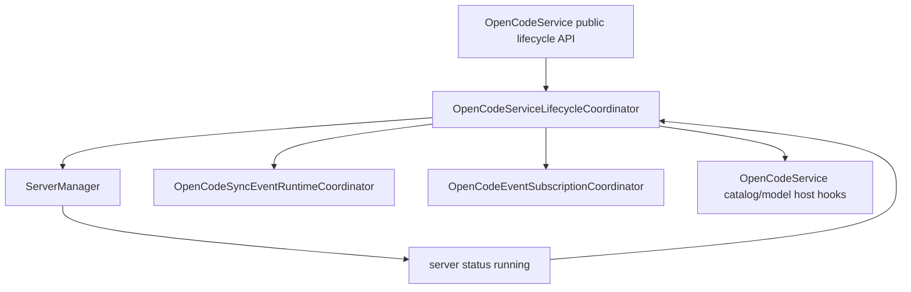

# OpenCodeServiceLifecycleCoordinator

> **源码**: `src/core/opencode/OpenCodeServiceLifecycleCoordinator.ts`
> **状态**: [REVIEW]

## 概述

`OpenCodeServiceLifecycleCoordinator` 是 `OpenCodeService` 内部的 service lifecycle owner。它现在同时收束：

- service initialize / start / stop / dispose
- server status change 后的 model/catalog bootstrap
- SDK-first health probe 与 `ServerManager.checkHealth()` fallback
- vault path / directory scope 变化后的 cache invalidation 与 subscription restart
- settings update plan、managed server stop/restart、subscription pause/resume 与 rollback/restore

这样 `OpenCodeService` 继续作为 façade + host seam，对外保留 `initialize()`、`start()`、`stop()`、`dispose()`、`checkHealth()`、`setVaultPath()` 与 `updateSettings()`，但不再直接持有独立的 settings reconfiguration coordinator 或 server-manager status wiring。

## 导入关系

```text
上游:
- `../../shared`
- `../types/settings`
- `./ServerManager`
- `./types`

下游:
- `src/core/opencode/OpenCodeService`
- 单元测试
```

## 核心类型 / 接口

- `OpenCodeServiceLifecycleAssemblyHost`: service façade 提供的装配 seam，包含 settings/baseUrl 读写、server state 回传、SDK health probe、catalog/model hooks 与 subscription runtimes。
- `OpenCodeServiceLifecycleCoordinatorHost`: coordinator 内部运行 seam，注入共享 `ServerManager`、sync/open-code event ports、scope invalidation hook 与对外通知回调。
- `OpenCodeServiceLifecycleAssembly`: `createAssembly()` 返回的共享装配结果，包含同一个 `ServerManager` 与 `OpenCodeServiceLifecycleCoordinator`。
- `OpenCodeSettingsUpdatePlan`: 单次 settings 更新的快照，记录新旧 mode/baseUrl/scope、subscription wanted state 与 managed server stop/restart 决策。
- `OpenCodeCompactionConfigApplyResult`: `reapplyCompactionConfigFromProjectConfig()` 的返回类型，status 为 `applied` 或 `deferred`，可选 reason。
- `OpenCodeServiceLifecycleCompactionPort`: compaction reload lifecycle 所需的 SDK/HTTP/diagnostics 操作 port。

## 核心逻辑

### Lifecycle assembly

`OpenCodeServiceLifecycleCoordinator.createAssembly()` 会先用当前 settings 创建共享 `ServerManager`，再把同一个 manager 注入 coordinator：

- `ServerManager.onStatusChange` 回流到 `handleServerStatusChange()`
- `ServerManager.onError` 继续透传给 `OpenCodeService` 上游事件回调
- server status / diagnostics / managed-state snapshot 由 coordinator 代理给服务层和 catalog debug metadata

### Initialize / start / stop

`initialize()` 只在本地服务且 `autoStart` 开启时调用 `start()`。`start()` 先确认 `baseUrl` 存在，再启动 `ServerManager`，最后恢复 sync event 与 open-code event subscriptions。`stop()` 与 `dispose()` 都先停止两类 subscriptions，再分别停止或释放 `ServerManager`。

### Server running bootstrap

`handleServerStatusChange()` 先把 status 向上传递；当状态进入 `running` 时，它会解除 transient connectivity 日志抑制，并异步执行 model/catalog bootstrap：

- `getAvailableModels()` 刷新 provider/model 目录
- `refreshToolIds()` 与 `refreshMcpServerStatus()` 并行刷新 catalog 相关状态
- provider 为空时保留原有 warning
- 成功后触发 `onModelsLoaded`

### Health probe fallback

`checkHealth()` 保持 SDK-first 语义：`sdkCrud` 开启时先调用 SDK `global.health()`，并在 coordinator 内统一归一化 boolean / `{ healthy }` 响应；SDK health 失败时记录 fallback warning，再回退到 `ServerManager.checkHealth(3000)`。任一健康路径成功都会重置 transient connectivity 日志抑制。

### Settings reconfiguration

`updateSettings(settings)` 现在由本 coordinator 直接拥有完整 reconfiguration lifecycle：

1. 构造 update plan：深拷贝新 settings，记录旧 baseUrl / tool catalog scope / subscription wanted state
2. 在本地运行中切换 host/port 时先执行 `canBindLocalEndpoint()` 预检；如果只是当前 managed server 的同端口 host 变更，则允许后续 restart 原地替换，避免被自己仍在监听的旧 sidecar 挡住
3. 写回 settings/baseUrl、更新 `ServerManager` config、按 scope 变化清理 tool schema cache，并暂停 subscriptions
4. 根据 mode/config/auth/source-mode/isolation-mode 决策 stop 或 restart managed server
5. 失败时回滚 settings/baseUrl/server config，必要时尽力 `start()` 原 managed server，最后恢复 subscriptions 并继续抛出原始错误

### Compaction config reload lifecycle

`reapplyCompactionConfigFromProjectConfig(compaction)` 现在由本 coordinator 直接拥有完整 compaction reload lifecycle：

1. 检查 `modelSourceMode === 'server'`，若是则 deferred（项目配置被禁用）
2. 检查 `getScopedDirectoryPath()` 是否可用，若否则 deferred
3. dispose scoped instance（SDK 优先，fallback 到 legacy HTTP）
4. 读取 resolved config（SDK 优先，fallback 到 legacy HTTP）
5. 对比 resolved config 中的 `compaction` 字段与传入值
6. 若匹配则返回 `applied`，否则返回 `deferred` 并附带原因
7. 任何异常都会被捕获，记录 diagnostic warning，返回 `deferred` 并附带错误描述

该 lifecycle 原先在 `OpenCodeService` 内实现，现已完整迁移到 coordinator；`OpenCodeService` 只保留公开门面并直接委托给 `this.serviceLifecycle.reapplyCompactionConfigFromProjectConfig()`。

### Subscription restarts

`setVaultPath(path)` 承担 vault path / directory scope 改变时的完整 lifecycle：记录旧 tool catalog scope，写回 `vaultPath`，同步 `ServerManager` 工作目录，按 scope 变化清理 tool schema cache，最后统一重启 sync event runtime 与 open-code event runtime。`restartEventSubscriptions()` 仍作为共享 restart primitive。

## 关键方法

| 方法 / 导出 | 说明 |
|-------------|------|
| `createAssembly(host)` | 创建共享 `ServerManager` 与 lifecycle coordinator |
| `createServerConfig(settings)` | 统一构造 `ServerManager` 初始配置与 settings update 配置 |
| `initialize()` | 按 settings 决定是否 auto-start local server |
| `handleServerStatusChange()` | 转发 server status，并在 running 后触发 model/catalog bootstrap |
| `start()` / `stop()` / `dispose()` | 编排 server 与 subscriptions lifecycle |
| `setVaultPath(path)` | 更新 vault scope、工作目录、tool cache 与 subscriptions |
| `restartEventSubscriptions()` | 统一重启 sync/open-code subscriptions |
| `checkHealth()` | 执行 SDK-first health probe 与 ServerManager fallback |
| `updateSettings(settings)` | 执行 settings reconfiguration / rollback lifecycle |
| `isReady()` / `getServerStatus()` / `getServerDiagnostics()` / `isServerProcessRunning()` | 代理 server status / diagnostics / managed process状态 |
| `reapplyCompactionConfigFromProjectConfig(compaction)` | 执行 compaction config reload lifecycle：dispose instance、读取 resolved config、对比并返回 applied/deferred |

## 数据流



## 与其他模块的交互

- `OpenCodeService` 继续作为对外 façade，负责创建 coordinator 并提供 host seam。
- `ServerManager` 仍拥有本地/远端 server process lifecycle；本 coordinator 决定何时 start/stop/restart/dispose 与何时响应 status。
- `OpenCodeCatalogQueryCoordinator` 仍拥有 tool schema cache；本 coordinator 只通过 host seam 触发 scope 变更时的 invalidation。
- `OpenCodeSyncEventRuntimeCoordinator` 与 `OpenCodeEventSubscriptionCoordinator` 仍各自持有 listener registry、wanted state 与 stream loop；本 coordinator 统一编排 service lifecycle 与 settings pause/resume 时机。

## 注意事项

- 不要把 streaming transport、prompt fallback、catalog query 或 session control 搬进本模块。
- `start()` 必须保持 server start 在前、subscription ensure 在后的顺序。
- `stop()` / `dispose()` 必须先停止 subscriptions，再停止或释放 server manager，避免 lingering SDK event loops。
- settings update 不得改变 managed server adoption/restart 规则、auth fallback、directory scope 或 sync/open-code event restart 条件。
