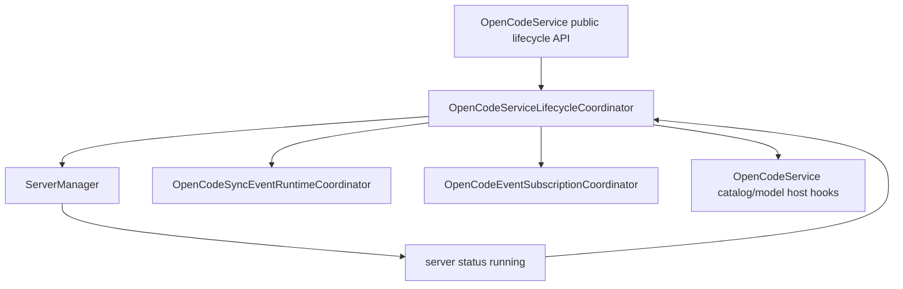

# OpenCodeServiceLifecycleCoordinator

> **源码**: `src/core/opencode/OpenCodeServiceLifecycleCoordinator.ts`
> **状态**: [REVIEW]

## 概述

`OpenCodeServiceLifecycleCoordinator` 是 `OpenCodeService` 内部的 service bootstrap / subscription lifecycle owner。它把服务初始化、server start/stop/dispose、server running 后的 model/catalog bootstrap、health probe fallback，以及 vault path scope refresh 与 sync / open-code event subscription 的启动停止顺序收束到一个 coordinator 中。

它不改变 `OpenCodeService` 的公开 API；上层仍然调用 `initialize()`、`start()`、`stop()`、`dispose()`、`checkHealth()` 和 `setVaultPath()`，只是这些入口的 runtime 编排不再直接铺在主门面里。

## 导入关系

```text
上游:
- `../../shared`
- `../types/settings`
- `./types`

下游:
- `src/core/opencode/OpenCodeService`
- 单元测试
```

## 核心类型 / 接口

- `OpenCodeServiceLifecycleCoordinatorHost`: host seam，提供 settings/baseUrl、SDK health probe、server manager、sync/open-code event subscription ports、model/catalog bootstrap hooks 与对外通知回调。
- `OpenCodeServiceLifecycleCoordinator`: 持有初始化、start/stop/dispose、vault path scope refresh、health fallback、server-running bootstrap 与 event subscription restart 的编排逻辑。

## 核心逻辑

### Initialize / start / stop

`initialize()` 只在本地服务且 `autoStart` 开启时调用 `start()`。`start()` 先确认 `baseUrl` 存在，再启动 `ServerManager`，最后按原有顺序恢复 sync event 与 open-code event subscriptions。`stop()` 与 `dispose()` 都先停止两类 event subscriptions，再分别停止或释放 `ServerManager`。

### Server running bootstrap

`handleServerStatusChange()` 先把 status 向上传递；当状态进入 `running` 时，它会解除 transient connectivity 日志抑制，并异步执行 model/catalog bootstrap：

- `getAvailableModels()` 刷新 provider/model 目录
- `refreshToolIds()` 与 `refreshMcpServerStatus()` 并行刷新 catalog 相关状态
- provider 为空时保留原有 warning
- 成功后触发 `onModelsLoaded`

### Health probe fallback

`checkHealth()` 仍保持 SDK-first 语义：`sdkCrud` 开启时先调用 SDK `global.health()`；SDK health 失败时记录 fallback warning，再回退到 `ServerManager.checkHealth(3000)`。任一健康路径成功都会重置 transient connectivity 日志抑制。

### Subscription restarts

`setVaultPath(path)` 现在承担 vault path / directory scope 改变时的完整 lifecycle：它先记录旧的 tool catalog scope，再写回 `vaultPath`、同步 `ServerManager` 工作目录、按 scope 变化清理 tool schema cache，最后统一重启 sync event runtime 与 open-code event runtime。`restartEventSubscriptions()` 则继续作为共享的 subscription restart primitive，供 vault path 变更与其他 lifecycle follow-up 复用。

## 关键方法

| 方法 / 导出 | 说明 |
|-------------|------|
| `initialize()` | 按 settings 决定是否 auto-start local server |
| `handleServerStatusChange()` | 转发 server status，并在 running 后触发 model/catalog bootstrap |
| `start()` | 启动 server，并恢复 sync/open-code subscriptions |
| `stop()` | 停止 subscriptions，再停止 server |
| `dispose()` | 停止 subscriptions，并释放 server manager |
| `setVaultPath(path)` | 更新 vault scope、刷新 ServerManager 工作目录、清理 scope-sensitive tool cache 并重启 subscriptions |
| `restartEventSubscriptions()` | 统一重启 sync/open-code subscriptions |
| `checkHealth()` | 执行 SDK-first health probe 与 ServerManager fallback |

## 数据流



## 与其他模块的交互

- `OpenCodeService` 继续作为对外 façade，负责创建 coordinator 并提供 host seam。
- `ServerManager` 仍拥有本地/远端 server process lifecycle；本 coordinator 只决定何时 start/stop/dispose 与何时响应 status。
- `OpenCodeSyncEventRuntimeCoordinator` 与 `OpenCodeEventSubscriptionCoordinator` 仍各自持有 listener registry、wanted state 与 stream loop；本 coordinator 只统一编排 service lifecycle 时机。
- `OpenCodeSettingsReconfigurationCoordinator` 仍负责 settings update / rollback 时的 pause/resume；不要把 settings reconfiguration 逻辑混入这里。

## 配置项

无独立配置项。它通过 host seam 读取 `OpenCodianSettings.server`、`baseUrl` 与 `sdkCrud` feature flag。

## 注意事项

- 不要把 streaming transport、prompt fallback 或 settings rollback 搬进本模块；这些分别属于 streaming runtime 与 settings reconfiguration owner。
- `start()` 必须保持 server start 在前、subscription ensure 在后的顺序。
- `stop()` / `dispose()` 必须先停止 subscriptions，再停止或释放 server manager，避免 lingering SDK event loops。
