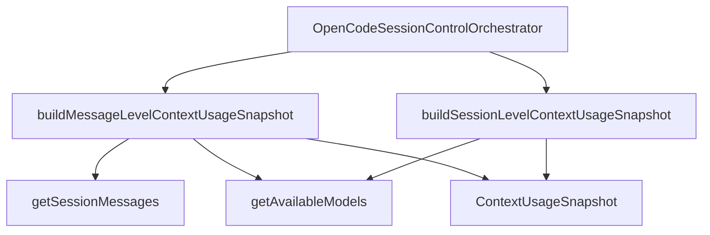

# OpenCodeSessionContextUsageBuilder

> **源码**: `src/core/opencode/OpenCodeSessionContextUsageBuilder.ts`
> **状态**: [REVIEW]

## 概述

`OpenCodeSessionContextUsageBuilder` 是 `OpenCodeSessionControlOrchestrator` 相邻的窄 owner，专门负责把 OpenCode session / message payload 组装成共享的 `ContextUsageSnapshot`。它把 provider/model 目录匹配、token breakdown、assistant cost 聚合，以及“最后一个带有效 token 的 assistant message”选择逻辑从 orchestrator 抽走，避免 session control owner 继续因为 usage 计算而变厚。

这个文件不改变 `OpenCodeService` 的公开 API。上层仍然只通过 `OpenCodeService.getSessionContextUsageSnapshot()` 拿结果；builder 只是内部实现 owner。

## 导入关系

```text
上游:
- `../types`
- `./OpenCodeSessionLifecycleCoordinator`

下游:
- `src/core/opencode/OpenCodeSessionControlOrchestrator.ts`
- 单元测试通过 orchestrator 间接覆盖
```

## 核心类型 / 接口

- `AvailableModelDirectory`: 从 host `getAvailableModels()` 返回的 provider/model 目录最小形状，供 snapshot 计算共享使用。
- `buildSessionLevelContextUsageSnapshot()`: 以 `Session.tokens` + `Session.model` 为源构造 snapshot；如果模型目录读取失败，退回原始 provider/model id 与 `contextWindow: 0`。
- `buildMessageLevelContextUsageSnapshot()`: 扫描 session messages，选择最后一个带有效 token 的 assistant message 作为当前上下文口径来源，同时优先保留 `session.cost`。
- `buildTokenBreakdown()`: 统一把 session/message token 结构展开成 `input/output/reasoning/cache` 分项与 `totalTokens`。
- `resolveAssistantTotalCost()`: 当 `session.cost` 缺失时，仅在全部 assistant message 都带数字 cost 时才聚合总成本。

## 核心逻辑

### Session-level snapshot

`buildSessionLevelContextUsageSnapshot()` 用于 session 已经存在可靠 `tokens + model` totals 的路径：

- 先尝试匹配 provider/model 目录，拿到展示用 `providerName`、`modelName` 与 `contextWindow`
- 如果目录读取失败，不吞掉 tokens/cost，而是退回 raw id 与 `contextWindow: 0`
- `compactingAt` 继续从 `Session.time.compacting` 透传到共享 snapshot

### Message-level snapshot

`buildMessageLevelContextUsageSnapshot()` 服务于“当前上下文占用”口径：

- 并行读取 session messages 与 model catalog
- 倒序挑选最后一个 `totalTokens > 0` 的 assistant message
- provider/model 优先取该 assistant message 的 ids；若缺失再退回 session model
- token 分项只来自这个最新有效 assistant message，避免把 session cumulative totals 误显示成当前上下文
- total cost 则优先保留 `session.cost`；只有缺失时才在 assistant message 全部具备数字 cost 的前提下聚合

### 通用组装

两个入口最终都会走 `buildContextUsageSnapshot()`：

- 统一写入 `sessionId`、title、created/updated time、`compactingAt`
- 复用同一 DTO 字段名，保证 OpenCode / Claude / Codex 的 context usage UI 可以消费同一个结构
- 把 token breakdown 与 model metadata 的 owner 放在 builder 内部，而不是向 orchestrator 泄漏更多临时字段

## 数据流



## 与其他模块的交互

- `OpenCodeSessionControlOrchestrator` 决定走 message-level 还是 session-level path，并在 message-level 失败时决定是否 fallback；builder 本身不负责日志策略。
- `OpenCodeSessionLifecycleCoordinator` 提供 `Session` / `SessionMessage` 结构定义，builder 直接消费这些上游 payload 形状。
- `src/core/types/chat.ts` 持有共享 `ContextUsageSnapshot` DTO；builder 只负责构造，不扩张字段。

## 注意事项

- 如果需求只是调整 token/cost/provider/model 的组装规则，优先改这个 builder，不要把分支塞回 orchestrator。
- message-level path 当前故意不会吞掉 model catalog / message fetch 异常；是否 fallback 由 orchestrator 决定，这样 warning/error 语义保持在 session control seam。
- `findLatestAssistantWithTokens()` 以 `totalTokens > 0` 为有效性标准，和当前 OpenCodian context usage UI 口径保持一致。
