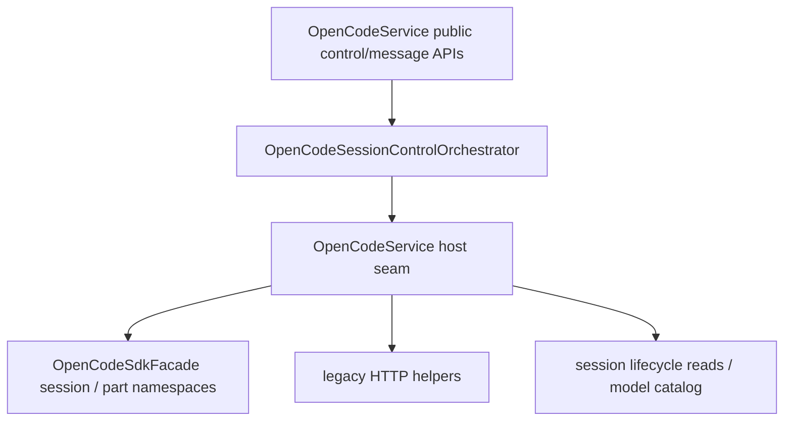

# OpenCodeSessionControlOrchestrator

> **源码**: `src/core/opencode/OpenCodeSessionControlOrchestrator.ts`
> **状态**: [REVIEW]

## 概述

`OpenCodeSessionControlOrchestrator` 是 `OpenCodeService` 内部的 session control / message-operation owner。它把 fork/revert/unrevert/diff、context-usage snapshot 的分流决策、session tree/share/summarize、message command/shell，以及 message/part 的更新删除操作收束到同一个较厚 orchestrator 里，让 `OpenCodeService` 退回为 transport seam 与对外 façade。

### 2026-07-22 context snapshot compatibility

`ContextUsageSnapshot` 现含 `totalTokens`。OpenCode 仍从可用的 input/output/reasoning/cache 分项合成它；未由后端报告的 cache-write 或 cost 保持 `null`，而非伪造为零，以便 Context UI 与 Codex 的精确数据共用同一 DTO。

它不改变 `OpenCodeService` 的公开 API：上层仍然通过 `OpenCodeService.forkSession()`、`revertSession()`、`getSessionDiff()`、`getSessionContextUsageSnapshot()`、`runSessionCommand()`、`updateMessagePart()` 等方法访问这条链路。

## 导入关系

```text
上游:
- `../../shared`
- `../types`
- `./OpenCodeSessionContextUsageBuilder`
- `./OpenCodeSessionLifecycleCoordinator`

下游:
- `src/core/opencode/OpenCodeService`
- 单元测试
```

## 核心类型 / 接口

- `SessionContextUsageSnapshot`: `ContextUsageSnapshot` 的 OpenCode 兼容别名，active tab context-usage 浮层消费的 session token/cost 快照；当前还会透传 `compactingAt`，让上层能读取 upstream `Session.time.compacting`。共享 DTO 的 owner 是 `src/core/types/chat.ts`，避免 OpenCode / Claude backend snapshot 路径重复定义字段。
- `SessionCommandTemplateContext`: `runSessionCommand()` 专用的 OpenCodian placeholder runtime 值，覆盖 vault path、当前笔记、当前选区、持久 external context paths 与会话标题。
- `SessionShellInput`: `runSessionShell()` 的结构化 shell 输入，集中持有 `agent`、shell `command`、可选 `model` 与 `messageID`。
- `OpenCodeSessionControlSdk`: orchestrator 依赖的最小 session SDK 面，覆盖 fork/revert/diff、session tree/share/summarize，以及 message command/shell。
- `OpenCodeSessionControlPartSdk`: part update/delete 的最小 SDK 面。
- `OpenCodeSessionControlOrchestratorHost`: host seam，提供 SDK CRUD 开关、legacy HTTP helper、session info/messages/model catalog 读取，以及 warning/error 日志。
- `buildMessageLevelContextUsageSnapshot()` / `buildSessionLevelContextUsageSnapshot()`: 相邻 owner `OpenCodeSessionContextUsageBuilder` 暴露的 usage 计算入口，承接 message/session 两条 snapshot 组装路径。
- `OpenCodeSessionControlOrchestrator`: 当前 owner，集中实现 session control / message-operation 公开方法。

## 核心逻辑

### Session control 收束

orchestrator 现在承接以下共享控制流：

- `forkSession()` / `revertSession()` / `unrevertSession()`：保持现有 mutation 语义；当 `sdkCrud` 启用时直接走 SDK mutation，不额外新增 mutation fallback。
- `getSessionRevertState()`：通过 host seam 读取 session info，统一返回 `revert.messageID` / `revert.partID`。
- `getSessionDiff()`：保留“SDK 只读读取失败时回退 legacy HTTP”的现有策略，并在同一 owner 中完成 diff payload 归一化。

### Context usage snapshot

`getSessionContextUsageSnapshot()` 现在也归口到这个 orchestrator，但计算细节已经挪到相邻 owner `OpenCodeSessionContextUsageBuilder`：

- 先用 session info 判断当前是否存在可靠的 session-level totals，再决定是优先走 latest-assistant message path 还是直接走 message scan
- 当 session-level totals 可用时，message-level 计算失败会在这里统一记 warning，并回退到 session totals
- 只有 message/session 两条 snapshot 的选择、fallback 和日志还留在 orchestrator；provider/model 解析、assistant token/cost 组装、`compactingAt` 透传等细节交给 builder
- 透传 session-level `time.compacting` 到 `compactingAt`，为后续 compaction live-state UI 保留事实来源
- 当 `session.tokens` 和 `session.model` 均非空时，仍会先扫描最后一个带 token 的 assistant message，把 session-level 累计 usage 误当成“当前上下文占用”；只有在最新 message token 缺失/无效时，才回退到 session totals
- session-level 回退路径在模型目录获取失败时退回原始 provider/model ID（`contextWindow: 0`），不丢失已有的 tokens/cost 数据；message-level 路径则优先保留 session-level 累计 cost，避免把 context token 口径修正后连带丢掉总成本

这样 `OpenCodeService` 不再直接持有 context-usage 计算细节，也避免相关逻辑继续散落在 session lifecycle 与 message API 之间。

### Message / part operations

剩余的 session message control 也收口到同一个 owner：

- `initializeSession()`、`getSessionChildren()`、`shareSession()`、`unshareSession()`、`summarizeSession()`
- `getSessionMessage()`、`deleteSessionMessage()`
- `runSessionCommand()`、`runSessionShell()`
- `updateMessagePart()`、`deleteMessagePart()`

这些 API 目前仍以 SDK namespace 为主，不在 orchestrator 内重新发明 transport layer；它只负责把 session control / message-operation surface 聚到一起。

其中 `runSessionCommand()` / `runSessionShell()` 现在还承担一个很窄的 request-normalization 责任：

- command template 里的 `{{vault_path}}`、`{{current_note_path}}`、`{{current_selection}}`、`{{external_context_paths}}`、`{{conversation_title}}` 会先在 orchestrator 内展开
- helper-only `placeholderContext` 不会继续透传给 SDK
- command 的 `agent` / `model` / `messageID` / `variant` 与 shell 的 `agent` / `command` / `messageID` 会在同一 seam 里做 trim / 克隆，避免外部复用同一个 request object 时产生隐式 mutation
- command 自带的结构化 `parts` 也会在这里浅克隆后再交给 SDK，保持 slash/plugin 注入语义留在 part 层而不是退回 prompt 字符串猜测

## 数据流



## 与其他模块的交互

- `OpenCodeService` 继续作为对外总门面，负责创建 orchestrator 并提供 transport、session read 与 catalog host seam。
- `OpenCodeSessionContextUsageBuilder` 持有 context usage snapshot 的 provider/model/token/cost 组装逻辑；orchestrator 只保留选择哪条 snapshot 路径与如何 fallback 的职责。
- `OpenCodeSessionLifecycleCoordinator` 仍拥有 session create/list/messages/todos/statuses/current-session 指针；本模块通过 host seam 读取 lifecycle 结果，而不是把 ownership 抢回主服务。
- `OpenCodeSdkFacade` 继续集中 request option 注入、response unwrap 与错误归一化；orchestrator 不直接创建 SDK client。

## 注意事项

- 不要把 fork/revert/diff、session share/summarize、message command/shell、part update/delete 再拆成多个薄 gateway；这些 API 共享同一块 session control / message-operation 语义。
- context usage snapshot 的“计算 owner”现在是 `OpenCodeSessionContextUsageBuilder`；如果只是改 token/cost/provider/model 组装细节，优先扩展 builder，而不是把实现重新塞回 orchestrator。
- command template placeholder expansion 继续留在 `runSessionCommand()` 所在的 session control seam；不要把这层 ownership 重新塞回 `OpenCodeService` 或 settings editor。
- 不要在这里混入 question/permission negotiation 或 broad query gateway；那是 roadmap 的后续 queue。
- 只读 diff 仍允许 SDK→legacy fallback；session mutation 与 message/part SDK wrappers 保持既有 transport 语义，不在这里引入额外回退分支。

### SDK capability availability check

新增 `isCapabilitySupported(capabilityId)` 方法，通过 host 的可选 `requireCapability(id)` 检查能力可用性。当 host 未提供 `requireCapability` 时默认返回 true（向后兼容）。Chat 在渲染 session 相关 affordance 前调用此方法。
