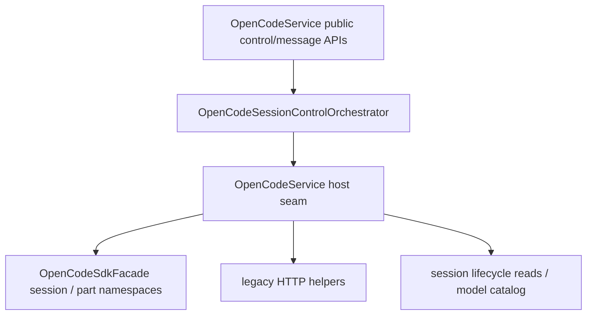

# OpenCodeSessionControlOrchestrator

> **源码**: `src/core/opencode/OpenCodeSessionControlOrchestrator.ts`
> **状态**: [REVIEW]

## 概述

`OpenCodeSessionControlOrchestrator` 是 `OpenCodeService` 内部的 session control / message-operation owner。它把 fork/revert/unrevert/diff、context-usage snapshot、session tree/share/summarize、message command/shell，以及 message/part 的更新删除操作收束到同一个较厚 orchestrator 里，让 `OpenCodeService` 退回为 transport seam 与对外 façade。

它不改变 `OpenCodeService` 的公开 API：上层仍然通过 `OpenCodeService.forkSession()`、`revertSession()`、`getSessionDiff()`、`getSessionContextUsageSnapshot()`、`runSessionCommand()`、`updateMessagePart()` 等方法访问这条链路。

## 导入关系

```text
上游:
- `../../shared`
- `../types`
- `./OpenCodeSessionLifecycleCoordinator`

下游:
- `src/core/opencode/OpenCodeService`
- 单元测试
```

## 核心类型 / 接口

- `SessionContextUsageSnapshot`: active tab context-usage 浮层消费的 session token/cost 快照。
- `SessionCommandTemplateContext`: `runSessionCommand()` 专用的 OpenCodian placeholder runtime 值，覆盖 vault path、当前笔记、当前选区、持久 external context paths 与会话标题。
- `OpenCodeSessionControlSdk`: orchestrator 依赖的最小 session SDK 面，覆盖 fork/revert/diff、session tree/share/summarize，以及 message command/shell。
- `OpenCodeSessionControlPartSdk`: part update/delete 的最小 SDK 面。
- `OpenCodeSessionControlOrchestratorHost`: host seam，提供 SDK CRUD 开关、legacy HTTP helper、session info/messages/model catalog 读取，以及 warning/error 日志。
- `OpenCodeSessionControlOrchestrator`: 当前 owner，集中实现 session control / message-operation 公开方法。

## 核心逻辑

### Session control 收束

orchestrator 现在承接以下共享控制流：

- `forkSession()` / `revertSession()` / `unrevertSession()`：保持现有 mutation 语义；当 `sdkCrud` 启用时直接走 SDK mutation，不额外新增 mutation fallback。
- `getSessionRevertState()`：通过 host seam 读取 session info，统一返回 `revert.messageID` / `revert.partID`。
- `getSessionDiff()`：保留“SDK 只读读取失败时回退 legacy HTTP”的现有策略，并在同一 owner 中完成 diff payload 归一化。

### Context usage snapshot

`getSessionContextUsageSnapshot()` 现在也归口到这个 orchestrator：

- 并行读取 session info、filtered session messages 与当前 model catalog
- 选取“最后一个带有效 token 的 assistant message”作为展示模型/上下文窗口/usage 的来源
- 聚合 assistant cost，总结 input/output/reasoning/cache token 数

这样 `OpenCodeService` 不再直接持有 context-usage 计算细节，也避免相关逻辑继续散落在 session lifecycle 与 message API 之间。

### Message / part operations

剩余的 session message control 也收口到同一个 owner：

- `initializeSession()`、`getSessionChildren()`、`shareSession()`、`unshareSession()`、`summarizeSession()`
- `getSessionMessage()`、`deleteSessionMessage()`
- `runSessionCommand()`、`runSessionShell()`
- `updateMessagePart()`、`deleteMessagePart()`

这些 API 目前仍以 SDK namespace 为主，不在 orchestrator 内重新发明 transport layer；它只负责把 session control / message-operation surface 聚到一起。

其中 `runSessionCommand()` 现在还承担一个很窄的 runtime helper 责任：在真正调用 SDK `session.command()` 前，把 OpenCodian command template 里的 `{{vault_path}}`、`{{current_note_path}}`、`{{current_selection}}`、`{{external_context_paths}}`、`{{conversation_title}}` 展开为当前 runtime 文本，并且不把 helper-only context payload 继续透传给 SDK。

## 数据流



## 与其他模块的交互

- `OpenCodeService` 继续作为对外总门面，负责创建 orchestrator 并提供 transport、session read 与 catalog host seam。
- `OpenCodeSessionLifecycleCoordinator` 仍拥有 session create/list/messages/todos/statuses/current-session 指针；本模块通过 host seam 读取 lifecycle 结果，而不是把 ownership 抢回主服务。
- `OpenCodeSdkFacade` 继续集中 request option 注入、response unwrap 与错误归一化；orchestrator 不直接创建 SDK client。

## 注意事项

- 不要把 fork/revert/diff、session share/summarize、message command/shell、part update/delete 再拆成多个薄 gateway；这些 API 共享同一块 session control / message-operation 语义。
- command template placeholder expansion 继续留在 `runSessionCommand()` 所在的 session control seam；不要把这层 ownership 重新塞回 `OpenCodeService` 或 settings editor。
- 不要在这里混入 question/permission negotiation 或 broad query gateway；那是 roadmap 的后续 queue。
- 只读 diff 仍允许 SDK→legacy fallback；session mutation 与 message/part SDK wrappers 保持既有 transport 语义，不在这里引入额外回退分支。
