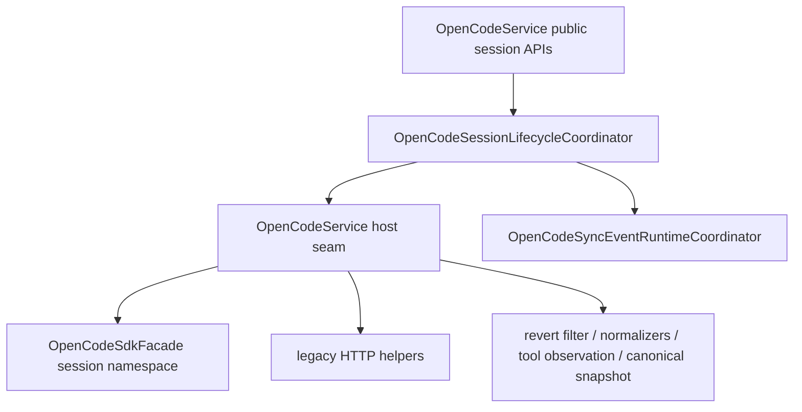

# OpenCodeSessionLifecycleCoordinator

> **源码**: `src/core/opencode/OpenCodeSessionLifecycleCoordinator.ts`
> **状态**: [REVIEW]

## 概述

`OpenCodeSessionLifecycleCoordinator` 是 `OpenCodeService` 内部的 session lifecycle owner。它把 session create/list/get/messages/todos/statuses/delete/update、session abort fallback、默认 current session 指针，以及公开 session sync 订阅 API 的委托，收束到一个较厚 coordinator 里，避免这些共享流程继续铺在 `OpenCodeService` 主门面中。

它不改变 `OpenCodeService` 的对外 API：上层仍然通过 `OpenCodeService.createSession()`、`listSessions()`、`getSessionMessages()`、`getSessionTodos()`、`getSessionStatuses()`、`deleteSession()`、`updateSessionTitle()` 与 session sync 订阅接口访问这条链路；streaming cancel 仍通过服务门面读取 current session，session control 的 shared message lookup 则直接复用本 owner。

## 导入关系

```text
上游:
- `../../shared`
- `../types`
- `./OpenCodeSyncEventRuntimeCoordinator`

下游:
- `src/core/opencode/OpenCodeService`
- 单元测试
```

## 核心类型 / 接口

- `Session` / `Message` / `Part` / `SessionMessage`: session lifecycle 公开接口复用的基础形状；其中 `Session.time.compacting`、`Message.summary`、`Part.auto/overflow/tail_start_id/metadata` 已保留 upstream compaction 元字段，供后续 live state / transcript 适配继续消费。
- `OpenCodeSessionLifecycleSdk`: coordinator 依赖的最小 session SDK 面，只覆盖 abort/create/get/list/messages/todo/status/delete/update；当前 host 可直接注入 `OpenCodeSdkFacade.session`，不再需要 `OpenCodeService` 先包一层 CRUD adapter。
- `OpenCodeSessionLifecycleSyncRuntime`: 对 `OpenCodeSyncEventRuntimeCoordinator` 的最小订阅面抽象。
- `OpenCodeSessionLifecycleCoordinatorHost`: host seam，提供 SDK CRUD/abort 开关、legacy HTTP helper、normalizer、revert 过滤、canonical snapshot 写入、tool 观测与日志。
- `OpenCodeSessionLifecycleCoordinator`: 持有 current session 指针，并实现 session lifecycle 公开方法。

## 核心逻辑

### Session lifecycle 收束

coordinator 持有以下共享流程：

- `createSession()`：按 `sdkCrud` 选择 SDK `session.create()` 或 legacy `POST /session`，并在需要时更新 current session 指针；未显式传入标题时会发送空 payload，让 OpenCode 官方 session 创建逻辑写入 `"New session - <ISO>"` 默认标题，以便首条真实用户消息后的官方后台标题生成能够命中。
- `getSessionInfo()`：按 `sdkCrud` 优先走 SDK `session.get()`，失败后回退到 legacy `GET /session/:id`，供 revert filtering、context usage 与 session control 共用。
- `abortSession()`：按独立 `sdkAbort` 优先走 SDK `session.abort()`，失败后回退到 legacy `POST /session/:id/abort`；空 session id 仍保持 no-op。
- `listSessions()`：优先走 SDK，失败后记录 warning 并回退到 legacy `GET /session`。
- `getSessionMessages()`：优先走 SDK `session.messages()`，统一经过 revert-state 过滤、tool-name 观测与 canonical snapshot 写入；SDK 失败时回退到 legacy `/session/:id/message`。
- `getSessionTodos()` / `getSessionStatuses()`：优先走 SDK，失败后分别回退到 legacy `/todo` 与 `/status`，并复用 `OpenCodeService` 的 normalizer。
- `deleteSession()` / `updateSessionTitle()`：保持现有 mutation 语义，不在 SDK mutation 失败时额外引入新 fallback。
- `updateSessionTitle()`：如果真实 server session 仍是 OpenCode 官方默认标题，则会跳过该 session 的第一次本地 provisional 标题写入，避免破坏官方 `ensureTitle()`；后续标题更新（本地兜底标题或用户手动改名）仍走 SDK `session.update({ title })` / legacy `PATCH /session/:id`。

### Current session 指针

`currentSessionId` 现在由 coordinator 自己持有：

- `createSession()` 可按 `setCurrent` 选项更新默认 session
- 无标题创建不会写入 OpenCodian 自己的 `"New Conversation"` 服务端标题；UI 空会话标题只保留在本地 conversation 元数据中。
- `setSessionId()` / `getSessionId()` 提供 `OpenCodeService` 公开 API 需要的读写入口
- `deleteSession()` 会在删除当前 session 时同步清空指针

这样 `OpenCodeService` 在 `requestAssistantResponse()`、`sendMessage()`、`cancelStream()`、`detachStream()` 等入口只需要读取 coordinator 的当前 session，而不再自己维护这块状态。

### Sync 订阅委托

session sync 订阅的状态机仍由 `OpenCodeSyncEventRuntimeCoordinator` 持有，但公开的：

- `subscribeToSessionTodoUpdates()`
- `subscribeToSessionStatusUpdates()`
- `subscribeToSessionSyncEvents()`

现在先进入 `OpenCodeSessionLifecycleCoordinator`，再转交给共享 sync runtime。这样 session lifecycle 的 API surface 和默认 session 指针被放在同一个 owner 里，而不是分散在 `OpenCodeService` 主类上。

## 数据流



## 与其他模块的交互

- `OpenCodeService` 继续作为对外总门面，负责创建 coordinator 并提供 transport / normalization host seam。
- `OpenCodeSyncEventRuntimeCoordinator` 继续持有 SDK sync stream 的 listener registry 与 wanted/subscription 状态机；本模块只把 session 订阅接口归口到 session lifecycle owner。
- `OpenCodeSdkFacade` 仍集中 SDK options 注入、response unwrapping 与错误归一化；coordinator 不自己创建 SDK client。

## 注意事项

- 不要把 create/get/list/messages/todo/status/abort/delete/update 再拆成独立薄 gateway；它们共享 current session、SDK/legacy fallback 与 revert/tool-observation 逻辑。
- 不要在无显式标题的 `createSession()` 中补本地默认标题，否则会破坏 OpenCode 官方 `ensureTitle()` 对默认标题的识别。
- `suppressedInitialDefaultTitleUpdates` 只用于跳过每个 session 的第一次 provisional 写入；不要把它扩展成长期拦截，否则会影响本地兜底标题和用户手动重命名。
- 不要在这里混入 session control/message operations、question/permission negotiation 或 broad query gateway；这些属于后续 roadmap queue。
- SDK mutation (`create` / `delete` / `update`) 当前保持原有语义，不额外引入“SDK mutation 失败再回退 legacy”的行为变化；`abortSession()` 保留既有 SDK abort 失败后 legacy abort 的流式取消语义。
