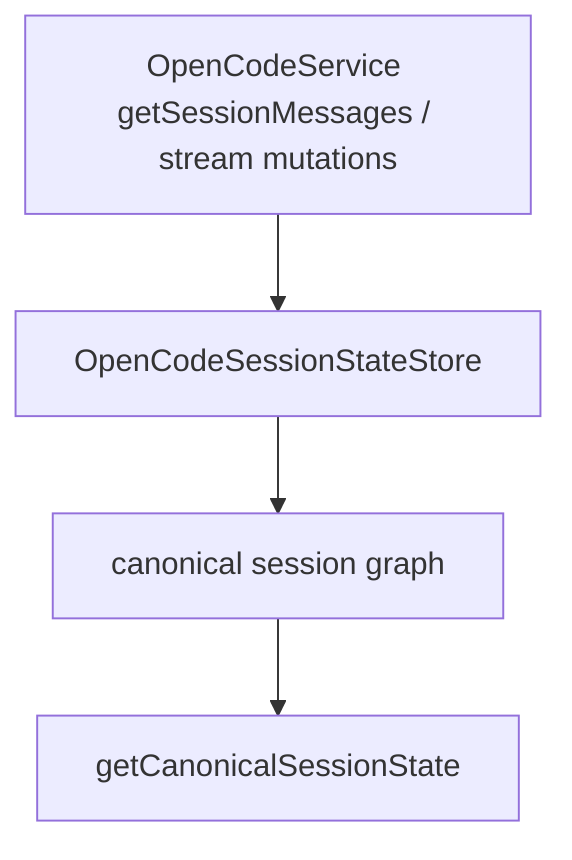

# OpenCodeSessionStateStore

> **源码**: `src/core/opencode/OpenCodeSessionStateStore.ts`
> **状态**: [REVIEW]

## 概述

`OpenCodeSessionStateStore` 是 `OpenCodeService` 内部的 canonical `session/message/part` graph owner。它把整份会话真相层收束到一个 reducer 风格 store 里，负责：

- 全量 session snapshot replace
- message / part 的 upsert 与 remove
- `message.part.delta` 风格的字符串字段增量合并
- stream mutation 的 message/part upsert、part merge、delta fallback part 补建
- `session.diff` sync event 的 diff entries 缓存
- session 级 eviction，用于删除会话或长期运行缓存收缩时释放 canonical graph
- 对外提供稳定、克隆后的 canonical state 读取视图

它不负责 SDK/legacy transport，也不负责 turn 渲染；当前只承接 session graph 状态本身。

## 导入关系

```text
上游:
- `./types`

下游:
- `src/core/opencode/OpenCodeService`
- 单元测试
```

## 核心类型 / 状态

- `OpenCodeCanonicalSessionState`: 单个 session 的规范状态，包含保留 authoritative / mutation 插入顺序的 `messages` 与按 message 聚合的 `partsByMessageID`。
- `OpenCodeSessionMessageWithParts`: `session.messages()` / legacy `/message` 读回的 `{ info, parts[] }` 结构。
- `sessions`: 以 `sessionID` 为键的内存状态表。
- `diffEntriesBySessionId`: 以 `sessionID` 为键的 diff entry 缓存表，由 `session.diff` sync event 写入。

## 核心逻辑

### Snapshot replace

`replaceSessionSnapshot()` 会：

1. 用当前 session 的 authoritative 消息数组重建 state
2. 补齐缺失的 `sessionID` / `messageID`
3. 保留 authoritative message 顺序，并继续按 `id` 稳定排序 part
4. 丢弃旧 snapshot 中已经不存在的 message/part

### Incremental mutation

- `upsertMessage()`：按 `message.id` 写入或更新 message
- `upsertPart()`：按 `messageID + part.id` 写入或更新 part
- `removeMessage()`：删除 message 并一并清掉其 parts
- `removePart()`：删除指定 part；最后一个 part 删除后清掉对应 message bucket
- `appendPartDelta()`：把 `delta` 追加到现有字符串字段，供后续 sync-event / streaming reducer 复用
- `applyStreamMutations()`：按 `OpenCodeStreamEventTransformer` 产出的 mutation 顺序应用 stream message/part upsert、nested part merge、part delta 与 delta-first fallback part 补建

### Read isolation

`getSessionState()` 与所有 mutation 返回值都会先 clone，再交给外部调用方，避免 UI 或测试直接反向修改 store 内部状态。

## 关键方法

| 方法 / 导出 | 说明 |
|-------------|------|
| `replaceSessionSnapshot()` | 用 authoritative `{info, parts[]}` 快照重建 canonical session graph |
| `upsertMessage()` | 写入或覆盖单条 message info |
| `removeMessage()` | 删除 message 并清理关联 parts |
| `upsertPart()` | 写入或覆盖单条 message part |
| `removePart()` | 删除单条 part |
| `appendPartDelta()` | 向现有字符串字段追加 delta |
| `applyStreamMutations()` | 应用 stream mutation 序列并维护 canonical message/part graph |
| `setSessionDiffEntries()` | 缓存 `session.diff` sync event 的 diff entries |
| `getSessionDiffEntries()` | 读取某个 session 的克隆后 diff entries |
| `removeSessionDiffEntries()` | 删除某个 session 的 diff entries |
| `deleteSession()` | 删除单个 session 的 canonical graph 与 diff entries，返回是否命中已存在 session |
| `deleteSessions()` | 按传入顺序批量删除 session，并返回实际删除的 session id |
| `getSessionIds()` | 按 store 插入顺序返回当前持有的 session id |
| `getSessionCount()` | 返回当前持有的 canonical session 数量 |
| `getSessionState()` | 读取某个 session 的克隆后 canonical state |

## 数据流



## 与其他模块的交互

- `OpenCodeService` 保留对外 session façade，但 authoritative `getSessionMessages()` snapshot 与 streaming runtime 的 mutation 序列都会立即写入本 store。
- `types.ts` 现在提供 canonical message/part/session state 类型，避免服务层和测试各自再定义一份结构。
- stream mutation graph reducer 已经复用同一个 owner；后续 sync-event graph mutation slice 也应继续复用这里，而不是重新引入第三份临时消息状态。

## 配置项

无独立配置项。store 完全依赖调用方传入的 session/message/part 数据。

## 注意事项

- 这是 canonical truth layer，不要把 UI 级 `ChatMessage.content` 拼接状态写回这里。
- message 顺序必须保留 authoritative snapshot / 增量 mutation 的原始会话顺序，不能再把 `id` 当成时间代理；本地 user message 已经可能使用随机 UUID 风格 `msg_*`，而 assistant message 仍可能来自单调 id 空间，按 `id` 排序会把旧 assistant 错挂到后续 user turn 后面。
- part 目前仍按 `id` 稳定排序；若未来 part 也引入独立显式顺序字段，应该在这里统一调整。
- `deleteSession()` 只清理本地 canonical graph；服务端删除仍由 OpenCodeSessionLifecycleCoordinator / OpenCodeService.deleteSession() 发起。
