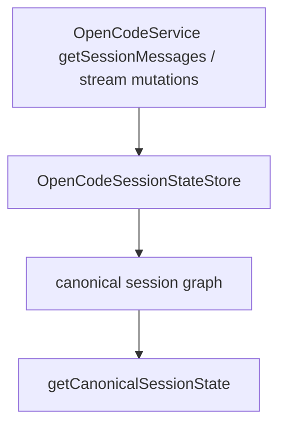

# OpenCodeSessionStateStore

> **源码**: `src/core/opencode/OpenCodeSessionStateStore.ts`
> **状态**: [REVIEW]

## 概述

`OpenCodeSessionStateStore` 是 `OpenCodeService` 内部的 canonical `session/message/part` graph owner。它把整份会话真相层收束到一个 reducer 风格 store 里，负责：

- 全量 session snapshot replace
- message / part 的 upsert 与 remove
- `message.part.delta` 风格的字符串字段增量合并
- stream mutation 的 message/part upsert、part merge、delta fallback part 补建
- `session.diff` sync event 的 diff entries 缓存
- session 级 eviction，用于删除会话或长期运行缓存收缩时释放 canonical graph
- 对外提供稳定、克隆后的 canonical state 读取视图

它不负责 SDK/legacy transport，也不负责 turn 渲染；当前只承接 session graph 状态本身。

## 导入关系

```text
上游:
- `./types`

下游:
- `src/core/opencode/OpenCodeService`
- 单元测试
```

## 核心类型 / 状态

- `OpenCodeCanonicalSessionState`: 单个 session 的规范状态，包含保留 authoritative / mutation 插入顺序的 `messages` 与按 message 聚合的 `partsByMessageID`。
- `OpenCodeSessionMessageWithParts`: `session.messages()` / legacy `/message` 读回的 `{ info, parts[] }` 结构。
- `sessions`: 以 `sessionID` 为键的内存状态表。
- `diffEntriesBySessionId`: 以 `sessionID` 为键的 diff entry 缓存表，由 `session.diff` sync event 写入。

## 核心逻辑

### Snapshot replace

`replaceSessionSnapshot()` 会：

1. 用当前 session 的 authoritative 消息数组重建 state
2. 补齐缺失的 `sessionID` / `messageID`
3. 保留 authoritative message 顺序，并继续按 `id` 稳定排序 part
4. 有读取 token 时，按请求开始 revision 合并等待期间的 message/part 更新、delta 和删除，再按合并结果判断 authoritative omission
5. 丢弃请求开始之前已存在、且读取期间没有新事件的缺失 message/part；为其保留 stream retraction barrier
6. 较旧请求晚于已提交的新请求完成时返回当前 clone；session eviction 后的旧 token 不得重建 session

### Incremental mutation

- `upsertMessage()`：按 `message.id` 写入或更新 message
- `upsertPart()`：按 `messageID + part.id` 写入或更新 part
- `removeMessage()`：删除 message 并清掉其 parts，同时为已有 part ID 分别记录 barrier；后续 message-only restore 不解除 part barrier
- `removePart()`：删除指定 part；最后一个 part 删除后清掉对应 message bucket
- `appendPartDelta()`：把 `delta` 追加到现有字符串字段，供后续 sync-event / streaming reducer 复用
- `applyStreamMutations()`：按 `OpenCodeStreamEventTransformer` 产出的 mutation 顺序应用 stream message/part upsert、nested part merge、part delta 与 delta-first fallback part 补建

### Read isolation

`getSessionState()` 与所有 mutation 返回值都会先 clone，再交给外部调用方，避免 UI 或测试直接反向修改 store 内部状态。

## 关键方法

| 方法 / 导出 | 说明 |
|-------------|------|
| `beginSessionSnapshot()` | 在每次异步请求前捕获 session owner、revision 和请求序号 |
| `replaceSessionSnapshot()` | 重建快照并合并读取期间 mutation；返回合并后的 clone |
| `upsertMessage()` | 写入或覆盖单条 message info |
| `removeMessage()` | 删除 message 并清理关联 parts |
| `upsertPart()` | 写入或覆盖单条 message part |
| `removePart()` | 删除单条 part |
| `appendPartDelta()` | 向现有字符串字段追加 delta |
| `applyStreamMutations()` | 应用 stream mutation 序列并维护 canonical message/part graph |
| `setSessionDiffEntries()` | 缓存 `session.diff` sync event 的 diff entries |
| `getSessionDiffEntries()` | 读取某个 session 的克隆后 diff entries |
| `removeSessionDiffEntries()` | 删除某个 session 的 diff entries |
| `deleteSession()` | 删除单个 session 的 canonical graph 与 diff entries，返回是否命中已存在 session |
| `deleteSessions()` | 按传入顺序批量删除 session，并返回实际删除的 session id |
| `getSessionIds()` | 按 store 插入顺序返回当前持有的 session id |
| `getSessionCount()` | 返回当前持有的 canonical session 数量 |
| `getSessionState()` | 读取某个 session 的克隆后 canonical state |

## 数据流


```mermaid
graph TD
    A[OpenCodeService getSessionMessages / stream mutations] --> B[OpenCodeSessionStateStore]
    B --> C[canonical session graph]
    C --> D[getCanonicalSessionState]
```

## 与其他模块的交互

- `OpenCodeService` 保留对外 session façade，但 authoritative `getSessionMessages()` snapshot 与 streaming runtime 的 mutation 序列都会立即写入本 store。
- `types.ts` 现在提供 canonical message/part/session state 类型，避免服务层和测试各自再定义一份结构。
- stream mutation graph reducer 已经复用同一个 owner；后续 sync-event graph mutation slice 也应继续复用这里，而不是重新引入第三份临时消息状态。

## 配置项

无独立配置项。store 完全依赖调用方传入的 session/message/part 数据。

## 注意事项

- 这是 canonical truth layer，不要把 UI 级 `ChatMessage.content` 拼接状态写回这里。
- message 顺序必须保留 authoritative snapshot / 增量 mutation 的原始会话顺序，不能再把 `id` 当成时间代理；本地 user message 已经可能使用随机 UUID 风格 `msg_*`，而 assistant message 仍可能来自单调 id 空间，按 `id` 排序会把旧 assistant 错挂到后续 user turn 后面。
- part 目前仍按 `id` 稳定排序；若未来 part 也引入独立显式顺序字段，应该在这里统一调整。
- `deleteSession()` 只清理本地 canonical graph；服务端删除仍由 OpenCodeSessionLifecycleCoordinator / OpenCodeService.deleteSession() 发起。

### 2026-10-02 T10 authoritative retraction regression

Authoritative message/part removal and omission from a replacement snapshot record session-local stream retraction barriers. `applyStreamMutations()` rejects delayed foreground upserts and delta-first fallback for those IDs. Authoritative upserts or snapshots can explicitly restore an ID; newly generated IDs remain accepted. Barriers survive snapshot replacement and belong weakly to the internal session state, so eviction releases them without changing the public canonical schema. This store owns backend messages only; immutable plugin-owned Turn Change Records remain in the chat owner under ADR 0002. Focused regression: `OpenCodeSessionStateStore.t10.test.ts`.

### 2026-10-02 T10 review fix: delayed snapshots

Lifecycle captures `beginSessionSnapshot()` before each SDK or HTTP request, including fallback, and retains the token through revert filtering. Message and part writes/removals/deltas record revisions. Snapshot commit preserves changes newer than the token; concurrent real removals still defeat stale restoration. Request order prevents an older response from replacing a newer committed snapshot. State-owned token identity prevents evicted-session resurrection. Synchronous replacement without a token remains authoritative. Dedicated regressions: `OpenCodeService.snapshotRace.t10.test.ts` and `OpenCodeSessionStateStore.snapshotRace.t10.test.ts`.

### 2026-10-02 T10 cycle fix

The snapshot token definition moved to `./types`; the store consumes it through its existing type-only import. Revision tracking, merge behavior, retraction barriers and runtime ownership are unchanged. This avoids making lifecycle consumers depend on this reducer implementation for a shared contract.
