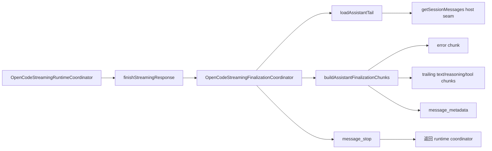

# OpenCodeStreamingFinalizationCoordinator

> **源码**: `src/core/opencode/OpenCodeStreamingFinalizationCoordinator.ts`
> **状态**: [REVIEW]

## 概述

`OpenCodeStreamingFinalizationCoordinator` 是 streaming transport 的 **finalization owner**。它负责在 SDK 或 legacy SSE 流结束后，基于 canonical session state 补发任何未在流中显式出现的尾部内容，确保客户端收到的 chunk 序列完整、一致。

本模块从 `OpenCodeStreamingRuntimeCoordinator` 中提取出来，专门承载以下职责：

- 在流结束后重新拉取最终 assistant message（含有限重试）
- 基于 `parentID` 过滤，确保只收尾当前 prompt 对应的 assistant
- 补发 trailing text delta、reasoning/thinking 块、tool use/result 块
- 检测并补发结构化 assistant error
- 输出 `message_metadata` 与 `message_stop` 结束标记

`OpenCodeStreamingRuntimeCoordinator` 仍负责 transport 选择、active stream registry、SDK/legacy fallback 和 cancel/detach 生命周期；finalization 逻辑全部委托给本模块。

## 导入关系

```text
上游:
- `../../shared`
- `../types`
- `./OpenCodeMessageNormalizationMapper`
- `./OpenCodeSessionLifecycleCoordinator`
- `./OpenCodeStreamEventTransformer`

下游:
- `src/core/opencode/OpenCodeStreamingRuntimeCoordinator.ts`
- `tests/unit/core/opencode/OpenCodeStreamingFinalizationCoordinator.test.ts`
```

## 核心类型 / 接口

- `OpenCodeStreamingFinalizationCoordinatorHost`: host seam，提供 `getSessionMessages()` 和 `delay()`。runtime coordinator 在构造时把自己适配成这个更小的 host 接口。
- `OpenCodeStreamingFinalizationCursor`: 单次 finalization 的 mutable cursor，携带 `lastContent`、`priorErrorMessage`、`processedToolIds`、reasoning 文本快照与 tool input 快照，避免把流内已发出的内容重复补发。
- `OpenCodeStreamingAssistantTail`: 从 session messages 中加载到的最终 assistant 消息及其 parts 摘要。
- `OpenCodeStreamingFinalizationOutcome`: finalization 结果，包含 assistant message ID、所有待补发的 chunks、以及最终文本长度。

## 核心逻辑

### Assistant tail 加载与重试

- `loadAssistantTail()` 通过 host seam 拉取当前 session 的完整消息列表。
- 使用 `findLatestAssistantMessage()` 从末尾向前扫描，只匹配 `role === 'assistant'` 的消息。
- 当传入了 `promptMessageId` 时，会进一步检查 `parentID` 是否匹配，避免在并发或多轮对话中误用上一轮 assistant。
- 如果当前 prompt 的 assistant 还未出现在消息列表中（常见于竞态），会做一次有界短延迟重试（最多 2 次，间隔 75ms）。

### 尾部内容补发

`buildAssistantFinalizationChunks()` 按以下顺序组装补发 chunks：

1. **Error chunk**: 如果最终 assistant 带有结构化错误、流内未发过 error、且当前也没有任何文本内容，则补发 `error` chunk。
2. **Trailing content chunks**: 遍历 assistant 的所有 parts：
   - **Text**: 计算 `currentText.slice(lastContent.length)`，只补发 delta。
   - **Reasoning/Thinking**: 对比 reasoning 文本快照，补发 delta；如果文本未变但存在 duration，则补发空 content + duration 的 thinking chunk。
   - **Tool**: 如果 tool 未被处理过或 input snapshot 发生变化，补发 `tool_use`；如果 tool 已完成/出错且 result 未被处理过，补发 `tool_result`。
3. **Metadata chunk**: 包含 assistant message ID、timestamp、model ID。

### 去重与状态隔离

- `processedToolIds` 确保同一个 tool 不会被重复补发。
- `reasoningTextSnapshots` 和 `toolInputSnapshots` 分别追踪 reasoning 文本和 tool input 的变更。
- `cursor` 是单次 finalization 的 mutable 对象，不同 session 或不同 finalization 调用之间互不干扰。

### 特殊处理

- **Internal structured output tools**（如 `__structured__output__`）会被跳过，不在 finalization 中补发。
- **Task tool** 会附加 `toolResultVisibility: 'hidden'`。
- **Tool metadata** 中如果包含 `sessionId`，会以 `toolMetadata` 形式附带，用于 child session linkage。

## 数据流



## 与其他模块的交互

- `OpenCodeStreamingRuntimeCoordinator` 在构造本模块时传入 host seam；流结束时调用 `finishStreamingResponse()` 获取最终 chunks。
- `OpenCodeMessageNormalizationMapper` 用于把 `providerID` + `modelID` 格式化为统一的 `modelId` 字符串。
- `OpenCodeSessionLifecycleCoordinator` 的 `Message` / `Part` 类型定义了 assistant tail 的数据结构。
- `OpenCodeStreamEventTransformer` 的 `OpenCodeStreamEventState` 提供了流内累积状态（`lastContent`、`processedToolIds` 等）。

## 配置项

本模块没有独立配置项；它完全依赖 host seam 和调用时传入的 `sessionId`、`state`、`promptMessageId`。

## 注意事项

- `loadAssistantTail()` 的重试逻辑只针对 `promptMessageId` 有值的情况；无 prompt 过滤时不会重试。
- `findLatestAssistantMessage()` 的 `parentID` 检查依赖 message 的 `parentID` 字段；如果该字段缺失，prompt-scoped 过滤会失效。
- 本模块是纯粹的 finalization 逻辑，不处理 transport、SSE reader 或 abort 信号；这些仍属于 `OpenCodeStreamingRuntimeCoordinator`。
- 不要在本模块中添加新的 runtime ownership（如 stream registry、cancel/detach），否则违背拆分边界。
