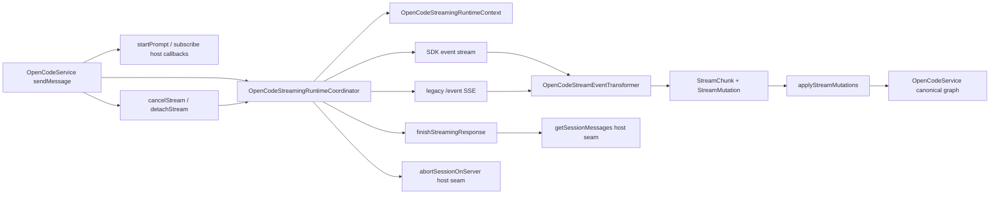

# OpenCodeStreamingRuntimeCoordinator

> **源码**: `src/core/opencode/OpenCodeStreamingRuntimeCoordinator.ts`
> **状态**: [REVIEW]

## 概述

`OpenCodeStreamingRuntimeCoordinator` 是 `OpenCodeService` 的 streaming transport owner。它现在把这整段 runtime seam 收束到一个 session-scoped coordinator 里：

- active stream registry 与 `AbortController` 生命周期
- 单一 streaming 入口下的 SDK/legacy transport 选择
- SDK stream 订阅、prompt 启动顺序与“首事件前失败 → legacy SSE”降级策略
- legacy `/event` SSE reader / parser / abort-detach 生命周期
- 在交付 legacy `StreamChunk` 前先把 stream mutations 转交给 canonical session graph
- `session.idle` / `session.error` 停止判定后的 final assistant message completion
- `cancelStream()` / `detachStream()` 的协议语义

`OpenCodeService` 仍负责 prompt payload 组装、SDK feature-flag 分流与 public API；`OpenCodeStreamEventTransformer` 仍负责 event → `StreamChunk` transform。本模块处在两者之间，承接完整 transport/fallback/read/finalize lifecycle。

## 导入关系

```text
上游:
- `../../shared`
- `../types`
- `./OpenCodeMessageNormalizationMapper`
- `./OpenCodeSessionLifecycleCoordinator`
- `./OpenCodeStreamEventTransformer`
- `./sdkTypes`

下游:
- `src/core/opencode/OpenCodeService.ts`
- `tests/unit/core/opencode/OpenCodeStreamingRuntimeCoordinator.test.ts`
```

## 核心类型 / 状态

- `OpenCodeStreamingRuntimeCoordinatorHost`: host seam，提供 stream mutation 应用、服务端 abort、legacy SSE 请求参数、session messages 读取、warning log、短延迟重试能力，以及共享的 `streamEventTransformer`。
- `OpenCodeStreamingRuntimeContext`: 单条活动流的 session-scoped runtime context，封装 `AbortController.signal`、part type map 与 part message-id map。
- `OpenCodeStreamingRuntimeRequest`: 单一 transport 入口；调用方传入 `useSdkStream`、当前 prompt 的 `promptMessageId`、SDK callbacks 与 legacy callbacks，coordinator 负责选择实际 transport。
- `OpenCodeStreamingLegacyStreamRequest`: legacy transport 入口；调用方可传入 `startPrompt()` 与 `promptMessageId`，coordinator 随后接手 `/event` 读取。
- `OpenCodeStreamingSdkStreamRequest`: SDK transport 入口；调用方传入 `startPrompt()`、`subscribe(signal)` 与 `promptMessageId`，coordinator 负责 SDK stream 读取与必要时的 legacy fallback。
- `activeStreams`: `Map<string, OpenCodeStreamingRuntimeContext>`，以 `sessionId` 为键保存当前活动流。

## 核心逻辑

### Active stream registry

- `createActiveStreamContext(sessionId)` 会为每个 session 分配独立 context。
- 如果同一 session 已有旧流，coordinator 会先中断旧 context，再注册新 context。
- `releaseActiveStreamContext()` 只在传入 context 仍是当前注册实例时才删除它，避免旧流 finally 把同 session 的新流误清掉。

### SDK / legacy transport seam

- `streamResponse()` 先根据 `useSdkStream` 选择 SDK 或 legacy transport，把 `OpenCodeService` 的入口分流收束到同一个 runtime seam。
- `streamSdkResponse()` 先用传入的 `subscribe(signal)` 建立 SDK event stream，再执行 `startPrompt()`，避免 prompt 启动后立刻产生的 reasoning delta 在订阅前丢失。
- 如果 SDK iterator 在第一条事件前抛错，coordinator 会通过 host 的 legacy SSE 请求参数立即切到 `/event`，保持既有 SDK-first / legacy fallback 策略。
- 一旦已经收到首个 SDK event，后续异常不会再切回 legacy，而是直接产出 `error` chunk。
- `streamLegacyResponse()` 则直接执行 legacy prompt 启动后进入 `/event` 读取。
- 每个 event outcome 都会先调用 `applyStreamMutations()`，再 yield 对应 `StreamChunk`，避免 canonical graph 落后于本地 loose chunk。

### SSE reader 与 finalize lifecycle

- `connectSSE()` / `openSseReader()` / `readSseStream()` 负责 legacy fetch reader、abort cancel、partial buffer、tail flush 生命周期。
- `streamEventTransformer.parseSSEEvents()` 继续负责把 buffer 切成完整 SSE events；coordinator 只维护 reader state 与剩余缓冲区。
- `finishStreamingResponse()` 会重新拉取最终 assistant message：
  - 只把 `parentID` 匹配当前 `promptMessageId` 的 assistant 当作本轮收尾候选，避免 silent timeout 后误复用上一轮 assistant
  - 如果当前 prompt 的 assistant 还没进入 `session.messages()`，会做一次有界短延迟重试，降低“第二次提问刚结束流就收尾，但持久化 assistant 仍未可见”的竞态
  - 基于 canonical assistant tail 的完整 parts 状态补发任何未在流中出现的尾部内容，而不只补文本：文本 delta、`reasoning/thinking`、tool use/result 都会按缺失情况恢复
  - 补发 `message_metadata`
  - 如果最终持久化 assistant message 带了结构化错误而流里没显式发出 `session.error`，补发 `error`
  - 始终以 `message_stop` 结束

### Cancel / detach 语义

- `cancelStream(sessionId)` 会中断本地 signal，并 best-effort 调用 host 的 `abortSessionOnServer()`。
- `detachStream(sessionId)` 只中断本地观察，不请求服务端 abort。
- 对于缺失 sessionId 或不存在的活动流，coordinator 只记 debug log，不抛异常。

### Part type tracking

`OpenCodeStreamingRuntimeContext` 继续保存流内 `partId -> partType` 映射，并额外记录 `partId -> messageID`。`OpenCodeStreamEventTransformer.handleStreamingEvent()` 会在 `message.part.updated` / `message.part.delta` 之间共享这些信息，让 reasoning/tool/text delta 的分类与 canonical message 归属都保持 per-session、per-stream 隔离。

## 数据流



## 与其他模块的交互

- `OpenCodeService` 现在只负责 prompt payload / request-body 组装、session 默认值解析，以及 transport callback 注入；SDK/legacy 入口分流、完整 transport/fallback/read/finalize 细节都委托给 coordinator。
- `OpenCodeStreamEventTransformer` 继续负责 `session.error` / `session.idle` 的 stop 判断、tool/question/file/permission 事件映射、canonical stream mutation 输出，以及 SSE event parsing。
- `OpenCodeSessionLifecycleCoordinator` 的 `getSessionMessages()` 通过 host seam 被用于 finalize 阶段补拉 assistant message。
- finalize 阶段还会复用 runtime 已记录的 `processedToolIds`、reasoning 文本快照与 tool input 快照，避免 canonical tail recovery 把已在流内发出的 tool/reasoning 块重复发一遍。
- `abortSessionOnServer()` 仍留在 `OpenCodeService`，因此 SDK `session.abort()` 失败后回退 legacy HTTP 的语义不变。

## 配置项

本模块没有独立配置项；它完全依赖 host seam、调用时传入的 `sessionId`，以及 `OpenCodeService` 注入的 SDK/legacy transport callbacks。

## 注意事项

- 不要把 prompt payload 组装重新搬回本模块；`OpenCodeContextPartSerializer` 与 `OpenCodePromptRequestBuilder` 仍是 `OpenCodeService` 的上游 owner。
- `releaseActiveStreamContext()` 的 identity check 是并发安全边界的一部分，不要简化成“按 sessionId 一律删除”。
- `cancelStream()` 与 `detachStream()` 的差异是协议语义，不只是日志差异：前者会请求服务端 abort，后者不会。
- `streamSdkResponse()` 的 fallback 只允许发生在首个 SDK event 之前；不要把“已经开始消费 SDK events 后的错误”也改成回退 legacy。
- 当前根因边界不是“单纯 SDK 不可用”，而是 SDK/legacy 两条 transport 都可能先结束本地流，再晚一点才让 canonical assistant tail 完整可见；因此收尾逻辑必须以最终 session state 为准，而不是只相信流内 chunk。
