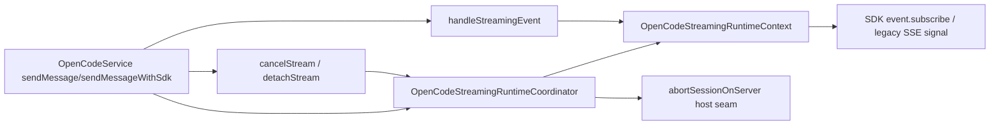

# OpenCodeStreamingRuntimeCoordinator

> **源码**: `src/core/opencode/OpenCodeStreamingRuntimeCoordinator.ts`
> **状态**: [REVIEW]

## 概述

`OpenCodeStreamingRuntimeCoordinator` 是 `OpenCodeService` 内部的 streaming runtime owner。它把按 session 隔离的 active stream registry、`AbortController` 生命周期、part type 跟踪，以及 `cancelStream()` / `detachStream()` 的本地终止语义收束到同一个较厚 coordinator，避免这些运行时状态继续直接铺在主服务里。

本模块刻意不负责 transport 调用，也不负责 event → `StreamChunk` transform；SDK `event.subscribe()`、legacy SSE `/event` 连接和 chunk 归一化仍留在 `OpenCodeService`，对应后续的 R25 边界。

## 导入关系

```text
上游:
- `../../shared`

下游:
- `src/core/opencode/OpenCodeService.ts`
- `tests/unit/core/opencode/OpenCodeStreamingRuntimeCoordinator.test.ts`
```

## 核心类型 / 状态

- `OpenCodeStreamingRuntimeCoordinatorHost`: host seam；当前只暴露 `abortSessionOnServer()`，让 coordinator 在 `cancelStream()` 时复用 `OpenCodeService` 既有的 SDK-first / legacy abort 路径。
- `OpenCodeStreamingRuntimeContext`: 单条活动流的 session-scoped runtime context，封装 `AbortController.signal` 与 part type map。
- `activeStreams`: `Map<string, OpenCodeStreamingRuntimeContext>`，以 `sessionId` 为键保存当前活动流。

## 核心逻辑

### Active stream registry

- `createActiveStreamContext(sessionId)` 会为每个 session 分配独立 context。
- 如果同一 session 已有旧流，coordinator 会先中断旧 context，再注册新 context。
- `releaseActiveStreamContext()` 只在传入 context 仍是当前注册实例时才删除它，避免旧流 finally 把同 session 的新流误清掉。

### Cancel / detach 语义

- `cancelStream(sessionId)` 会中断本地 signal，并 best-effort 调用 host 的 `abortSessionOnServer()`。
- `detachStream(sessionId)` 只中断本地观察，不请求服务端 abort。
- 对于缺失 sessionId 或不存在的活动流，coordinator 只记 debug log，不抛异常。

### Part type tracking

`OpenCodeStreamingRuntimeContext` 继续保存流内 `partId -> partType` 映射，供 `OpenCodeService.handleStreamingEvent()` 在 `message.part.updated` / `message.part.delta` 之间共享类型信息。这样 reasoning/tool/text delta 的分类仍保持 per-session、per-stream 隔离。

## 数据流



## 与其他模块的交互

- `OpenCodeService` 现在只负责 transport 装配、`StreamingState` chunk 聚合，以及 public API 的 session 默认值解析；active stream runtime registry 则委托给 coordinator。
- `OpenCodeService.handleStreamingEvent()` 继续直接消费 context 的 part type helper，但不再持有 `activeStreams` map。
- `abortSessionOnServer()` 仍留在 `OpenCodeService`，因此 SDK `session.abort()` 失败后回退 legacy HTTP 的现有语义不变。

## 配置项

本模块没有独立配置项；它完全依赖 host seam 与调用时传入的 `sessionId`。

## 注意事项

- 不要把 event → chunk transform、SSE parser 或 finish/fallback 逻辑迁进本模块；这些仍属于 `OpenCodeService` / R25 的职责。
- `releaseActiveStreamContext()` 的 identity check 是并发安全边界的一部分，不要简化成“按 sessionId 一律删除”。
- `cancelStream()` 与 `detachStream()` 的差异是协议语义，不只是日志差异：前者会请求服务端 abort，后者不会。
