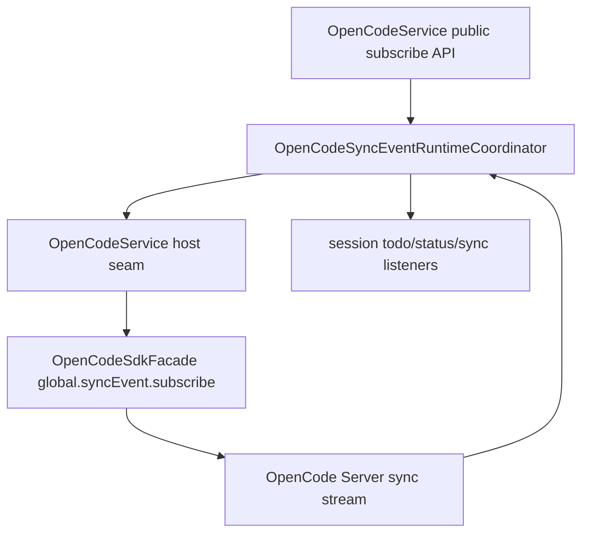

# OpenCodeSyncEventRuntimeCoordinator

> **源码**: `src/core/opencode/OpenCodeSyncEventRuntimeCoordinator.ts`
> **状态**: [REVIEW]

## 概述

`OpenCodeSyncEventRuntimeCoordinator` 是 `OpenCodeService` 内部的 sync-event runtime owner。它把 `global.syncEvent.subscribe()` 相关的 session todo、session status、message / part 增删改事件与 session diff 监听集合、wanted state、订阅生命周期、重连等待和 emit 路径收束到同一个较厚 coordinator，避免这些状态机继续铺在 `OpenCodeService` 主门面里。

它不改变 `OpenCodeService` 的对外 API；上层仍然通过 `OpenCodeService.subscribeToSessionTodoUpdates()`、`subscribeToSessionStatusUpdates()` 和 `subscribeToSessionSyncEvents()` 订阅事件。

## 导入关系

```text
上游:
- `../../shared`
- `../types`

下游:
- `src/core/opencode/OpenCodeService`
- 单元测试
```

## 核心类型 / 接口

- `SessionActivityStatus`: session 的 `idle` / `busy` / `retry` 状态。
- `SessionSyncEventUpdate`: reducer-ready 的 session sync payload，直接携带 canonical message / part 数据；`session.diff` 变体也会尽量附带已归一化的 diff entries，供 chat runtime 走独立 diff/notice 输入。
- `OpenCodeSyncEventRuntimeCoordinatorHost`: coordinator 的 host seam，提供 SDK 订阅、todo/status normalization、canonical sync-event apply、transient connectivity 判断、日志、健康检查和 delay。
- `OpenCodeSyncEventRuntimeCoordinator`: 持有 listener registry、wanted state、abort controller 与订阅 promise。

## 核心逻辑

### Listener registry

三类订阅都落到本 coordinator 内部：

- `subscribeToSessionTodoUpdates()`
- `subscribeToSessionStatusUpdates()`
- `subscribeToSessionSyncEvents()`

任一 listener 注册后会标记 `wanted = true` 并尝试确保 SDK sync event 订阅；最后一个 listener 释放后会停止订阅并清除 wanted state。

### Subscription lifecycle

`ensureSubscription()` 只在 `sdkSync` 可用、存在 listener、wanted state 为 true 且当前没有运行中的订阅 promise 时启动新的 `AbortController` 与 loop。`stopSubscription(keepWanted)` 只负责终止当前 loop，并可在设置切换或 vault path 改变时保留 wanted state，等待后续恢复。`restartSubscription()` 用于 directory/settings scope 改变后的受控重订阅。

### Event routing

SDK stream 事件会按现有语义路由：

- `todo.updated` → normalized `SessionTodo[]`
- `session.status` → normalized `SessionActivityStatus`
- `message.updated` / `message.removed` → reducer-ready message mutation
- `message.part.updated` / `message.part.removed` / `message.part.delta` → reducer-ready part mutation
- `session.diff` → 带可选 `diff` entries 的 `SessionSyncEventUpdate`

session id 仍按 `properties.sessionID`、`properties.info.sessionID`、`properties.part.sessionID` 的顺序解析；缺少 session id 的事件会被忽略。`session.diff` 的 `properties.diff` 会在这里先归一化成 `SessionDiffEntry[]`（缺失或形状异常时退为空数组）。对 message / part 事件，coordinator 现在会先调用 host 的 canonical apply seam，再把同一份 `SessionSyncEventUpdate` 广播给 listener。

### Transient connectivity recovery

当 SDK sync stream 报告 transient connectivity 错误时，coordinator 通过 host seam 复用 `OpenCodeService` 的日志抑制、`checkHealth()` 和 delay 逻辑，在服务恢复健康前轮询等待，而不是立即继续每秒重连刷日志。

## 关键方法

| 方法 / 导出 | 说明 |
|-------------|------|
| `subscribeToSessionTodoUpdates()` | 注册 todo.updated listener，并按需启动 SDK sync event loop |
| `subscribeToSessionStatusUpdates()` | 注册 session.status listener，并按需启动 SDK sync event loop |
| `subscribeToSessionSyncEvents()` | 注册 message/session sync listener，并按需启动 SDK sync event loop |
| `hasListeners()` | 供 `OpenCodeService.updateSettings()` 判断是否需要保留 wanted state |
| `ensureSubscription()` | 启动受 `sdkSync`、listener 与 wanted state 保护的订阅 loop |
| `stopSubscription()` | 中断当前订阅，可选择保留 wanted state |
| `restartSubscription()` | 在 directory/settings scope 改变时重启 SDK sync event loop |

## 数据流



## 与其他模块的交互

- `OpenCodeService` 继续作为对外总门面，负责创建 coordinator 并提供 host seam。
- `OpenCodeSdkFacade` 仍集中 SDK client options injection、response unwrapping 与错误归一化；coordinator 不直接创建 SDK client。
- `OpenCodianView` 与 chat runtime 不直接依赖本模块，仍通过 `OpenCodeService` 的公开订阅 API 消费 sync event。

## 配置项

无独立配置项。是否启用 SDK sync 由 host seam 的 `shouldUseSdkSync()` 读取 `sdkFeatureFlags.sdkSync` 决定。

## 注意事项

- 不要把 todo/status/message 三类 listener 再拆成独立薄 service；它们共享同一个 SDK sync stream 和 wanted/subscription 状态机。
- 不要在这里混入 OpenCode catalog event、tool/MCP catalog、prompt builder 或 streaming runtime；这些属于后续 maintainability queue。
- 修改 transient connectivity 行为时要同步考虑 `OpenCodeService.checkHealth()` 的日志抑制恢复语义。
