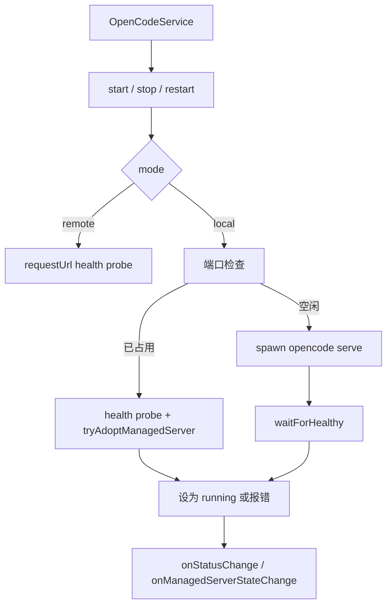

# ServerManager

> **源码**: `src/core/opencode/ServerManager.ts`
> **状态**: [REVIEW]

## 概述

`ServerManager` 负责 OpenCode 服务端进程生命周期，但它管理的并不只有“本地 spawn 出来的子进程”。

它同时处理三种场景：

- 本地模式下启动和停止 OpenCode 子进程
- 远程模式下只做可达性校验并把状态标成 `running`
- 端口已被占用时，尝试重新接管之前由插件自己启动过的 OpenCode 进程

因此，它既是进程管理器，也是“当前运行模式下服务是否可用”的状态机。

最近为了诊断 Obsidian 冷启动和插件首开过慢，这个 owner 还补充了 server boot 耗时日志：`start()` 会汇总整次 manager 启动耗时，而本地 spawn 流程会额外拆出 `spawn` 和 `waitForHealthy` 两段，便于确认瓶颈是在拉起进程本身，还是在等待 sidecar 进入 health ready。

## 导入关系

```text
上游:
- Node `child_process`, `fs`, `net`, `path`
- Obsidian `Notice`, `requestUrl`
- `../../shared/logger`
- `../config/modelConfig`
- `./LocalSidecarProcessInspector`
- `./types`

下游:
- `src/core/opencode/OpenCodeService`
```

## 核心类型 / 状态

- `ServerStatus`: `'stopped' | 'starting' | 'running' | 'error' | 'restarting' | 'conflict'`
- `ServerManagerEvents`: `onStatusChange` / `onError`
- `ServerManagerRuntimeOptions`:
  - `initialManagedServerState`
  - `onManagedServerStateChange`
- `process`: 当前 spawn 出来的 `ChildProcess`，只有本地 managed 进程才会有
- `managedServerState`: 插件持久化的 managed server 快照；`pid` 现在优先表示真实 listener pid，并可额外保存 `launcherPid` / `listenerPid` 双 pid 信息，以及启动签名（工作目录、模型来源模式、隔离模式、配置指纹）
- `diagnostics`: 结构化诊断快照，供设置页区分 `managed` / `external` / `conflict` / `orphan restarted`
- `startPromise`: 避免并发重复启动
- `workingDirectory`: 通常是 vault 根目录，用来让 OpenCode 读取 `.opencode/`

`getStatus()` 和 `isRunning()` 的语义不同：

- `getStatus()` 反映状态机值
- `isRunning()` 只有在状态是 `running` 且 `managedServerState !== null` 时才返回 `true`

所以远程模式可能是 `status === 'running'`，但 `isRunning() === false`；而本地未知健康服务现在会优先进入 `conflict`，不再伪装成正常运行。

## 核心逻辑

### 工作目录与 managed pid 追踪

`setWorkingDirectory(path)` 会：

- 记录 vault 根路径
- 把它作为后续 spawn 的 `cwd`
- 额外尝试读取 `${path}/.opencode/opencode.json` 里的权限配置并写 debug log

managed pid 的持久化/恢复通过 `managedServerState` 与 `onManagedServerStateChange` 完成。现在这份快照会把“谁启动了 sidecar”和“谁真正监听端口”分开记录：

- `pid`: 当前主判定 pid；优先等于 `listenerPid`
- `launcherPid`: 插件 `spawn()` 到的 wrapper / shell / direct child pid
- `listenerPid`: 当前本地端口真正的 owner pid

另外还会一起保存：

- `signatureVersion`
- `workingDirectory`
- `modelSourceMode`
- `pluginIsolationMode`
- `configFingerprint`

Windows 上 `launcherPid` 往往是 `cmd.exe` / `node.exe` 之类的包装层；真正监听 `127.0.0.1:4196` 的常常是后代 `opencode.exe`。因此 adopt / recycle / stop 不能再把单一 `pid` 当成永久真值。

### 启动流程 (`start` / `doStart`)

`start()` 先做两层短路：

1. 已经有 `startPromise` 时直接复用
2. `isRunning()` 为真时直接返回

真正逻辑在 `doStart()`：

#### 远程模式

不会 spawn 任何本地进程，但仍会：

- 对 `config.baseUrl` 执行健康检查
- 不可达时抛错
- 可达时把状态设成 `running`

#### 本地模式

插件托管 sidecar 的默认本地端点现在是 `127.0.0.1:4196`。独立 OpenCode CLI 仍常见使用 `127.0.0.1:4096`，两者不能再混为一谈。

会先检查目标端口：

- 端口空闲：进入 spawn 流程
- 端口占用但健康检查通过：
  - 先尝试 `tryAdoptManagedServer()`
  - 如果能确认这个 pid 就是之前插件管理的 `opencode serve --port ... --hostname ...`，且启动签名仍与当前 vault / 模式 / 配置指纹一致，则恢复接管
  - adopt 前还会再次核对：当前端口 owner 是否仍等于持久化的 `listenerPid`；不一致说明之前记录的 sidecar 已经漂移或被替换，需要转入 restart
  - 如果确认是插件之前的 managed server，但签名已经过期（例如工作目录、模型来源模式、隔离模式或相关 OpenCode 配置文件已经变化），会先停掉旧进程再重新 spawn
  - 如果当前端点正好是插件默认 `127.0.0.1:4196`，但 runtime state 丢了，而该进程看起来像插件自己拉起的 sidecar（命令行同时带有 Obsidian CORS 标记），则把它视为“插件孤儿 sidecar”，先同步回收，再重启当前 vault 对应服务
  - 其他未知健康服务不再无条件标成 `running`：现在会进入 `conflict`，把 pid / command line / 端口写入 diagnostics，让 UI 明确显示冲突
- 端口占用但健康检查失败：抛出“端口被其他进程占用”的错误

这里有一个反复出现的真实坑：

- 不能因为目标端口上已经有一个健康的 OpenCode 服务，就直接无条件接管
- 如果那个进程是插件之前拉起的旧 managed server，但它的工作目录、`modelSourceMode`、`pluginIsolationMode` 或相关 OpenCode 配置文件已经变化，继续复用它就会让当前 vault 看到错误的 provider/runtime 目录
- 典型症状是：`opencode models` 有很多 provider，但插件设置页 `服务器目录` 只剩 1 个或 3 个

现在 `tryAdoptManagedServer()` 必须先做“启动签名”校验；签名过期就先停旧进程，再重新 spawn 当前 vault 对应的本地服务。后续不要把这层逻辑回退成“只要端口健康就 adopt”。

真正 spawn 时会：

- 调用 `findOpenCodeBinary()`
- 用 `spawn(opencodePath, ['serve', '--port', ..., '--hostname', ..., '--cors', ...])`
- 把 `cwd` 设为 `workingDirectory`
- 注入由 `getSpawnEnv()` 生成的环境变量
- 记录 managed pid
- 启动成功后再用“当前端口 owner 反查”刷新 `listenerPid`，把 launcher / listener 双 pid 一起写回 runtime state
- 挂上 stdout/stderr tail、`error` / `exit` 追踪
- 直接进入“健康轮询 + 进程提前退出”竞态等待；不再依赖固定延迟 1 秒

如果启动失败，报错会带上最近的进程输出 tail，而不是只有泛化 timeout。

本地成功启动后会先输出一条 startup 性能日志，汇总：

- 从开始 spawn 到 ready 的总耗时
- `spawn` 耗时
- `waitForHealthy` 耗时

随后才弹出 `new Notice('OpenCode server started')`。

### 停止与重启 (`stop` / `restart`)

`stop()` 分三种情况：

- 没有 `process`、也没有 `managedServerState`：直接进入 `stopped`
- 没有 `process` 但有 `managedServerState`：说明是“接管到的 pid”，会按保存下来的 listener / launcher pid 候选顺序终止
- 有 `process`：走正常终止流程

正常终止流程的策略是：

- 非 Windows：先发 `SIGTERM`，5 秒后仍未退出再发 `SIGKILL`
- Windows：通过 `taskkill /PID ... /T /F` 终止整棵进程树

`stop()` / `dispose()` 现在还有一个关键约束：**只有确认本地端口已经释放**，才会清掉 `managedServerState`。如果 kill 发出后端口仍然忙，manager 会保留 runtime state，让下次启动优先 adopt / restart，而不是把仍然活着的 sidecar误判成孤儿。

`dispose()` 额外提供了同步 best-effort 清理路径，给 `main.ts` 的 `onunload()` 优先回收已拥有的本地 sidecar，减少 Obsidian 退出时留下孤儿进程；同步 unload 里如果端口仍忙，也会保留 managed state 而不是盲目清空。

`restart()` 只是按顺序执行：

1. `setStatus('restarting')`
2. `stop()`
3. `start()`

### 健康检查与端口探测

- `checkHealth(timeout)` 通过 `requestUrl(GET ${baseUrl}/global/health)` 判断服务是否健康，只有 HTTP 200 才返回 `true`
- `canBindLocalEndpoint(host, port)` 和内部 `isPortAvailable()` 通过真实 bind 一个临时 `net.Server` 来判断端口是否可用
- `waitForHealthy(timeout)` 轮询健康检查，并在进程提前退出时立刻失败
- 对“旧 managed server 需要重启”的情况，还会额外等待端口释放后再重新 spawn；目标不是单纯让 `4196` 有服务，而是让插件默认 sidecar 端点对应**当前 vault 的正确服务**
- OS 级别的进程查询（`lsof`/`netstat`、命令行解析、PID 存活检查）已委托给 `LocalSidecarProcessInspector`；`ServerManager` 只保留 domain 层的 adopt / recycle / conflict 判定逻辑

### Spawn 环境变量与模型来源模式

`getSpawnEnv()` 会根据配置生成不同的 OpenCode 运行环境：

- `pluginIsolationMode === 'pure'`: 设置 `OPENCODE_PURE=true`
- basic auth: 设置 `OPENCODE_SERVER_USERNAME` / `OPENCODE_SERVER_PASSWORD`
- `modelSourceMode === 'server'`:
  - `OPENCODE_DISABLE_PROJECT_CONFIG=true`
  - 清掉 `OPENCODE_CONFIG_DIR` / `OPENCODE_CONFIG_CONTENT`
- `modelSourceMode === 'merge'`:
  - 不禁用 project config
  - 清掉 `OPENCODE_CONFIG_DIR` / `OPENCODE_CONFIG_CONTENT`
- 其他情况（本地 project config 模式）:
  - 同样清掉 `OPENCODE_DISABLE_PROJECT_CONFIG` / `OPENCODE_CONFIG_DIR` / `OPENCODE_CONFIG_CONTENT`
  - 让 OpenCode 直接按 `cwd=<vault>` 去解析当前 vault 的 `.opencode` 配置

另外，spawn 前仍会清理一批会污染配置作用域的 `OPENCODE_*` 覆盖变量（例如 `OPENCODE_CONFIG`、`OPENCODE_CONFIG_DIR`、`OPENCODE_CONFIG_CONTENT`、`OPENCODE_PERMISSION`、`OPENCODE_PLUGIN_META_FILE` 等），避免插件本地 `4196` sidecar 沿用外部终端或旧集成留下的配置注入。

但从这次 slash-command 对齐修复开始，`default` 模式不会再主动抹掉用户显式设置的插件 / skill 运行时开关（例如 `OPENCODE_DISABLE_DEFAULT_PLUGINS`、`OPENCODE_DISABLE_CLAUDE_CODE*`、`OPENCODE_DISABLE_EXTERNAL_SKILLS`、`OPENCODE_PURE`）。原因是 OpenCodian 需要尽量和用户在官方 OpenCode Desktop / TUI 中看到的插件加载结果一致；如果这些 flag 是用户有意配置的运行时偏好，插件 sidecar 也应继承它们。`pure` 模式仍会显式写入 `OPENCODE_PURE=true`，作为插件内的强制隔离开关。

### OpenCode 可执行文件解析

`findOpenCodeBinary()` 现在会真正按候选列表解析可执行文件，而不是只返回字面量命令名：

- Windows：优先 `%APPDATA%\\npm\\opencode.cmd`，再尝试 `%LOCALAPPDATA%\\npm\\opencode.cmd`，最后才回退到 `PATH` 里的 `opencode.cmd` / `opencode`
- macOS / Linux：优先常见绝对路径，再回退到 `PATH`
- 当系统里同时存在 npm 全局安装和其他渠道（例如 `winget`）的 `opencode` 时，这能让插件更稳定地命中 npm 版本，减少“终端 `opencode` 与插件本地 `4196` sidecar 不是同一套二进制”的偏差

## 关键方法

| 方法 | 说明 |
|------|------|
| `setWorkingDirectory(path)` | 记录 vault 根目录，并作为本地 spawn 的 `cwd` |
| `getStatus()` | 返回状态机值 |
| `isRunning()` | 判断插件当前是否持有一个 managed pid |
| `updateConfig(config)` | 更新运行配置 |
| `canBindLocalEndpoint(host, port)` | 预检目标 host/port 是否可绑定 |
| `start()` | 启动或接管服务 |
| `stop()` | 停止本地 managed 进程或终止被接管的 pid |
| `restart()` | 顺序执行 stop + start |
| `checkHealth(timeout?)` | 请求 `/global/health` |
| `launchLocalServerRuntime()` | 本地模式下 spawn sidecar、等待健康，并输出本次 ready 耗时拆分 |

## 数据流



## 与其他模块的交互

- `OpenCodeService` 是唯一直接消费者，负责决定何时 start/stop/restart。
- `modelConfig.parseOpencodeConfigText()` 被用于解析本地 `.opencode` 配置，从中提取 provider id。
- `shared/logger` 负责启动参数、状态变化和错误日志。

## 配置项

`ServerManager` 直接消费 `OpenCodeServerConfig` 中这些字段：

- `mode`
- `baseUrl`
- `local.host`
- `local.port`
- `auth`
- `modelSourceMode`
- `pluginIsolationMode`
- `timeout`

## 注意事项

### 优先扩展的相邻模块

`ServerManager` 的下游只有 `OpenCodeService`，它不直接被 UI 或其他模块消费。新功能类型应优先扩展：

| 功能类型 | 优先扩展 |
|----------|----------|
| 服务状态 / 模型目录 / catalog bootstrap | `OpenCodeServiceLifecycleCoordinator` |
| 本地 server 配置 UI | `SettingsServerSection` |
| 远程连接配置 | `SettingsServerSection` + `OpenCodeService` |
| Managed server state 持久化 | `main.ts` (通过 runtime options callback) |
| Server 健康检查 / diagnostics | `OpenCodeServiceLifecycleCoordinator` (health probe) |

### 不可移除的关键行为

1. **签名过期的 managed server 必须重启**：对“之前插件自己拉起、但当前签名已过期”的本地服务，不会再无条件接管；会先重启，让 provider/runtime 目录重新和当前 vault 配置、全局配置保持一致。不能跳过签名检查直接复用旧进程。
2. **未知健康服务只回收默认端口 sidecar**：对未知健康服务，只有“确认是插件默认 `4196` 端点上的插件 sidecar”才允许自动回收；自定义端口上的未知健康服务一律进入 `conflict`。不能放宽回收条件。
3. **`pid` 不等于 launcher pid**：`pid` 不再等同于“最初 spawn 出来的 child pid”；Windows 上应优先把 `listenerPid` 视为真实 sidecar 生命周期真值。adopt / recycle / stop 不能把单一 `pid` 当成永久真值。
4. **远程模式 `start()` 不是空操作**：远程模式下 `start()` 会做健康检查并把状态置为 `running`；不能跳过健康检查直接标记为 running。

### 其他注意事项

- `findOpenCodeBinary()` 会显式探测候选路径和 `PATH`，不再只是“构造候选字符串后交给 shell”。
- `setWorkingDirectory()` 只会额外检查 `.opencode/opencode.json` 的存在并写日志，不会在这里解析 `.jsonc`。
- 如果未来又出现“服务器目录突然只剩 deepseek / 1 个 provider / 3 个 provider”这类问题，第一排查项不是 SDK 返回解包，而是：插件默认 `4196` 端点是否被孤儿 sidecar / 冲突进程占用、`runtime.json` 的 managed server 签名是否过期、当前 `cwd` 是否真的指向目标 vault。
