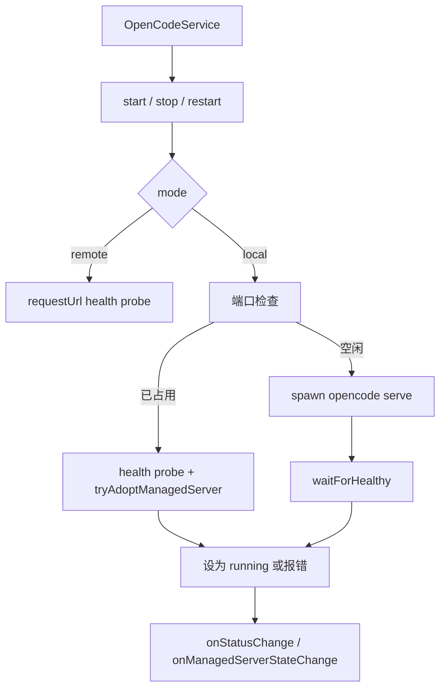

# ServerManager

> **源码**: `src/core/opencode/ServerManager.ts`
> **状态**: [REVIEW]

## 概述

`ServerManager` 负责 OpenCode 服务端进程生命周期，但它管理的并不只有“本地 spawn 出来的子进程”。

它同时处理三种场景：

- 本地模式下启动和停止 OpenCode 子进程
- 远程模式下只做可达性校验并把状态标成 `running`
- 端口已被占用时，尝试重新接管之前由插件自己启动过的 OpenCode 进程

因此，它既是进程管理器，也是“当前运行模式下服务是否可用”的状态机。

## 导入关系

```text
上游:
- Node `child_process`, `fs`, `net`, `path`
- Obsidian `Notice`, `requestUrl`
- `../../shared/logger`
- `../config/modelConfig`
- `./types`

下游:
- `src/core/opencode/OpenCodeService`
```

## 核心类型 / 状态

- `ServerStatus`: `'stopped' | 'starting' | 'running' | 'error' | 'restarting'`
- `ServerManagerEvents`: `onStatusChange` / `onError`
- `ServerManagerRuntimeOptions`:
  - `initialManagedServerState`
  - `onManagedServerStateChange`
- `process`: 当前 spawn 出来的 `ChildProcess`，只有本地 managed 进程才会有
- `managedServerState`: 插件持久化的 `{ pid, host, port }`
- `startPromise`: 避免并发重复启动
- `workingDirectory`: 通常是 vault 根目录，用来让 OpenCode 读取 `.opencode/`

`getStatus()` 和 `isRunning()` 的语义不同：

- `getStatus()` 反映状态机值
- `isRunning()` 只有在状态是 `running` 且 `managedServerState !== null` 时才返回 `true`

所以远程模式或“外部已有但未被插件接管”的服务，可能是 `status === 'running'`，但 `isRunning() === false`。

## 核心逻辑

### 工作目录与 managed pid 追踪

`setWorkingDirectory(path)` 会：

- 记录 vault 根路径
- 把它作为后续 spawn 的 `cwd`
- 额外尝试读取 `${path}/.opencode/opencode.json` 里的权限配置并写 debug log

managed pid 的持久化/恢复通过 `managedServerState` 与 `onManagedServerStateChange` 完成。它只记录：

- `pid`
- `host`
- `port`

### 启动流程 (`start` / `doStart`)

`start()` 先做两层短路：

1. 已经有 `startPromise` 时直接复用
2. `isRunning()` 为真时直接返回

真正逻辑在 `doStart()`：

#### 远程模式

不会 spawn 任何本地进程，但仍会：

- 对 `config.baseUrl` 执行健康检查
- 不可达时抛错
- 可达时把状态设成 `running`

#### 本地模式

会先检查目标端口：

- 端口空闲：进入 spawn 流程
- 端口占用但健康检查通过：
  - 先尝试 `tryAdoptManagedServer()`
  - 如果能确认这个 pid 就是之前插件管理的 `opencode serve --port ... --hostname ...`，则恢复接管
  - 否则把它当成“外部已有 OpenCode 服务”直接标成 `running`
- 端口占用但健康检查失败：抛出“端口被其他进程占用”的错误

真正 spawn 时会：

- 调用 `findOpenCodeBinary()`
- 用 `spawn(opencodePath, ['serve', '--port', ..., '--hostname', ..., '--cors', ...])`
- 把 `cwd` 设为 `workingDirectory`
- 注入由 `getSpawnEnv()` 生成的环境变量
- 记录 managed pid
- 监听 `error` / `exit`
- 延迟 1 秒后进入 `waitForHealthy()` 轮询

本地成功启动后会弹出 `new Notice('OpenCode server started')`。

### 停止与重启 (`stop` / `restart`)

`stop()` 分三种情况：

- 没有 `process`、也没有 `managedServerState`：直接进入 `stopped`
- 没有 `process` 但有 `managedServerState`：说明是“接管到的 pid”，调用 `terminateManagedPid(pid)`
- 有 `process`：走正常终止流程

正常终止流程的策略是：

- 非 Windows：先发 `SIGTERM`，5 秒后仍未退出再发 `SIGKILL`
- Windows：通过 `taskkill /PID ... /T /F` 终止整棵进程树

`restart()` 只是按顺序执行：

1. `setStatus('restarting')`
2. `stop()`
3. `start()`

### 健康检查与端口探测

- `checkHealth(timeout)` 通过 `requestUrl(GET ${baseUrl}/global/health)` 判断服务是否健康，只有 HTTP 200 才返回 `true`
- `canBindLocalEndpoint(host, port)` 和内部 `isPortAvailable()` 通过真实 bind 一个临时 `net.Server` 来判断端口是否可用
- `waitForHealthy(timeout)` 每 500 ms 轮询一次健康检查，直到成功或超时

### Spawn 环境变量与模型来源模式

`getSpawnEnv()` 会根据配置生成不同的 OpenCode 运行环境：

- `pluginIsolationMode === 'pure'`: 设置 `OPENCODE_PURE=true`
- basic auth: 设置 `OPENCODE_SERVER_USERNAME` / `OPENCODE_SERVER_PASSWORD`
- `modelSourceMode === 'server'`:
  - `OPENCODE_DISABLE_PROJECT_CONFIG=true`
  - 清掉 `OPENCODE_CONFIG_DIR` / `OPENCODE_CONFIG_CONTENT`
- `modelSourceMode === 'merge'`:
  - 不禁用 project config
  - 清掉 `OPENCODE_CONFIG_DIR` / `OPENCODE_CONFIG_CONTENT`
- 其他情况（本地 project config 模式）:
  - `OPENCODE_DISABLE_PROJECT_CONFIG=true`
  - `OPENCODE_CONFIG_DIR=<vault>/.opencode`
  - `OPENCODE_CONFIG_CONTENT={"enabled_providers":[...]}`

provider 列表来自 `getLocalProviderIds()`，它会读取 `.opencode/opencode.json` 或 `.opencode/opencode.jsonc`，优先拿 `provider` 对象的键，否则从 `model` 的 `provider/model` 字符串里截 provider 前缀。

### OpenCode 可执行文件解析

`findOpenCodeBinary()` 现在会真正按候选列表解析可执行文件，而不是只返回字面量命令名：

- Windows：优先 `%APPDATA%\\npm\\opencode.cmd`，再尝试 `%LOCALAPPDATA%\\npm\\opencode.cmd`，最后才回退到 `PATH` 里的 `opencode.cmd` / `opencode`
- macOS / Linux：优先常见绝对路径，再回退到 `PATH`
- 当系统里同时存在 npm 全局安装和其他渠道（例如 `winget`）的 `opencode` 时，这能让插件更稳定地命中 npm 版本，减少“终端 `opencode` 与插件本地 4096 服务不是同一套二进制”的偏差

## 关键方法

| 方法 | 说明 |
|------|------|
| `setWorkingDirectory(path)` | 记录 vault 根目录，并作为本地 spawn 的 `cwd` |
| `getStatus()` | 返回状态机值 |
| `isRunning()` | 判断插件当前是否持有一个 managed pid |
| `updateConfig(config)` | 更新运行配置 |
| `canBindLocalEndpoint(host, port)` | 预检目标 host/port 是否可绑定 |
| `start()` | 启动或接管服务 |
| `stop()` | 停止本地 managed 进程或终止被接管的 pid |
| `restart()` | 顺序执行 stop + start |
| `checkHealth(timeout?)` | 请求 `/global/health` |

## 数据流



## 与其他模块的交互

- `OpenCodeService` 是唯一直接消费者，负责决定何时 start/stop/restart。
- `modelConfig.parseOpencodeConfigText()` 被用于解析本地 `.opencode` 配置，从中提取 provider id。
- `shared/logger` 负责启动参数、状态变化和错误日志。

## 配置项

`ServerManager` 直接消费 `OpenCodeServerConfig` 中这些字段：

- `mode`
- `baseUrl`
- `local.host`
- `local.port`
- `auth`
- `modelSourceMode`
- `pluginIsolationMode`
- `timeout`

## 注意事项

- 远程模式下 `start()` 不是空操作；它会做健康检查并把状态置为 `running`。
- `findOpenCodeBinary()` 虽然构造了多组候选路径，但当前实现直接返回候选数组的第一个值，实际依赖的是系统 `PATH`/spawn 解析，而不是显式文件探测。
- `setWorkingDirectory()` 只会额外检查 `.opencode/opencode.json` 的存在并写日志，不会在这里解析 `.jsonc`。
- 对“外部已有但未接管”的健康 OpenCode 服务，状态会是 `running`，但 `isRunning()` 仍可能是 `false`。
