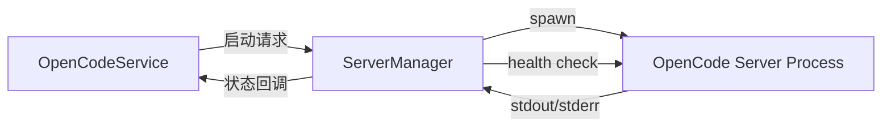

# ServerManager

> **源码**: `src/core/opencode/ServerManager.ts`
> **状态**: [DRAFT]

## 概述

OpenCode 服务器进程生命周期管理器。负责在本地模式下启动和停止 OpenCode Node.js 子进程，监控进程健康状态，并提供服务器可达性检查接口。在远程模式下不启动本地进程，仅提供健康检查。

## 导入关系

```text
上游: obsidian (Notice API), src/shared/logger, child_process (Node.js)
下游: src/core/opencode/OpenCodeService
```

## 核心类型 / 接口

```typescript
// 服务器运行状态
interface ServerStatus {
  running: boolean;
  port?: number;
  pid?: number;
}
```

## 核心逻辑

### 服务器启动 (start)

在本地模式下：
1. 确定 OpenCode 二进制路径（全局安装的 `opencode-ai`）
2. 使用 `child_process.spawn` 启动 OpenCode 服务器进程
3. 传递 vault 路径和相关环境变量
4. 监听 stdout/stderr 输出，重定向到日志
5. 等待服务器就绪（端口监听）
6. 可选：支持 pure 模式等特殊环境变量

在远程模式下跳过启动。

### 服务器停止 (stop)

优雅停止子进程：发送终止信号，等待进程退出，超时后强制终止。清理所有引用。

### 健康检查 (checkHealth)

向 OpenCode 服务器发送 HTTP 健康检查请求（通常是 `GET /health`），判断服务器是否可达且正常响应。

## 关键方法

| 方法 | 说明 |
|------|------|
| `start()` | 启动 OpenCode 服务器进程（本地模式） |
| `stop()` | 停止服务器进程并清理资源 |
| `checkHealth()` | 检查服务器是否响应健康检查 |

## 数据流



## 与其他模块的交互

- **OpenCodeService**: 唯一的直接消费者，在需要时调用 start/stop/checkHealth
- **Settings**: 服务器模式（本地/远程）和端口配置影响启动行为
- **PluginManagementService**: pure 模式等插件隔离设置影响服务器环境变量

## 配置项

- **服务器模式**: `local`（启动子进程）或 `remote`（连接远程地址）
- **端口**: 本地服务器监听端口
- **认证**: 远程模式下的认证凭据

## 注意事项

- 服务器启动是异步操作，需要等待端口就绪后才能发送 API 请求
- 进程清理应在插件卸载时执行，避免孤立进程
- Windows 和 macOS/Linux 的进程管理存在差异（信号处理、路径分隔符等）
- 远程模式下 start() 不执行任何操作

## 待补充

- [ ] 进程启动参数的完整列表
- [ ] 健康检查的具体 HTTP 端点和超时设置
- [ ] 进程崩溃时的自动重启策略（如有）
- [ ] pure 模式下的环境变量列表
- [ ] 服务器就绪检测的轮询机制细节
