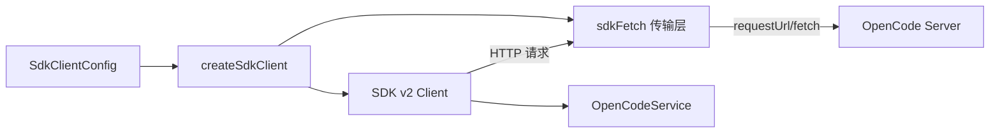

# SDK v2 Client Factory

> **源码**: `src/core/opencode/createSdkClient.ts`
> **状态**: [DRAFT]

## 概述

OpenCode SDK v2 客户端工厂函数，负责创建类型化的 SDK 客户端实例。配置传输层（通过 `sdkFetch` 桥接 Obsidian 的 `requestUrl`），设置服务器地址和认证信息，返回供 `OpenCodeService` 使用的完整 SDK 客户端对象。

## 导入关系

```text
上游: @opencode/sdk (SDK v2 包), src/core/opencode/sdkFetch, src/core/opencode/sdkTypes
下游: src/core/opencode/OpenCodeService
```

## 核心类型 / 接口

```typescript
// SDK v2 客户端类型（从 SDK 包导入）
import type { OpenCodeClient } from "@opencode/sdk/v2";

// 工厂配置
interface SdkClientConfig {
  baseUrl: string;
  authToken?: string;
  // ...
}

// 工厂函数签名
function createSdkClient(config: SdkClientConfig): OpenCodeClient;
```

## 核心逻辑

### 客户端创建

1. 从配置中获取服务器 base URL 和认证信息
2. 创建自定义 fetch 传输层（使用 `sdkFetch` 的混合 requestUrl/fetch 实现）
3. 初始化 SDK v2 客户端，注入自定义传输层
4. 返回类型化的客户端实例

### 传输层注入

SDK v2 默认使用标准 `fetch` API，但 Obsidian 环境中需要通过 `requestUrl` 绕过 CORS 和安全限制。`createSdkClient` 将 `sdkFetch` 作为自定义传输注入到 SDK 客户端。

## 关键方法

| 方法 | 说明 |
|------|------|
| `createSdkClient(config)` | 创建并返回配置完成的 SDK v2 客户端实例 |

## 数据流



## 与其他模块的交互

- **sdkFetch**: 提供混合传输层实现
- **sdkTypes**: 提供 SDK v2 与插件内部类型的桥接定义
- **OpenCodeService**: 唯一消费者，通过此工厂获取 SDK 客户端实例
- **SDK v2 参考实现**: `reference-projects/opencode/packages/sdk/js/src/v2`

## 配置项

- **baseUrl**: OpenCode 服务器地址
- **authToken**: 远程模式下的认证令牌

## 注意事项

- SDK v2 包的实际导入路径需要与 `reference-projects/opencode/packages/sdk/js/src/v2` 中的类型保持一致
- 自定义传输层必须兼容 SDK 的 fetch 接口契约
- 客户端实例应考虑缓存/复用，避免重复创建

## 待补充

- [ ] SDK v2 包的确切导入路径和版本
- [ ] 完整的 `SdkClientConfig` 字段列表
- [ ] SDK 客户端的生命周期管理（是否需要显式销毁）
- [ ] 错误处理：连接失败、认证失败等
