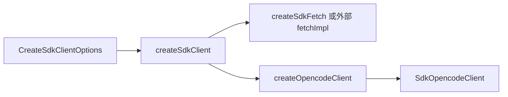

# SDK v2 Client Factory

> 2026-07-29: SDK client factory now accepts an optional OpenCode trace port and passes it only to the custom fetch implementation.

> **源码**: `src/core/opencode/createSdkClient.ts`
> **状态**: [REVIEW]

## 概述

`createSdkClient.ts` 只有一个职责：按 OpenCodian 运行时环境创建 `@opencode-ai/sdk/v2/client` 客户端。

它把三件事固定下来：

- 使用 OpenCodian 提供的 `baseUrl`
- 注入适配 Obsidian 环境的 `fetch`
- 打开 SDK 的 `responseStyle: 'data'` 与 `throwOnError: true`

这个模块本身不缓存客户端；当前 `OpenCodeService.getSdkClient()` 会按需重复创建。

## 导入关系

```text
上游:
- `@opencode-ai/sdk/v2/client`
- `./sdkFetch`
- `./sdkTypes`

下游:
- `src/core/opencode/OpenCodeService`
```

## 核心类型 / 接口

`CreateSdkClientOptions` 的字段是源码里真实定义的全部输入：

| 字段 | 说明 |
|------|------|
| `baseUrl` | OpenCode 服务地址 |
| `authHeaders?` | 要透传给 SDK 的请求头 |
| `directory?` | SDK 工作目录，当前通常传 vault 路径 |
| `experimentalWorkspaceId?` | 会被重命名成 SDK 需要的 `experimental_workspaceID` |
| `fetchImpl?` | 可选的 fetch 实现；不传时使用 `createSdkFetch()` |

返回值类型是 `SdkOpencodeClient`，本质上是 SDK 的 `OpencodeClient` 别名。

## 核心逻辑

### 配置组装

工厂内部会构造一个 SDK config 对象，并固定这些字段：

- `baseUrl`
- `directory`
- `experimental_workspaceID`
- `fetch`
- `headers`
- `responseStyle: 'data'`
- `throwOnError: true`

其中：

- `baseUrl` 被断言成模板字面量类型 `` `${string}://${string}` ``
- `experimentalWorkspaceId` 会重命名为 `experimental_workspaceID`
- `fetch` 默认来自 `createSdkFetch()`

### 传输层注入

SDK 默认期望标准 `fetch`，但 OpenCodian 需要兼顾：

- Obsidian 的 `requestUrl`
- SSE 流式事件
- 可选的测试替身 fetch

所以这里不直接依赖全局 `fetch`，而是把 fetch 选择逻辑收口到一个工厂里。

## 关键方法

| 方法 | 说明 |
|------|------|
| `createSdkClient(options)` | 组装 SDK config 并返回 `createOpencodeClient(config)` |

## 数据流



## 与其他模块的交互

- `sdkFetch`: 提供 Obsidian 环境可用的 fetch 适配器。
- `sdkTypes`: 为输入/输出类型提供 `Sdk*` 别名，避免在调用方重复依赖 SDK 路径。
- `OpenCodeService`: 当前唯一直接消费者，每次 SDK 调用前通过这里创建客户端。

## 配置项

本模块没有自己的持久化配置；所有输入都来自调用方传入的 `CreateSdkClientOptions`。

## 注意事项

- `directory` 会直接透传给 SDK，因此 `OpenCodeService.setVaultPath()` 之后创建的客户端才能感知 vault 级 `.opencode` 配置。
- `experimentalWorkspaceId` 在这里仅做字段改名，当前 Worker 1 范围内没有其他模块直接消费它。
- 模块本身不做客户端缓存或复用；是否复用由上层决定。
