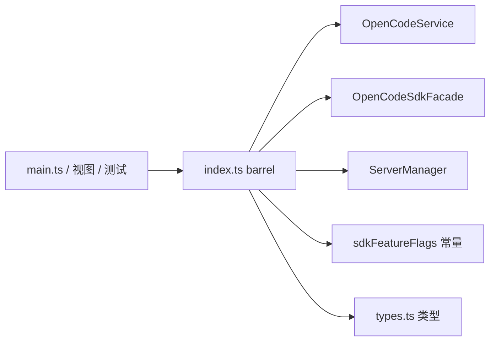

# Core OpenCode Barrel

> **源码**: `src/core/opencode/index.ts`
> **状态**: [REVIEW]

## 概述

`src/core/opencode/index.ts` 是 `core/opencode` 目录的公开 barrel。它只暴露上层真正需要直接依赖的类、常量和类型：

- `OpenCodeService`
- `OpenCodeSdkFacade`
- `ServerManager`
- SDK v2 rollout 常量与解析函数
- 供调用方使用的服务层类型

像 `createSdkClient.ts`、`sdkFetch.ts`、`sdkTypes.ts`、`omoCompat.ts` 这类实现细节并不会通过本文件转发。

## 导入关系

```text
上游:
- `./OpenCodeService`
- `./OpenCodeSdkFacade`
- `./sdkFeatureFlags`
- `./ServerManager`
- `./types`

下游:
- `src/main.ts`
- 依赖 OpenCode 服务层类型的设置页 / 视图 / 测试
```

## 公开导出

| 导出 | 来源 | 用途 |
|------|------|------|
| `OpenCodeService` | `./OpenCodeService` | OpenCode 运行时门面 |
| `OpenCodeSdkFacade` | `./OpenCodeSdkFacade` | 对齐 SDK v2 全 namespace 的薄包装层 |
| `SessionActivityStatus` | `./OpenCodeService` | session 忙闲/重试状态的类型 |
| `ServerManager` | `./ServerManager` | 本地/远程服务生命周期管理 |
| `resolveSdkFeatureFlags` | `./sdkFeatureFlags` | 合并 SDK rollout 开关 |
| `SDK_FEATURE_FLAG_DISABLED_DEFAULTS` | `./sdkFeatureFlags` | 全关闭默认值 |
| `SDK_FEATURE_FLAG_ROLLOUT_DEFAULTS` | `./sdkFeatureFlags` | 当前运行时 rollout 默认值 |
| `OpenCodeClientConfig` 等类型 | `./types` | 调用方使用的服务层配置、状态与 canonical session graph 类型 |

## 核心逻辑

### 公开 API 收口

barrel 的作用是给上层提供稳定入口，而不是把整个目录平铺导出。当前公开面聚焦在两类东西：

- 运行时类：`OpenCodeService`、`ServerManager`
- SDK 原子 façade：`OpenCodeSdkFacade`
- 调用方会直接引用的类型/常量：`SdkFeatureFlags`、`QueryOptions`、`ServerStatus` 与 canonical session graph 类型等

### rollout 常量透传

`SDK_FEATURE_FLAG_DISABLED_DEFAULTS` 与 `SDK_FEATURE_FLAG_ROLLOUT_DEFAULTS` 通过本文件暴露给 `main.ts` 和测试代码。当前 `main.ts` 会把 rollout 默认值传给 `OpenCodeService`，而测试如果直接构造服务且不传运行时覆盖，则仍然落回“全关闭”基线。

### 类型重导出

这里重导出的类型都来自 `types.ts`，因此调用方不需要知道 `OpenCodeService` 内部实际如何使用 SDK v2、legacy HTTP 或 `ServerManager`。

## 数据流



## 与其他模块的交互

- `main.ts` 通过本 barrel 导入 `OpenCodeService` 和 `SDK_FEATURE_FLAG_ROLLOUT_DEFAULTS`。
- `OpenCodeService` 自身也通过本 barrel 暴露给测试和其他调用方，而 `OpenCodeSdkFacade` 提供完整 SDK namespace 入口。
- 其他模块如果只需要服务层类型，也可以停留在 barrel 这一层，不必直接依赖实现文件。
- canonical session graph 类型继续通过 `types.ts` 暴露，但 `OpenCodeSessionStateStore` 本身仍是内部 owner，不通过 barrel 对外公开。
- `createSdkClient.ts`、`sdkFetch.ts`、`sdkTypes.ts`、`omoCompat.ts` 仍然是内部实现文件，需要时应直接导入源码文件，而不是期待 barrel 暴露它们。

## 配置项

本文件没有自己的运行时配置；它只转发会被运行时消费的 `SdkFeatureFlags` 及其默认常量。

## 注意事项

- 新增导出会扩大 `core/opencode` 的公开 API 面，应该只在确实需要对上层公开时才加入。
- `SessionActivityStatus` 是从 `OpenCodeService.ts` 转发的类型，而不是来自 `types.ts`。
- `OpenCodeSdkFacade` 暴露的是 SDK 原子接口层；产品级缓存、目录和 fallback 逻辑仍在 `OpenCodeService`。
- 本 barrel 没有导出 SDK v2 客户端工厂或 fetch 适配器；这些仍属于内部实现细节。
