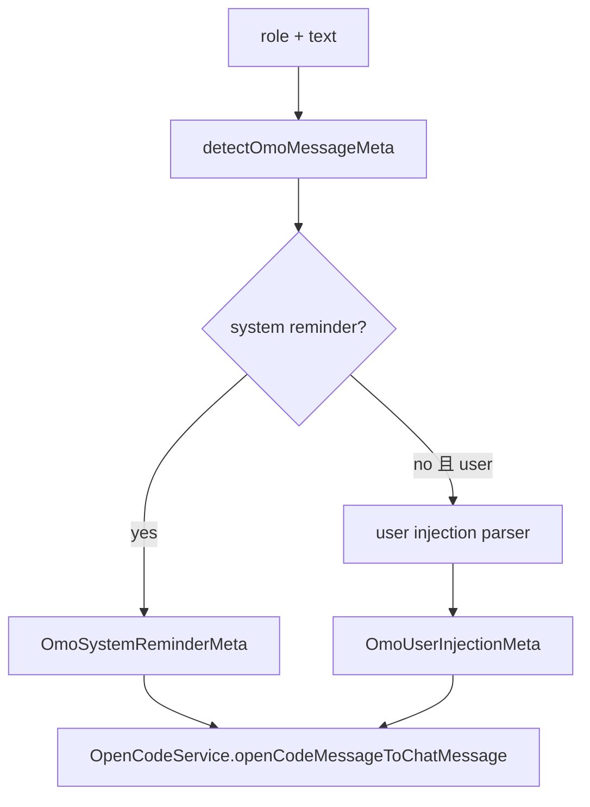

# OMO Compatibility

> **源码**: `src/core/opencode/omoCompat.ts`
> **状态**: [REVIEW]

## 概述

`omoCompat.ts` 是一个纯文本解析模块，唯一对外导出 `detectOmoMessageMeta(role, text)`。它负责识别两类 OMO 变异内容：

- 用户消息里的注入提示（`[xxx-mode] ... --- ...`）
- system reminder（`<system-reminder>...</system-reminder>` 或 `<!-- OMO_INTERNAL_INITIATOR -->`）

返回值不是 UI 组件，而是 `OmoMessageMeta`，随后由 `OpenCodeService.openCodeMessageToChatMessage()` 写进 `ChatMessage.omo`。

## 导入关系

```text
上游:
- `src/core/types/chat.ts` 中的 `OmoMessageMeta` / `OmoReminderType` / `OmoBackgroundTaskInfo`

下游:
- `src/core/opencode/OpenCodeService`
```

## 核心类型 / 输出形状

模块只返回两种元数据：

- `OmoUserInjectionMeta`
  - `kind: 'user-injection'`
  - `modeTag`
  - `injectedPrompt`
  - `originalText`
  - `rawText`
  - `headline`
- `OmoSystemReminderMeta`
  - `kind: 'system-reminder'`
  - `reminderType`
  - `reminderText`
  - `rawText`
  - `headline`
  - `isInternalInitiator`
  - `tasks?`

## 核心逻辑

### system reminder 检测优先

`detectOmoMessageMeta()` 会先调用 `detectSystemReminder(text)`，不区分角色。

system reminder 的识别条件是：

- 文本里出现 `<!-- OMO_INTERNAL_INITIATOR -->`
- 或匹配 `<system-reminder>...</system-reminder>`

解析后会做这些规范化处理：

- 把 `\r\n` 统一成 `\n`
- 折叠连续 3 个及以上空行为 2 个空行
- 去掉 marker / tag 包装并 `trim()`

`reminderType` 的分类规则只有三种：

- 包含 `[ALL BACKGROUND TASKS COMPLETE]` -> `all-background-tasks-complete`
- 包含 `[BACKGROUND TASK COMPLETED]` -> `background-task-completed`
- 其他 -> `generic`

### 后台任务信息解析

源码当前只支持两种 task 文本结构：

- 单个完成任务：
  - `ID: \`...\``
  - `Description: ...`
- 全部完成任务列表：
  - `- \`task-id\`: description`

如果文本不符合这两种格式，`tasks` 就保持 `undefined`。

### 用户注入提示检测

只有当 `role === 'user'` 且前面没有匹配到 system reminder 时，才会尝试 `detectUserInjection(text)`。

判定条件是：

1. 第一行匹配 `^\[([a-z0-9-]+-mode)\]$`
2. 从底部向上找到最后一个 `---` 分隔线
3. 分隔线前有注入提示正文，分隔线后有原始输入正文

这里没有解析固定的“原始输入”字样；真正依赖的是：

- 第一行的 `[...-mode]`
- 最后一个 `---`

### headline 生成

两类元数据都会通过 `getFirstMeaningfulLine()` 取第一条非空行作为 `headline`，供 UI 做摘要标题。

## 关键方法

| 方法 | 说明 |
|------|------|
| `detectOmoMessageMeta(role, text)` | 先检查 system reminder，再按用户角色检查 injection，返回 `OmoMessageMeta | null` |

## 数据流



## 与其他模块的交互

- `OpenCodeService` 在 `openCodeMessageToChatMessage()` 内调用这里的检测函数。
- 解析出的 `rawText`、`headline`、`tasks` 等字段会跟随 `ChatMessage.omo` 一起流向 UI。

## 配置项

无。该模块不读取设置，也不读取 `.opencode` 配置文件。

## 注意事项

- 检测顺序固定是“先 system reminder，后 user injection”；同一段文本不会同时返回两种元数据。
- 当前解析是基于非常具体的字符串模式，不会做通用 markdown/HTML AST 解析。
- assistant 角色不会尝试 user injection 解析。
- 如果 reminder 或 injection 的结构不完整，函数会直接返回 `null`，不会返回半成品元数据。
