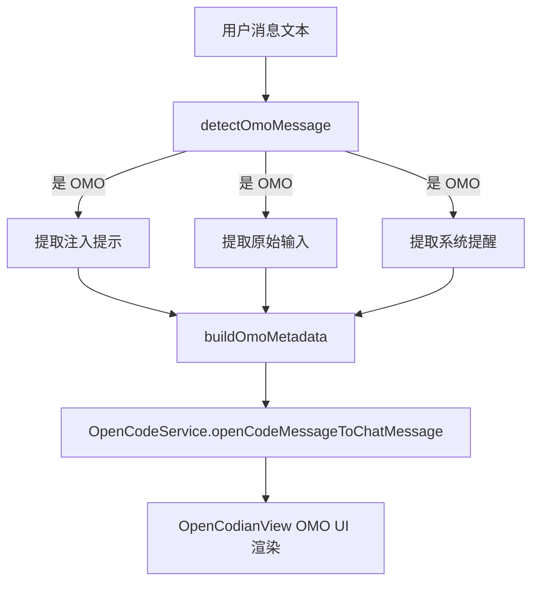

# OMO Compatibility

> **源码**: `src/core/opencode/omoCompat.ts`
> **状态**: [DRAFT]

## 概述

oh-my-opencode (OMO) 兼容层，处理 OMO 插件对用户消息的注入和变异。负责检测 OMO 添加的特殊标记（如 `[search-mode]` 前缀、`<system-reminder>` 标签、`<!-- OMO_INTERNAL_INITIATOR -->` 注释等），保留原始 OMO 文本的同时提取 UI 友好的元数据，供聊天界面渲染注入提示摘要和原始提示折叠面板。

## 导入关系

```text
上游: (无外部依赖，纯文本解析逻辑)
下游: src/core/opencode/OpenCodeService (openCodeMessageToChatMessage), src/features/chat/OpenCodianView (OMO UI 渲染)
```

## 核心类型 / 接口

```typescript
// OMO 检测结果
interface OmoDetectionResult {
  isOmoMessage: boolean;
  injectedPrompt?: string;
  rawOriginalInput?: string;
  systemReminder?: string;
  isInternalInitiator?: boolean;
  // ...
}

// OMO 消息模式
type OmoPattern = "search-mode" | "system-reminder" | "internal-initiator" | ...;
```

## 核心逻辑

### 注入提示检测

检测用户消息中的 OMO 注入模式：
1. **`[search-mode]` 前缀 + `--- 原始输入`**: OMO 的搜索模式注入，分隔线前为 OMO 注入内容，分隔线后为用户原始输入
2. **`<system-reminder>...</system-reminder>`**: OMO 的系统提醒注入，包含 markdown 格式的提醒内容
3. **`<!-- OMO_INTERNAL_INITIATOR -->`**: OMO 内部发起者标记，标识该消息由 OMO 内部触发

### 元数据提取

从检测到的 OMO 模式中提取：
- 注入的提示内容（用于摘要显示）
- 用户原始输入（用于显示真实用户消息）
- 系统提醒内容（用于通知卡片渲染）
- 原始完整文本（用于原始提示折叠面板）

### UI 元数据构建

将解析结果转换为 UI 层可直接消费的元数据结构，包含：
- 注入提示的摘要文本
- 是否显示原始提示展开面板
- 系统提醒的 markdown 内容
- 后台任务提醒标记

## 关键方法

| 方法 | 说明 |
|------|------|
| `detectOmoMessage(text)` | 检测文本是否包含 OMO 注入模式，返回解析结果 |
| `extractInjectedPrompt(text)` | 提取注入的提示内容 |
| `extractOriginalInput(text)` | 提取用户的原始输入文本 |
| `extractSystemReminder(text)` | 提取 system-reminder 标签内容 |
| `buildOmoMetadata(text)` | 构建完整的 OMO UI 元数据 |

## 数据流



## 与其他模块的交互

- **OpenCodeService**: 在 `openCodeMessageToChatMessage()` 中调用 OMO 检测，将结果附加到消息元数据
- **OpenCodianView**: 根据 OMO 元数据渲染：
  - 注入提示摘要面板
  - 原始提示可折叠面板
  - 系统提醒通知卡片（支持 markdown 渲染）
  - 后台任务提醒（主流结束后保持可见）
- **styles.css**: OMO 相关的 UI 样式

## 配置项

- **OMO 设置入口**: 在 OpenCodianSettings 中有 OMO 相关的配置项（如显示/隐藏注入提示）
- **OMO 配置文件**: `.opencode/oh-my-opencode.jsonc`（由 PluginManagementService 管理）

## 注意事项

- OMO 注入模式可能随 OMO 版本变化，需要保持兼容性
- 检测逻辑应基于模式匹配而非硬编码偏移量
- 必须保留原始 OMO 文本，不丢失任何信息
- 系统提醒中的 markdown 需要正确渲染
- 后台任务提醒在主流结束后仍需保持可见

## 待补充

- [ ] 所有支持的 OMO 注入模式的完整列表和正则表达式
- [ ] OMO 元数据在 ChatMessage 类型中的存储结构
- [ ] 多层 OMO 注入（同一消息中多种模式）的处理策略
- [ ] OMO 版本兼容性矩阵
- [ ] 与 `OpenCodeService.openCodeMessageToChatMessage()` 的具体集成点
