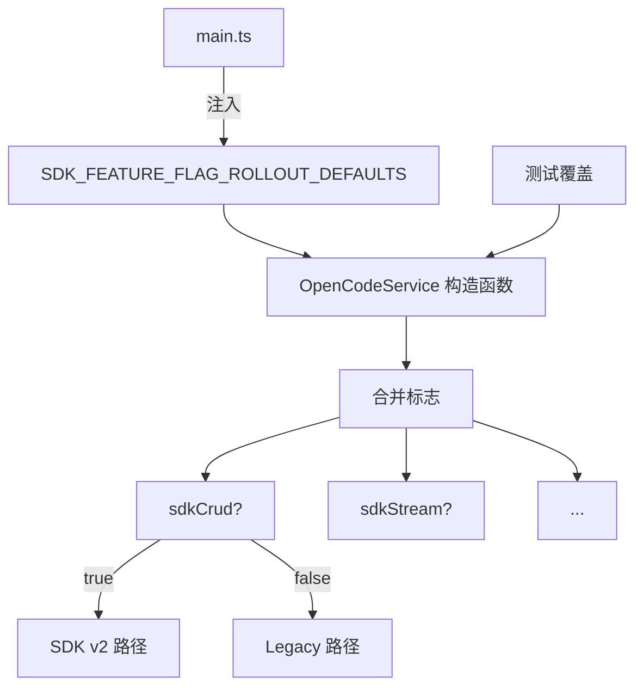

# SDK Feature Flags

> **源码**: `src/core/opencode/sdkFeatureFlags.ts`
> **状态**: [DRAFT]

## 概述

SDK v2 迁移的内部灰度开关系统。定义六个特性标志，控制 OpenCodeService 中每个功能模块是使用 SDK v2 路径还是回退到 legacy HTTP/SSE 路径。标志由 `main.ts` 在插件加载时通过 `SDK_FEATURE_FLAG_ROLLOUT_DEFAULTS` 注入，运行时可在 `OpenCodeService` 构造时覆盖。

## 导入关系

```text
上游: (无外部依赖，纯类型/常量定义)
下游: src/core/opencode/OpenCodeService, src/main.ts
```

## 核心类型 / 接口

```typescript
// SDK 特性标志集合
interface SdkFeatureFlags {
  sdkCrud: boolean;      // 会话 CRUD 操作
  sdkPrompt: boolean;    // 非流式消息发送
  sdkStream: boolean;    // 流式消息主路径
  sdkAbort: boolean;     // 取消/中断操作
  sdkQuestions: boolean; // 问答请求处理
  sdkSync: boolean;      // 同步事件订阅
}

// 运行时默认值（由 main.ts 注入）
const SDK_FEATURE_FLAG_ROLLOUT_DEFAULTS: SdkFeatureFlags;

// OpenCodeService 构造时的可选覆盖
interface OpenCodeServiceOptions {
  featureFlags?: Partial<SdkFeatureFlags>;
}
```

## 核心逻辑

### 标志定义与注入

1. 本模块定义标志接口和默认值
2. `main.ts` 在 `onload` 时将 `SDK_FEATURE_FLAG_ROLLOUT_DEFAULTS` 注入到 `OpenCodeService`
3. `OpenCodeService` 构造时合并注入的默认值和可选的运行时覆盖
4. 每个 API 方法根据对应标志决定走 SDK v2 还是 legacy 路径

### 标志语义

| 标志 | 控制范围 | 启用时的行为 |
|------|---------|-------------|
| `sdkCrud` | createSession, getSessionMessages, updateSessionTitle, deleteSession, forkSession, revertSession | 使用 SDK v2 的 session.* 方法 |
| `sdkPrompt` | requestAssistantResponse | 使用 SDK v2 的非流式 prompt |
| `sdkStream` | sendMessage | 使用 SDK v2 的流式 prompt |
| `sdkAbort` | cancelStream | 使用 SDK v2 的 abort 机制 |
| `sdkQuestions` | getPendingQuestions, replyToQuestion, rejectQuestion | 使用 SDK v2 的 question.* 方法 |
| `sdkSync` | global.syncEvent.subscribe | 使用 SDK v2 的同步事件订阅 |

## 关键方法

| 方法/常量 | 说明 |
|-----------|------|
| `SDK_FEATURE_FLAG_ROLLOUT_DEFAULTS` | 运行时默认标志值集合 |
| `SdkFeatureFlags` (interface) | 标志接口定义 |

## 数据流



## 与其他模块的交互

- **main.ts**: 注入运行时默认值
- **OpenCodeService**: 在每个 API 方法中读取标志进行路由决策
- **测试**: 构造 `OpenCodeService` 时不传覆盖，所有标志默认关闭（测试安全）

## 配置项

无用户可见配置项。标志由开发者在代码中控制。

## 注意事项

- **测试安全**: 不传运行时覆盖时所有标志默认关闭，确保测试使用 legacy 路径
- **渐进迁移**: 每个标志独立控制，支持逐个功能模块迁移
- **Rollback**: 所有 legacy 路径必须保留，直到对应标志被确认稳定并可永久开启
- **不要删除 legacy 代码**: `connectSSE()`, `parseSSEEvents()` 等方法是 flag off 时的唯一路径

## 待补充

- [ ] 当前各标志的默认启用状态
- [ ] 每个标志的迁移完成度和稳定性评估
- [ ] 是否需要运行时动态切换标志的机制
- [ ] 标志全部启用后的移除计划
