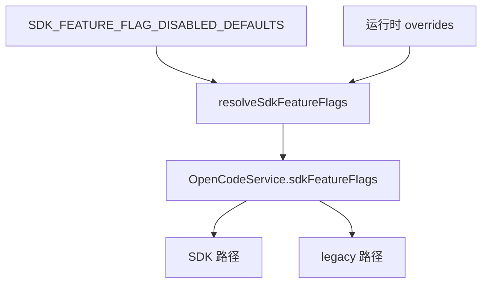

# SDK Feature Flags

> **源码**: `src/core/opencode/sdkFeatureFlags.ts`
> **状态**: [REVIEW]

## 概述

`sdkFeatureFlags.ts` 定义了 OpenCode JS SDK v2 迁移的内部开关。这个文件只做两件事：

- 定义 `SdkFeatureFlags` 形状
- 提供“全关闭基线”和“当前 rollout 默认值”

真正的路由发生在 `OpenCodeService`；这里不感知任何运行时对象。

## 导入关系

```text
上游:
- 无

下游:
- `src/core/opencode/OpenCodeService`
- `src/core/opencode/types`
- `src/core/opencode/index`
- `src/main.ts`
```

## 核心类型 / 常量

`SdkFeatureFlags` 一共有 6 个布尔位：

| 标志 | 语义 |
|------|------|
| `sdkCrud` | session CRUD、health、models、diff、permissions 等 SDK 路径 |
| `sdkPrompt` | 非流式 `session.prompt()` |
| `sdkStream` | 流式 `promptAsync() + event.subscribe()` |
| `sdkAbort` | `session.abort()` |
| `sdkQuestions` | `question.list/reply/reject` |
| `sdkSync` | `global.syncEvent.subscribe()` |

两个常量的源码值是：

| 常量 | 值 |
|------|----|
| `SDK_FEATURE_FLAG_DISABLED_DEFAULTS` | 6 个标志全部 `false` |
| `SDK_FEATURE_FLAG_ROLLOUT_DEFAULTS` | `sdkCrud` / `sdkPrompt` / `sdkStream` / `sdkAbort` / `sdkSync` 为 `true`，`sdkQuestions` 仍为 `false` |

## 核心逻辑

### 合并规则

`resolveSdkFeatureFlags(overrides?, defaults = SDK_FEATURE_FLAG_DISABLED_DEFAULTS)` 的规则很直接：

```ts
return {
  ...defaults,
  ...(overrides ?? {}),
};
```

也就是说：

- 不传任何参数 -> 全关闭
- 只传一部分覆盖 -> 未覆盖的标志保留默认值
- 可以显式传第二个 `defaults` 参数替换基线

### 当前运行时注入方式

`main.ts` 当前把 `SDK_FEATURE_FLAG_ROLLOUT_DEFAULTS` 作为 `OpenCodeService` 构造参数里的 `sdkFeatureFlags` 传入。由于 `OpenCodeService` 调用 `resolveSdkFeatureFlags(runtimeOptions.sdkFeatureFlags)` 时没有自定义第二个默认基线，所以 rollout 默认值实际上是“覆盖在全关闭基线之上”生效的。

测试如果直接构造 `OpenCodeService` 而不传运行时覆盖，则仍会回到全部 `false`。

## 关键方法

| 方法 / 常量 | 说明 |
|-------------|------|
| `SDK_FEATURE_FLAG_DISABLED_DEFAULTS` | 全关闭基线 |
| `SDK_FEATURE_FLAG_ROLLOUT_DEFAULTS` | 当前生产运行时默认 rollout |
| `resolveSdkFeatureFlags()` | 合并默认值与覆盖值 |

## 数据流



## 与其他模块的交互

- `OpenCodeService` 在每个能力点读取不同 flag 决定走 SDK 还是 legacy。
- `types.ts` 重新导出 `SdkFeatureFlags`，方便调用方不直接依赖这个文件。
- `main.ts` 当前通过 barrel 导入 `SDK_FEATURE_FLAG_ROLLOUT_DEFAULTS`。

## 配置项

无用户可见配置项；这些标志只在开发者侧控制。

## 注意事项

- `sdkQuestions` 当前仍默认关闭，这意味着 questions 相关接口默认继续走 legacy HTTP。
- 这个文件只定义布尔开关，不维护“迁移完成度”或“最终计划”之类的元数据。
- 只要某个 flag 仍可能关闭，对应 legacy 路径就仍然是必需实现，而不是死代码。
