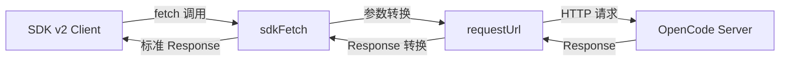

# SDK Fetch Transport

> **源码**: `src/core/opencode/sdkFetch.ts`
> **状态**: [DRAFT]

## 概述

SDK v2 的混合传输层实现，桥接 Obsidian 内置的 `requestUrl` API 与标准 `fetch` API。SDK v2 默认使用标准 `fetch`，但在 Obsidian 桌面应用环境中，`requestUrl` 提供更好的 CORS 处理和请求控制。本模块为 SDK 客户端提供符合 fetch 接口契约的自定义传输实现。

## 导入关系

```text
上游: obsidian (requestUrl API)
下游: src/core/opencode/createSdkClient
```

## 核心类型 / 接口

```typescript
// 标准 fetch 签名（SDK 期望的接口）
type FetchLike = (input: RequestInfo, init?: RequestInit) => Promise<Response>;

// sdkFetch 导出的自定义 fetch 实现
function sdkFetch(input: RequestInfo, init?: RequestInit): Promise<Response>;
```

## 核心逻辑

### requestUrl → fetch 适配

1. 接收标准 `fetch` 格式的 `RequestInfo` + `RequestInit` 参数
2. 将请求参数转换为 Obsidian `requestUrl` 的 `RequestUrlParam` 格式
3. 通过 `requestUrl` 发送请求（绕过 CORS 限制）
4. 将 `requestUrl` 的 `RequestUrlResponse` 转换回标准 `Response` 对象
5. 处理 SSE (Server-Sent Events) 流的特殊情况

### SSE 流处理

对于流式响应（如消息发送的 SSE 流），需要特殊处理 `requestUrl` 的响应体，将其转换为符合标准 `Response.body` 的 `ReadableStream`。

## 关键方法

| 方法 | 说明 |
|------|------|
| `sdkFetch(input, init?)` | 混合传输层 fetch 实现，内部使用 `requestUrl` |

## 数据流



## 与其他模块的交互

- **createSdkClient**: 作为 SDK 客户端的传输层注入
- **OpenCodeService**: 间接使用，通过 SDK 客户端发出请求

## 配置项

无独立配置项。服务器地址和认证信息在 SDK 客户端层面配置。

## 注意事项

- SSE 流式响应的转换是实现难点，需确保 `ReadableStream` 的正确构造和背压处理
- `requestUrl` 的响应头处理可能与标准 `fetch` 存在差异
- 错误响应（4xx/5xx）需要正确映射为 `Response` 对象
- 请求超时需通过 `requestUrl` 的配置处理

## 待补充

- [ ] requestUrl → Response 的具体转换逻辑
- [ ] SSE 流的 ReadableStream 构造细节
- [ ] 错误映射策略
- [ ] 超时配置的传递方式
- [ ] 是否处理请求/响应拦截器
