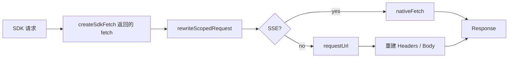

# SDK Fetch Transport

> 2026-07-29: requestUrl HTTP and native-fetch SSE paths record sanitized URL, method, status, duration, request ID and failures.

> **源码**: `src/core/opencode/sdkFetch.ts`
> **状态**: [REVIEW]

## 概述

`sdkFetch.ts` 提供 `createSdkFetch()`，把 SDK 期望的标准 `fetch` 接口拆成两条路径：

- 非 SSE 请求：走 Obsidian `requestUrl`
- SSE 请求：保留标准 `fetch`，直接返回原生流式 `Response`

也就是说，这个模块不是“用 `requestUrl` 模拟完整 fetch”，而是“在 Obsidian 里为 SDK 选择合适的传输实现”。

## 导入关系

```text
上游:
- Obsidian `requestUrl`

下游:
- `src/core/opencode/createSdkClient`
```

## 核心类型 / 接口

- 导出函数：`createSdkFetch(options?: { nativeFetch?: typeof fetch }): typeof fetch`
- 内部辅助函数：
  - `isSseRequest(request)`
  - `normalizeScopedHeaderValue(value)`
  - `normalizeDirectoryPath(value)`
  - `rewriteScopedRequest(request)`
  - `headersToRecord(headers)`
  - `requestBodyToText(request)`
  - `responseHeadersToHeaders(headersValue, fallbackContentType?)`
  - `responseBodyToText(response)`

## 核心逻辑

### SSE 请求识别

模块把下面两类请求视为 SSE：

- `Accept` 头包含 `text/event-stream`
- URL path 以这些后缀之一结尾：
  - `/event`
  - `/global/event`
  - `/global/sync-event`

一旦判定为 SSE，就直接调用 `nativeFetch(request)`，不经过 `requestUrl`。

### 作用域请求重写

在真正判断 SSE / 非 SSE 之前，模块会先执行一次 `rewriteScopedRequest()`：

- 读取 `x-opencode-directory` / `x-opencode-workspace` 头
- 分别改写成 URL 查询参数 `directory` / `workspace`
- `directory` 会先做 `decodeURIComponent()`，再把 Windows 反斜杠路径统一成正斜杠
- 改写完成后会删除这些 header，避免下游 transport 同时收到 header 和 query 两套作用域

这样做的原因是：

- SDK client 会把 scope 既放进 header，也放进查询参数
- `requestUrl` 路径最终是普通 HTTP 请求，OpenCode 侧更稳定的作用域入口仍然是 query 参数
- Windows 上如果直接把 `C:\vault` 原样透传给 `/config`、`/config/providers` 或 `/provider`，服务端常会退回到接近默认工作目录的结果；统一成 `C:/vault` 后，legacy 路径和 SDK 路径才能看到同一个 vault 作用域

所以现在无论最终走 `nativeFetch` 还是 `requestUrl`，都会先共享同一套 scope 规范化逻辑。

### 非 SSE 请求的 `requestUrl` 适配

对于普通请求：

1. 先执行 `rewriteScopedRequest()`，把 scope header 迁到 query。
2. 再把 `Request` headers 转成普通对象。
3. 除 `GET` / `HEAD` 外，读取请求体文本。
4. 调用 `requestUrl({ url, method, headers, body })`。
5. 把 `requestUrl` 返回值重新包装成标准 `Response`。

这里的返回体处理规则是：

- 如果响应里有 `text`，直接作为 body
- 如果只有 `json`，会先 `JSON.stringify`
- 如果拿不到 body，则返回空 body 的 `Response`

### 响应头重建

`responseHeadersToHeaders()` 会把 `requestUrl` 的 headers 重新写进标准 `Headers`，并在需要时补 `Content-Type`。

源码里的一个具体实现细节是：

- 当响应来源是 `text` 或 `json` 时，fallback content type 会被设成 `application/json`

这意味着当前适配器明显更偏向 SDK 的 JSON API，而不是通用二进制下载场景。

## 关键方法

| 方法 | 说明 |
|------|------|
| `createSdkFetch(options?)` | 返回供 SDK 使用的 fetch 实现 |
| `isSseRequest(request)` | 判断请求是否必须走原生流式 fetch |
| `rewriteScopedRequest(request)` | 把 SDK scope header 统一改写成 OpenCode 兼容的 query 参数 |
| `requestBodyToText(request)` | 读取非 `GET`/`HEAD` 请求体 |
| `responseBodyToText(response)` | 把 `requestUrl` 响应转换成可写入 `Response` 的 body |

## 数据流



## 与其他模块的交互

- `createSdkClient()` 默认使用这里生成的 fetch。
- `OpenCodeService` 通过 SDK 间接使用本模块，因此 SDK prompt、CRUD、sync event 都会经过这里的路由逻辑。
- `OpenCodeService.setVaultPath()` 提供的目录作用域，最终也是靠这里统一落到 query 参数上；因此 `getResolvedModelConfig()`、`getAvailableModels()`、`getProviderDirectory()` 的 scope 一致性，实际依赖这个 transport。

## 配置项

唯一可注入项是 `nativeFetch`；不传时默认使用 `globalThis.fetch.bind(globalThis)`。

## 注意事项

- `requestUrl` 路径不会提供原生 `ReadableStream`；这正是 SSE 请求必须绕过它的原因。
- 非 SSE 请求体最终会被转成文本；当前实现不面向文件上传/下载这类通用二进制 transport。
- `GET` / `HEAD` 不会携带 body。
- scope header 会在 transport 层被移到 query 参数；如果手写 legacy HTTP 调试请求，最好也直接带 `?directory=...` / `?workspace=...`。
- Windows 下 `directory` 会被规范化成正斜杠路径；这是为了避免 OpenCode 侧把 `C:\vault` 误当成接近默认工作目录的无作用域请求。
- 这个适配器只负责 transport 兼容，不负责认证头或 base URL 拼接；这些由上层 SDK client config 提供。
