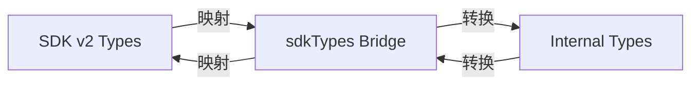

# SDK Type Bridge

> **源码**: `src/core/opencode/sdkTypes.ts`
> **状态**: [DRAFT]

## 概述

SDK v2 类型桥接层，定义 SDK v2 的类型与插件内部类型之间的映射和转换。当 SDK v2 包的类型定义与 OpenCodian 内部的类型系统不完全匹配时，此模块提供适配层，确保类型安全的交互。

## 导入关系

```text
上游: @opencode/sdk (SDK v2 类型), src/core/types/* (内部类型)
下游: src/core/opencode/OpenCodeService, src/core/opencode/createSdkClient
```

## 核心类型 / 接口

```typescript
// SDK v2 消息类型 → 插件内部 ChatMessage 的映射
// SDK v2 会话类型 → 插件内部 Session 类型的映射
// SDK v2 流事件类型 → 插件内部 StreamChunk 类型的映射

// 类型转换函数
function sdkMessageToChatMessage(sdkMsg: SdkMessage): ChatMessage;
function sdkSessionToSession(sdkSession: SdkSession): Session;
// ... 具体映射待补充
```

## 核心逻辑

### 双向类型映射

在 SDK v2 的请求/响应类型与 OpenCodian 内部类型之间建立双向转换：
1. **请求方向**: 内部类型 → SDK 类型（发送请求前）
2. **响应方向**: SDK 类型 → 内部类型（接收响应后）

### 流事件类型映射

SDK v2 的流事件类型（如 text delta, thinking, tool_use 等）映射到 `StreamChunk` 类型。

## 关键方法

| 方法 | 说明 |
|------|------|
| 待补充 | SDK 消息 → 内部消息转换 |
| 待补充 | SDK 会话 → 内部会话转换 |
| 待补充 | SDK 流事件 → 内部 StreamChunk 转换 |

## 数据流



## 与其他模块的交互

- **OpenCodeService**: 在 SDK 路径中大量使用类型转换
- **createSdkClient**: 使用类型映射确保 SDK 客户端的类型安全
- **types/**: 引用内部类型定义
- **SDK v2 包**: 引用 SDK 的类型定义

## 配置项

无。

## 注意事项

- 类型映射应保持纯函数，不引入运行时副作用
- 当 SDK v2 类型发生变更时，此桥接层需要同步更新
- 确保映射的完整性：所有 SDK 类型字段都应有对应的内部类型字段

## 待补充

- [ ] 完整的类型映射对照表
- [ ] 字段缺失或类型不匹配时的处理策略
- [ ] 是否使用 namespace 或 type branding 增强类型安全
- [ ] 与 `src/core/types/` 中各类型文件的对应关系
