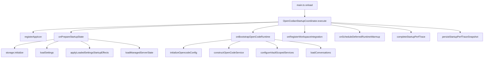

# OpenCodianStartupCoordinator

> **源码**: `src/core/runtime/OpenCodianStartupCoordinator.ts`
> **状态**: [REVIEW]

## 概述

`OpenCodianStartupCoordinator` 是 OpenCodian 的启动引导运行时 owner。它负责编排插件 `onload` 阶段的完整启动序列，并统一管理启动期性能追踪（startup perf tracing）。

它不是薄包装，而是与 app 层 `PluginRuntimeCoordinator` 并列的相邻 durable owner：

- `app.runtime/PluginRuntimeCoordinator` 负责启动后的 runtime 调度（deferred warmup、model refresh、cross-view refresh）
- `OpenCodianStartupCoordinator` 负责启动窗口内的引导序列和诊断

`main.ts` 保留插件生命周期入口所有权（`onload`/`onunload`、命令注册、视图注册），但将启动期的具体编排委托给此 coordinator。

## 导入关系

```text
上游:
- Node `fs` / `path`
- `obsidian` (`PluginManifest`)
- `src/shared/logger`、`formatDurationMs`、`getPerformanceTimestampMs`、`getRecentLogText`

下游:
- `src/main.ts`（`onload()` 中创建实例并调用 `execute()`）
```

## 核心类型 / 接口

```typescript
export type StartupPerfEntry = {
  step: string;
  elapsedMs: number;
  status: 'ok' | 'error';
  depth: number;
  detail?: string;
};

export type StartupPerfTrace = {
  runId: string;
  startedAt: string;
  completedAt?: string;
  status: 'running' | 'completed' | 'failed';
  entries: StartupPerfEntry[];
};

export interface StartupExecuteOptions<TManagedServerState> {
  manifest: PluginManifest;
  getVaultBasePath: () => string | null;
  registerAppIcon: () => void;
  onPrepareStartupState: (coordinator: OpenCodianStartupCoordinator) => Promise<TManagedServerState>;
  onBootstrapOpenCodeRuntime: (initialManagedServerState: TManagedServerState) => Promise<void>;
  onRegisterWorkspaceIntegration: () => void;
  onScheduleDeferredRuntimeWarmup: () => void;
}
```

## 核心逻辑

### 启动序列编排 (`execute`)

`execute()` 是 coordinator 的唯一入口，由 `main.ts` `onload()` 调用。它按固定顺序执行：

1. `registerAppIcon` —— 注册品牌图标
2. `onPrepareStartupState` —— 创建 StorageService、加载设置、应用启动副作用、加载 managed server state
3. `onBootstrapOpenCodeRuntime` —— 初始化 `.opencode` 配置、构造 OpenCodeService、配置 vault-scoped 服务、预加载会话元数据
4. `onRegisterWorkspaceIntegration` —— 注册视图、ribbon、命令、设置页
5. `onScheduleDeferredRuntimeWarmup` —— 调度启动后的 deferred runtime warmup

每个阶段都被 `measureStartupStep` 包裹，自动记录耗时和嵌套深度。

如果任何阶段抛出异常，`execute` 会将 perf trace 标记为 `failed`、尝试持久化诊断快照，然后再向上抛异常。workspace 注册和 warmup 调度不会被执行。

### 性能追踪 (`measureStartupStep`)

`measureStartupStep` 是 coordinator 的核心能力，负责：

- 在进入操作前同步递增 `startupPerfDepth`
- 在 `finally` 中同步恢复 depth
- 记录成功/失败的耗时条目，包含嵌套深度和可选 detail
- 自动输出 debug 日志

depth 采用同步语义：在 `await` 前 capture、在 `finally` 中 restore。这保证了即使跨 async 边界，嵌套深度仍然正确。`main.ts` 中的 handler 方法也可以调用此 coordinator 的 `measureStartupStep` 来给子步骤继续嵌套打点。

### 诊断输出

启动完成后，coordinator 自动生成两类诊断输出：

- **Summary**：Run ID、状态、总耗时、顶层步骤列表、最慢的 6 个嵌套步骤
- **Diagnosis**：主导 phase 分析、settings restore 慢速检测、normalized settings 回写提示

`main.ts` 的 `buildDiagnosticReport()` 通过 `getStartupPerfSummaryLines()` 和 `getStartupPerformanceDiagnosisLines()` 将这些数据纳入诊断报告。

## 关键方法

| 方法 | 说明 |
|------|------|
| `execute(options)` | 执行完整启动序列，编排各阶段回调 |
| `measureStartupStep(step, operation, options?)` | 包裹单步操作，记录耗时和嵌套深度 |
| `getStartupPerfSummaryLines()` | 获取启动性能摘要文本行 |
| `getStartupPerformanceDiagnosisLines()` | 获取自动诊断文本行 |

## 数据流



## 与其他模块的交互

- `main.ts`: 创建 coordinator 实例，在 `onload()` 中调用 `execute()`；通过 handler 回调执行具体的 storage/service/view 操作；通过 getter 读取 perf trace 数据用于诊断报告
- `app.runtime/PluginRuntimeCoordinator`: `execute()` 最后通过回调触发 `scheduleDeferredRuntimeWarmup()`，将控制权移交到启动后 runtime owner
- `StorageService`: `onPrepareStartupState` 中创建和初始化
- `OpenCodeService`: `onBootstrapOpenCodeRuntime` 中构造
- `OpencodeConfigManager`: 在 bootstrap 阶段调用 `ensureInitialized`

## 配置项

无直接配置项。行为由以下常量控制：

- `STARTUP_TRACE_AUTO_PERSIST_THRESHOLD_MS = 1200`：总耗时超过此阈值触发自动诊断快照
- `STARTUP_SLOW_PHASE_THRESHOLD_MS = 400`：单个 phase 超过此阈值视为慢启动
- `STARTUP_DOMINANT_PHASE_RATIO = 0.45`：单个 phase 占总耗时比例超过此值视为 dominant

## 注意事项

### 为何不是静态方法集合

`OpenCodianStartupCoordinator` 持有实例状态（`startupPerfTrace`、`startupPerfDepth`），因此必须是可实例化的类。`main.ts` 在 `onload()` 中创建实例，启动完成后保留引用以便诊断报告读取 trace 数据。

### 嵌套 depth 的正确性

`measureStartupStep` 的 depth 管理是此模块最关键的实现细节。depth 在 try 之前同步递增、在 finally 中同步恢复。这意味着：

- 同步操作：depth 正确反映调用栈深度
- 异步操作：await 前后 depth 仍然正确，因为 capture/restore 都在同步代码路径上

如果把 depth 管理改成 async（比如在 Promise.resolve 之后），嵌套测量就会失效。

### 与 main.ts 的边界

coordinator 不直接操作任何 plugin 实例属性（如 `this.storage`、`this.settings`）。所有具体行为都通过回调注入。这让 coordinator 保持纯粹的“编排”职责，而 `main.ts` 保留对 plugin 状态的直接所有权。

### 扩展方向

如果未来启动序列需要增加新阶段（如预加载缓存、健康检查），应该：

1. 在 `execute()` 的固定顺序中新增一步
2. 在 `StartupExecuteOptions` 中新增对应的回调类型
3. 在 `main.ts` 的 handler 中实现具体行为

不要在 coordinator 里直接引入新的服务依赖。
