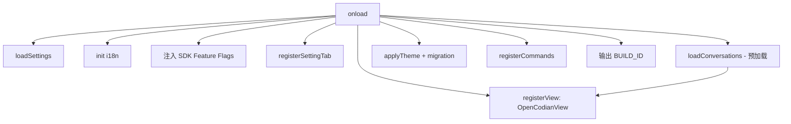

# Plugin Entry Point (main.ts)

> **源码**: `src/main.ts`
> **状态**: [DRAFT]

## 概述

OpenCodian 插件的入口文件，继承自 Obsidian 的 `Plugin` 类。负责插件生命周期的完整管理：在 `onload` 中注册侧边栏聊天视图、设置面板、命令和事件监听器，初始化 SDK v2 特性开关的默认值，预加载会话数据，应用主题设置与迁移逻辑，并将 BUILD_ID 注入到开发者控制台。在 `onunload` 中清理服务器进程和持久化状态。

## 导入关系

```text
上游: obsidian (Plugin API), src/core/opencode/*, src/core/config/*, src/core/storage/*, src/core/theme/*, src/features/chat/*, src/features/settings/*
下游: 无（顶层入口，所有其他模块均为其上游）
```

## 核心类型 / 接口

```typescript
// 插件设置类型（从 types/settings 导入）
interface OpenCodianSettings { ... }
const DEFAULT_SETTINGS: OpenCodianSettings;

// SDK 特性开关注入接口
const SDK_FEATURE_FLAG_ROLLOUT_DEFAULTS: Record<string, boolean>;
```

## 核心逻辑

### 插件生命周期 (onload / onunload)

`onload()` 按序执行：
1. 加载设置 (`loadData`)
2. 初始化 i18n locale
3. 注入 `SDK_FEATURE_FLAG_ROLLOUT_DEFAULTS` 到 OpenCodeService
4. 注册 `OpenCodianView` 侧边栏视图 ( Obsidian `registerView`)
5. 注册 `OpenCodianSettingTab` 设置面板
6. 调用 `loadConversations()` 预加载会话元数据 — 在完成前不会注册/恢复聊天视图
7. 应用主题设置、执行主题迁移
8. 注册命令（打开聊天、新建会话等）
9. 输出 BUILD_ID 到开发者控制台

`onunload()` 停止 ServerManager、清理资源。

### 会话预加载

在视图注册前通过 `StorageService` 预加载所有会话的元数据，确保 OpenCodianView 恢复时数据已就绪，避免竞态条件。

### 主题应用与迁移

读取设置中的主题预设值，通过 `core/theme` 模块应用到 CSS 变量，并执行跨版本的主题迁移逻辑。

### BUILD_ID 注入

构建时由 esbuild 注入 `BUILD_ID`（格式 `{branch}.{timestamp}`），在插件加载时输出到 Obsidian 开发者控制台，便于调试版本追踪。

## 关键方法

| 方法 | 说明 |
|------|------|
| `onload()` | 插件加载入口：初始化所有子模块、注册视图和命令 |
| `onunload()` | 插件卸载：停止服务器、清理状态 |
| `loadSettings()` | 从磁盘加载持久化设置并合并默认值 |
| `saveSettings()` | 将当前设置写入磁盘 |

## 数据流



## 与其他模块的交互

- **OpenCodeService**: 通过注入 `SDK_FEATURE_FLAG_ROLLOUT_DEFAULTS` 控制 SDK v2 的灰度开关
- **ServerManager**: 间接通过 OpenCodeService 管理服务器生命周期
- **StorageService**: 预加载会话数据、读写设置
- **OpenCodianView**: 注册为 Obsidian 视图，由侧边栏激活
- **core/theme**: 应用主题预设和 CSS 变量
- **i18n**: 根据设置初始化语言包

## 配置项

通过 `OpenCodianSettings` 控制全部插件行为，详见 `src/core/types/settings.ts`。

## 注意事项

- **会话恢复顺序**: 必须等 `loadConversations()` 完成后再注册/恢复聊天视图，否则会引入竞态条件
- **SDK 特性开关**: 构造 `OpenCodeService` 不传运行时覆盖时，所有 SDK 标志默认关闭（测试安全）
- **BUILD_ID 格式**: `{git-branch-slashes-to-dashes}.{YYYYMMDDHHmm}`
- **并发 Tab**: OpenCodeService 维护 per-session 流状态，支持多 Tab 并发流式

## 待补充

- [ ] 具体 `registerCommand` 列表及对应的命令 ID
- [ ] 主题迁移版本映射细节
- [ ] `onunload` 清理步骤的完整清单
- [ ] 与 Obsidian ribbon / 左侧栏图标注册逻辑
