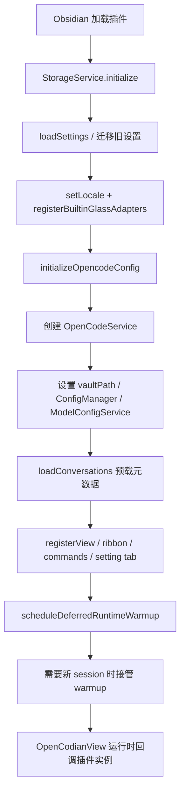

# Plugin Entry Point (main.ts)

> **源码**: `src/main.ts`
> **状态**: [REVIEW]

## 概述

`main.ts` 定义 `OpenCodianPlugin`，是 Obsidian 侧的总装配点。它负责：

- 初始化 `StorageService`，并通过 `src/core/types/settingsLoadNormalization.ts` 加载/迁移持久化设置
- 创建 `OpenCodeService`、`OpencodeConfigManager`、`ModelConfigService`
- 在 `OpenCodianView` 注册前预加载会话元数据
- 注册 ribbon、明暗主题自适应品牌图标、命令、设置页与视图
- 协调主题外观、日志、诊断导出和本地 `.opencode` 权限配置同步

它不是单纯的“入口壳”，还承担了插件级状态缓存、UI 刷新调度和诊断导出；但启动期的 persisted-settings merge / normalization 已收束到相邻 bootstrap owner。

## 导入关系

```text
上游:
- Obsidian API (`Plugin`, `Notice`, `Editor`, `MarkdownView`)
- Node `fs` / `path`
- `src/core/config/*`
- `src/core/opencode/*`
- `src/core/storage/*`
- `src/core/theme/*`
- `src/core/types/*`
- `src/features/chat/OpenCodianView`
- `src/features/settings/OpenCodianSettings`
- `src/i18n`
- `src/shared/*`
- `src/utils/glass`

下游:
- Obsidian 插件加载器
- `OpenCodianView` / `OpenCodianSettingTab` 在运行时回调插件实例
```

## 核心类型 / 状态

- `OpenCodianPlugin extends Plugin`: 插件主类。
- `BUILD_ID`: 由构建阶段注入的常量，只用于日志与诊断。
- `settings`: 当前归一化后的 `OpenCodianSettings`。
- `storage`: vault 侧持久化入口。
- `openCodeService`: OpenCode 运行时门面。
- `opencodeConfigManager` / `modelConfigService`: 只有拿到 vault 路径后才创建。
- `conversations`: 只在内存里缓存会话元数据；正文按需从 `StorageService.loadFullConversation()` 读取。
- `themeBackgroundDataUrlCache` / `themeBackgroundDataUrlRequests`: 聊天背景图 data URL 缓存与并发去重。
- `chatAppearanceSaveTimeoutId` / `settingsUiStateSaveTimeoutId` / `modelRefreshFrameId`: 插件级节流与 UI 刷新调度句柄。
- `settingsPersistenceWritable`: 启动恢复失败时切到只读保护，阻止默认值覆盖已损坏的设置文件。
- `startupPerfTrace`: 最近一次插件启动埋点快照，记录分阶段耗时、运行状态、最慢嵌套步骤，以及自动诊断输出，用于冷启动诊断报告和慢启动自动快照。

## 核心逻辑

### 启动顺序 (`onload`)

`onload()` 的顺序是有意排好的：

1. 记录启动首行：版本、`BUILD_ID` 和 vault 路径。
2. 用 `measureStartupStep()` 给顶层和关键嵌套子步骤打点；`loadSettings()` 会继续拆出 `storage.loadPersistedSettings` / `normalizeLoadedSettings` / `persistNormalizedSettings`，而 `loadConversations()` 会继续拆出 `storage.listConversations` / `cacheConversationMetas`。
3. 注册品牌 icon。
4. 创建并初始化 `StorageService`。
5. 调用 `loadSettings()`，完成设置归一化与历史字段迁移。
6. 注册内置 glass adapter，并按设置启用/关闭调试日志。
7. 设置 i18n locale。
8. 从存储中读取上次保存的 `ManagedServerState`。
9. 若 vault 下还没有 `.opencode` 配置，按当前 `permissionMode` 调用 `initializeOpencodeConfig()` 创建。
10. 构造 `OpenCodeService`，注入 server status / error / models loaded 回调，以及 `initialManagedServerState`、`SDK_FEATURE_FLAG_ROLLOUT_DEFAULTS` 和 managed server state 持久化回调。
11. 如果能解析到 vault 路径，就创建 `OpencodeConfigManager` / `ModelConfigService`，并把 vault 路径传给 `openCodeService`。
12. 在注册视图之前执行 `loadConversations()`，只预热会话元数据；`StorageService` 会优先读取轻量 `session-metas/` sidecar，缺失时再回退完整 session JSON，并把这次 fallback 统计送进 startup diagnosis。
13. 注册 `OpenCodianView`、自定义品牌 icon（供 ribbon / tab header 复用）、命令与设置页。
14. 启动结束时输出一行汇总日志；若检测到失败或明显慢启动，还会额外输出一条 automatic diagnosis。
15. 最近一次 trace 会暴露给诊断报告；若 debug 已开启，或本次启动被判定为慢启动/失败，还会自动把 `startup-perf-latest.log` 写到 vault 的 `.opencodian/debug/`。
16. `onload()` 返回后再后台调度 deferred runtime warmup：本地 sidecar 自启动与首个 server snapshot 不再阻塞插件注册和视图恢复；真正需要新 session 的路径（当前主要是 `createConversation()`）才会显式接管并等待这次 warmup，避免首次建会话撞上未就绪 server，同时不拖慢已有会话的视图首开。

这里没有调用 `OpenCodeService.initialize()`；实际运行时由 `main.ts` 自己决定是否启动服务。

### 设置归一化与迁移 (`loadSettings`)

`loadSettings()` 不是简单的“读 JSON 合并默认值”，还承担了多轮历史兼容与恢复：

- 先读取 `StorageService.loadPersistedSettings()` 返回的分层结果，区分 `primary / backup / legacy / missing / blocked`。
- `settings.core.json` / `settings.ui.json` 任一主文件损坏时，优先尝试对应 `.bak`。
- 若新格式不存在或不可恢复，再尝试旧 `.opencodian/settings.json` 自动迁移。
- 只有真正 `missing` 才按首次安装处理；`blocked` 会阻止后续自动写盘。

- 把旧的 `debugLogPath` 合并进新的 `debugLogPaths`（按当前平台落位）。
- 把旧的扁平 `server.{host,port,autoStart}` 迁移为新的 `server.mode/local/remote/auth` 结构。
- 归一化 `chatAppearance`、`theme`、`tabState`、`providerIconLibrary`。
- 归一化 `questionDisplayMode`、`questionCardPosition`、`showAnsweredQuestionCards`。
- 归一化 `inlineSerializedDebugLogArgs`，确保 debug 控制台输出格式开关总是布尔值。
- 归一化 `disabledModelRefs`，避免历史配置中的脏模型引用污染当前运行时。
- 根据 `inputPanelGlassRefractionGlassDefaultsVersion` 判断是否重置 glass/card/pill 默认层级参数。
- 检测旧版 `nikdelvin` 液态玻璃默认档案并替换为新默认值。
- 丢弃已废弃的 `experimentalComposerGlassRefractionEnabled` 与 `inputPanelLiquidGlassMode`。
- 当主题预设开启时，重新计算 `theme.customAppearanceOverrides` 与生效的 `chatAppearance`。

因此，`this.settings` 在赋值前已经是“当前版本可用”的归一化结果。

### 设置保存与全局刷新 (`saveSettings`)

`saveSettings()` 负责四件事：

1. 清掉延迟保存/延迟 UI 状态的 timer。
2. 先把新设置同步到 `OpenCodeService.updateSettings()`；若服务层更新失败，就回滚到旧快照。
3. 把归一化后的设置拆成 `core/ui` 两个域，再写回 `StorageService` 的串行写队列。
4. 刷新所有已打开的 `OpenCodianView`，并在需要时调用 `syncOpencodeConfig()` 让 `.opencode` 权限配置与 `permissionMode` 对齐。

此外，保存完成后入口层现在会主动广播一次 slash command catalog 失效，让 `OpenCodianView` 内部的 `SlashCommandMenuCatalogCache` 不必再等 120 秒 TTL 才看到新的项目命令/Skill 可见性变化。

`handleModelsLoaded()` 会在服务层模型默认值变化后把新 provider/model 回写到设置，并用 `requestAnimationFrame` 合并视图刷新。

OpenCode server status 回调也不再只刷新设置页状态：当本地/远端服务重新进入 `running` 时，入口层会通知所有已打开的 `OpenCodianView` 立即清空 slash command catalog，并触发一次后台 warm preload，这样服务重启后的命令列表能尽快和当前 runtime 对齐。

聊天外观的防抖保存只写 `core` 域；tab/设置页 UI 状态的防抖保存只写 `ui` 域。视图层不再直接把整份 `this.settings` 落盘。

### 视图、命令与插件级 UI 调度

入口层直接注册并调度这些 UI 能力：

- `activateView()`: 按 `openInMainTab` 决定在主标签页或右侧边栏打开 `OpenCodianView`。
- ribbon 图标：`bot`
- 命令：
- `open-view`
- `new-conversation`
- `toggle-liquid-diamond-demo`
- `toggle-liquid-diamond-demo-webgl`
- `toggle-glass-octahedron`
- `inline-edit`
- `add-current-note-to-context`
- `add-selection-to-context`

同时，插件实例还向所有已打开的视图广播：

- `applyLocaleTexts()`
- `applyChatAppearanceSettings()`
- `applyChatScrollMode()`
- `applyTabBarLayout()`
- `reloadModelCatalog()`
- `refreshCurrentConversationRendering()`
- `refreshQuestionUi()`

### 会话缓存与本地持久化

`loadConversations()` 只读取 `StorageService.listConversations()` 返回的元数据，并通过 `conversationsLoadPromise` 防止并发重复加载。

后续流程分成两层：

- `createConversation()` 会先接管尚未完成的 deferred runtime warmup，再在 OpenCode 侧创建 session，最后建立本地 conversation 记录。
- `createConversationFromSession()` 允许已有 OpenCode session 映射为新的本地 conversation。
- `getConversationById()` 默认优先从磁盘补全完整消息，再更新内存缓存；`preferCache` 可跳过这一步。
- `deleteConversation()` 会先把本地缓存删掉，再 best-effort 删除 OpenCode session，最后清理本地存储。

### 主题背景资源与诊断导出

入口层还承接两类“插件级”能力：

- 主题背景图：
  - 导入文件到 `StorageService.saveThemeBackgroundAsset()`
  - 维护 data URL 缓存
  - 在保存失败时回滚外观并删除新导入的资源
- 诊断导出：
  - `buildDiagnosticReport()` 汇总 server 状态、关键设置、最近一次 startup perf trace、自动 startup analysis 与最近日志
  - `writeDiagnosticLogFile()` 把报告写到指定目录

## 关键方法

| 方法 | 说明 |
|------|------|
| `onload()` | 完成服务装配、设置迁移、视图/命令注册与会话预加载 |
| `onunload()` | 停止 `OpenCodeService`，清除 chat appearance timer 与模型刷新帧请求 |
| `loadSettings()` | 读取并迁移历史设置，生成当前版本的归一化配置 |
| `saveSettings()` | 同步服务层、写回存储、刷新所有视图、同步 `.opencode` 权限配置 |
| `activateView()` | 打开或定位 `OpenCodianView` |
| `loadConversations()` | 预加载会话元数据，保证视图恢复前数据已就绪 |
| `createConversation()` | 创建 OpenCode session 并建立本地 conversation |
| `getConversationById()` | 从缓存或磁盘获取完整 conversation |
| `deleteConversation()` | 删除本地 conversation，并 best-effort 删除远端 session |
| `buildDiagnosticReport()` | 生成调试报告文本 |
| `writeDiagnosticLogFile()` | 将调试报告写成日志文件 |
| `measureStartupStep()` | 统一记录启动阶段耗时、嵌套深度和失败状态 |

## 数据流



## 与其他模块的交互

- `StorageService`: 读写分层设置、会话、managed server state、主题背景资源。
- `settingsLoadNormalization.ts`: 收束启动期 core/ui settings snapshot merge、历史 server/theme/input-panel 迁移与“是否需要回写归一化结果”的判定。
- `OpenCodeService`: 承担 OpenCode 侧运行时；插件把设置、vault 路径和 managed PID 状态注入进去。
- `OpencodeConfigManager`: 用于首次创建或后续同步 `.opencode` 权限配置。
- `ModelConfigService`: 在拿到 vault 路径后构建，供设置页和视图读取模型目录。
- `OpenCodianView`: 由入口注册，并在运行时回调插件实例获取会话、刷新 UI、附加上下文等能力。
- `OpenCodianSettingTab`: 通过插件实例保存设置、刷新服务状态和模型目录。
- `core/theme`: 负责主题预设与外观覆盖的归一化。
- `i18n`: 由入口设置 locale，并通过视图刷新把文字变更传播出去。

## 配置项

`main.ts` 直接消费的设置主要包括：

- `server.*`: 决定 OpenCode 连接方式、基础地址和是否自动启动本地服务。
- `permissionMode`: 决定 `.opencode` 初始/同步写入的权限模式。
- `locale`: 决定 i18n 语言。
- `openInMainTab`: 决定 `activateView()` 打开主标签页还是右侧边栏。
- `theme` / `chatAppearance` / `inputPanel*`: 决定外观归一化、预设覆盖与主题背景资源行为。
- `enableDebugLogging` / `inlineSerializedDebugLogArgs` / `debugLogPaths`: 控制调试日志及其 Console 输出格式。
- `defaultProvider` / `defaultModel`: 会在模型加载后由服务层回写和校正。

## 注意事项

- `loadConversations()` 只加载元数据，不加载消息正文；正文由 `getConversationById()` 按需补读。
- `onload()` 仍然先预载会话，再注册 `OpenCodianView`，这是热重载/恢复链路的顺序约束。
- 本地 server auto-start 已改成注册完成后的后台 warmup；冷启动 trace 现在更接近“插件何时可见”，而不是“sidecar 何时 ready”。
- 启动 trace 会同时记录顶层 phase 和嵌套子步骤；诊断报告里的总耗时只汇总顶层 phase，避免双重累计。
- `saveSettings()` 的失败回滚只覆盖服务层设置同步；分层磁盘写入发生在服务层更新之后。
- 当启动阶段判定设置不可恢复时，插件会进入持久化只读保护，并通过 `Notice` 告警，而不是把默认值写回磁盘。
- `measureStartupStep()` 现在只在 trace 处于 `running` 时记录条目，避免后续手动刷新历史列表时污染“本次启动”快照。
- 慢启动自动快照不依赖用户先打开 debug；只要启动失败，或顶层总耗时 / 主导 phase 超过阈值，就会把 trace 写到 `.opencodian/debug/startup-perf-latest.log`。
- `onunload()` 当前没有显式调用 `clearSettingsUiStateSaveTimer()`；卸载时只清除了 chat appearance timer 与 model refresh 帧请求。
